<p align="center">
  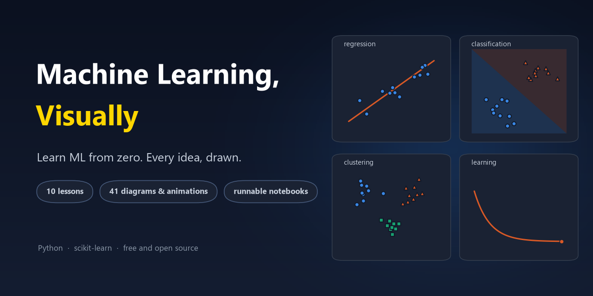
</p>

<p align="center">
  <b>A free, beginner-friendly machine learning course where every idea is explained with a diagram.</b><br>
  10 lessons &nbsp;·&nbsp; 40+ diagrams and animations &nbsp;·&nbsp; runnable notebooks &nbsp;·&nbsp; real, tested code
</p>

<p align="center">
  <a href="https://github.com/younespuri/visual-machine-learning-for-beginners/actions/workflows/ci.yml"></a>
  
  
  
  <a href="LICENSE"></a>
</p>

<p align="center">
  <a href="#the-lessons">Lessons</a> &nbsp;·&nbsp;
  <a href="#start-in-30-seconds">Start</a> &nbsp;·&nbsp;
  <a href="#cheat-sheet-which-algorithm-should-i-use">Cheat sheet</a> &nbsp;·&nbsp;
  <a href="#how-its-made">How it's made</a>
</p>

---

<p align="center">
  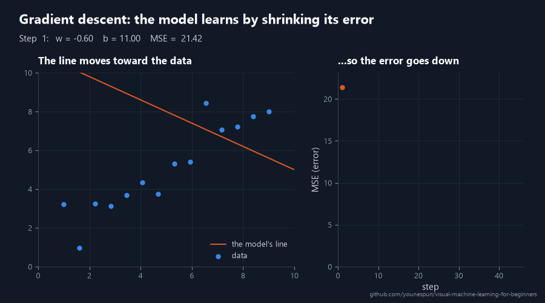
  <br><sub>This is what "a model learning" looks like. By the end of lesson 02 you'll understand every part of it.</sub>
</p>

## Why this course?

- **See it, then code it.** Every key idea comes with a diagram drawn to be the thing you remember.
- **Starts from zero.** If you can write a Python loop, you're ready. Any math is explained right where you need it.
- **Real code, real output.** Every lesson has a notebook you can run in your browser. Every output shown in the text comes from a real run, and CI re-runs all of it on every change.
- **Practice built in.** Every lesson ends with exercises at three levels, a mini project, and a quiz with hidden answers.

## The roadmap

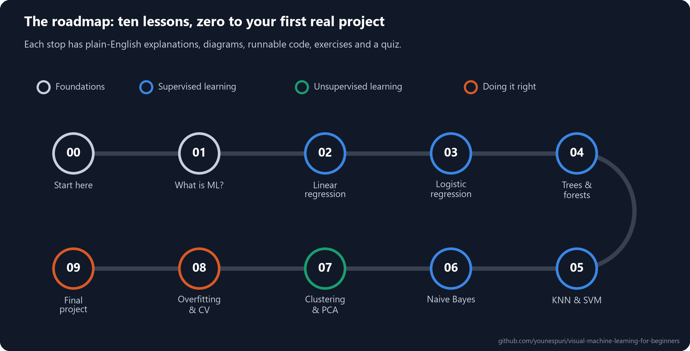

## The lessons

<table>
<tr>
<td width="50%" valign="top">
<a href="lessons/00-start-here/README.md"></a>
<br><b><a href="lessons/00-start-here/README.md">00 · Start here</a></b>
<br>Your tools, the key words, and the recipe every ML project follows.
</td>
<td width="50%" valign="top">
<a href="lessons/01-what-is-machine-learning/README.md">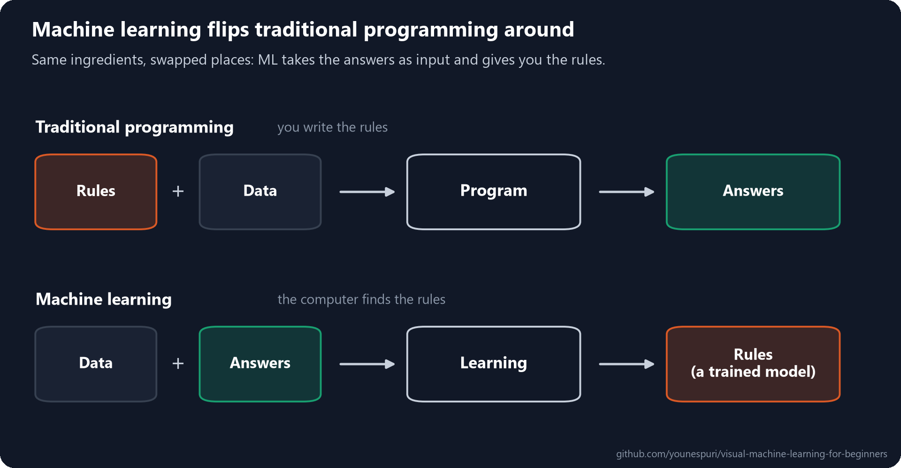</a>
<br><b><a href="lessons/01-what-is-machine-learning/README.md">01 · What is machine learning?</a></b>
<br>Stop writing the rules yourself. Show the computer examples and let it find them.
</td>
</tr>
<tr>
<td width="50%" valign="top">
<a href="lessons/02-linear-regression/README.md">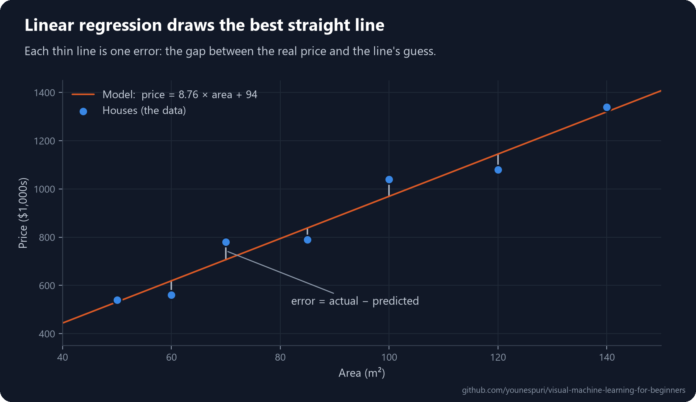</a>
<br><b><a href="lessons/02-linear-regression/README.md">02 · Linear regression</a></b>
<br>Draw the best straight line through your data, then use it to predict.
</td>
<td width="50%" valign="top">
<a href="lessons/03-logistic-regression/README.md"></a>
<br><b><a href="lessons/03-logistic-regression/README.md">03 · Logistic regression</a></b>
<br>Answer yes-or-no questions with a probability, then grade those answers honestly.
</td>
</tr>
<tr>
<td width="50%" valign="top">
<a href="lessons/04-decision-trees-and-random-forests/README.md"></a>
<br><b><a href="lessons/04-decision-trees-and-random-forests/README.md">04 · Decision trees and random forests</a></b>
<br>Ask a few yes/no questions to reach an answer, then let a whole forest of trees vote.
</td>
<td width="50%" valign="top">
<a href="lessons/05-knn-and-svm/README.md">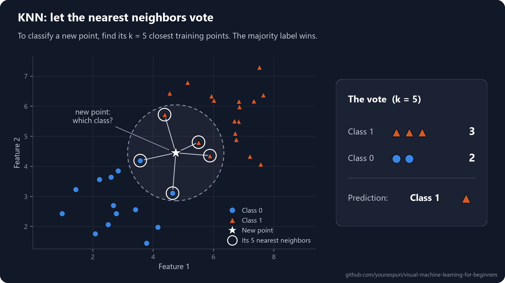</a>
<br><b><a href="lessons/05-knn-and-svm/README.md">05 · KNN and SVM</a></b>
<br>Ask the nearest neighbors, or draw the widest possible street between the classes.
</td>
</tr>
<tr>
<td width="50%" valign="top">
<a href="lessons/06-naive-bayes-and-unsupervised-learning/README.md">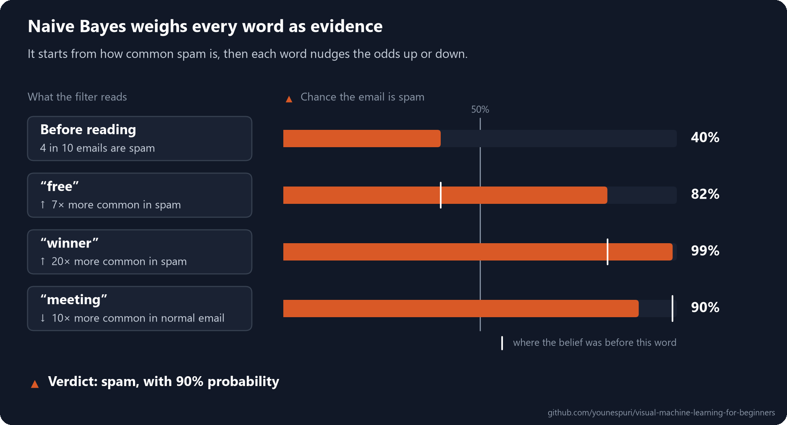</a>
<br><b><a href="lessons/06-naive-bayes-and-unsupervised-learning/README.md">06 · Naive Bayes and unsupervised learning</a></b>
<br>Weigh every word as evidence to catch spam, then find the groups hiding in unlabeled data.
</td>
<td width="50%" valign="top">
<a href="lessons/07-clustering-and-pca/README.md">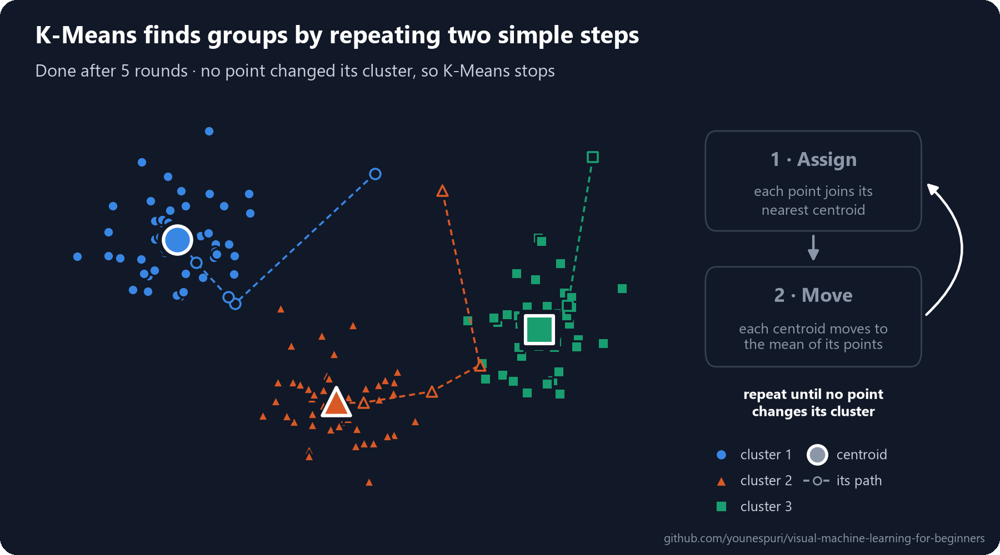</a>
<br><b><a href="lessons/07-clustering-and-pca/README.md">07 · Clustering and PCA</a></b>
<br>Let K-Means find the groups for you, and squeeze many features down to a few with PCA.
</td>
</tr>
<tr>
<td width="50%" valign="top">
<a href="lessons/08-overfitting-and-cross-validation/README.md">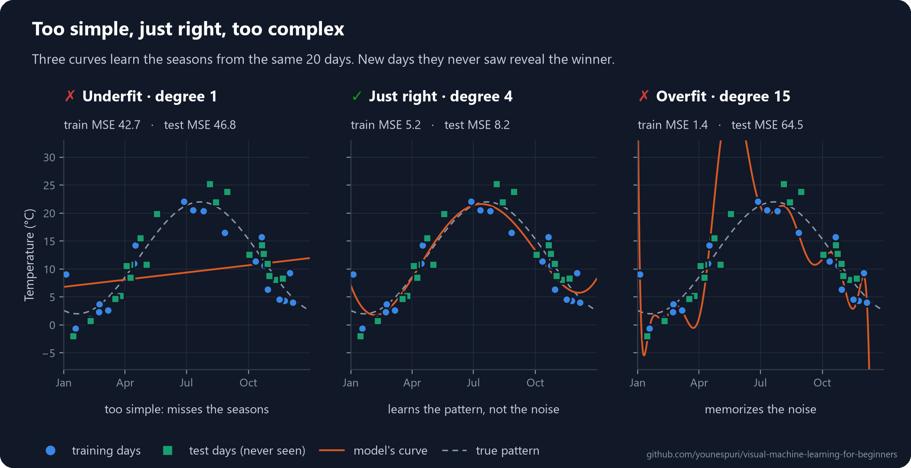</a>
<br><b><a href="lessons/08-overfitting-and-cross-validation/README.md">08 · Overfitting and cross-validation</a></b>
<br>Why models that ace their training data fail in the real world, and how to catch it.
</td>
<td width="50%" valign="top">
<a href="lessons/09-final-project/README.md">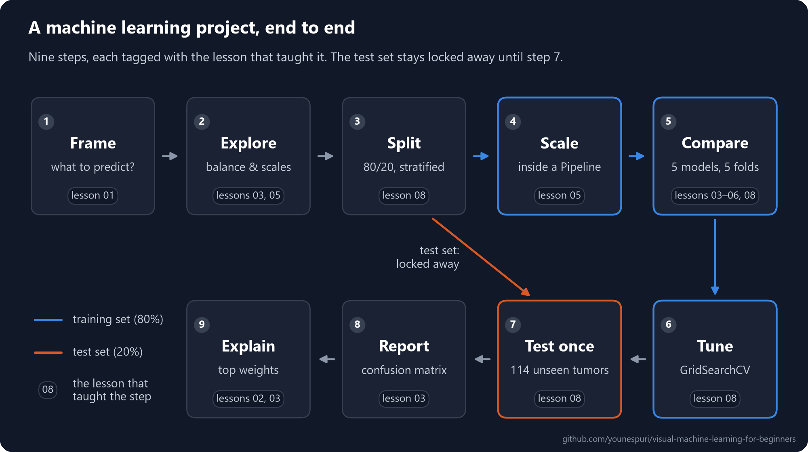</a>
<br><b><a href="lessons/09-final-project/README.md">09 · Final project</a></b>
<br>Take one real dataset from a raw table to a tested, explained model you can trust.
</td>
</tr>
</table>

## Start in 30 seconds

**In your browser:** open [lesson 00](lessons/00-start-here/README.md) and click **Open in Colab**. Nothing to install.

**On your computer:**

```bash
git clone https://github.com/younespuri/visual-machine-learning-for-beginners.git
cd visual-machine-learning-for-beginners
pip install -r requirements.txt
jupyter notebook
```

Then open any `lessons/.../notebook.ipynb`. Each lesson's `README.md` is the full lesson, and its notebook holds the same code, ready to run.

## Cheat sheet: which algorithm should I use?

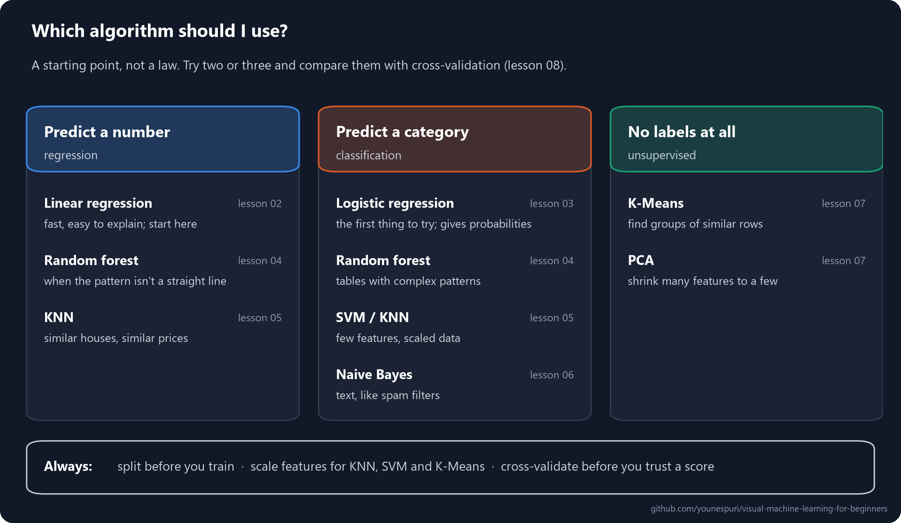

## How every lesson works

1. **The idea in plain words.** No jargon, just what's going on.
2. **An everyday example.** Where you've already met the idea.
3. **How it really works.** The details, with a diagram for every key idea.
4. **Code it.** Short, runnable steps with the real output shown.
5. **Practice.** Exercises, a mini project, and a quiz with hidden answers.

## How it's made

- **Every diagram is code.** Each lesson has a script in [`tools/diagrams/`](tools/diagrams/) that draws its figures, and they all share one visual system, [`tools/style.py`](tools/style.py). The colors were checked with a color-vision validator, and classes are told apart by shape as well as color, so nothing depends on color alone.
- **The notebooks are built from the lessons.** [`tools/build_notebooks.py`](tools/build_notebooks.py) turns the code in each lesson into its notebook and runs it, so the text and the code can't drift apart.
- **Everything is tested.** On every change, [CI](.github/workflows/ci.yml) runs every notebook from scratch on a clean machine.

To rebuild anything yourself:

```bash
pip install -r requirements-dev.txt
python tools/diagrams/lesson_02.py      # redraw one lesson's diagrams
python tools/build_notebooks.py         # rebuild and run every notebook
```

## Contributing

Found a typo, a confusing sentence, or have an idea for a better diagram? Open an issue or a pull request. Clearer explanations are always welcome.

## License

The code is [MIT](LICENSE). The lesson text and diagrams are [CC BY 4.0](https://creativecommons.org/licenses/by/4.0/): share and adapt them freely, including in your own teaching, as long as you give credit.

<p align="center"><sub>Made by <a href="https://github.com/younespuri">Younes</a>. If this course helped you, a star helps other people find it.</sub></p>
