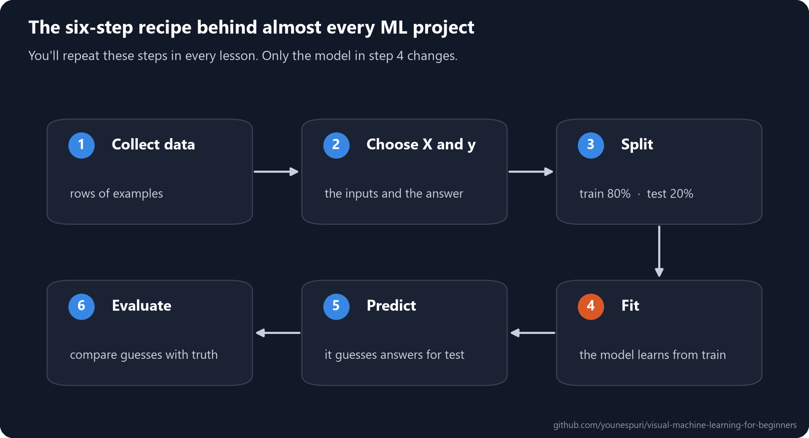
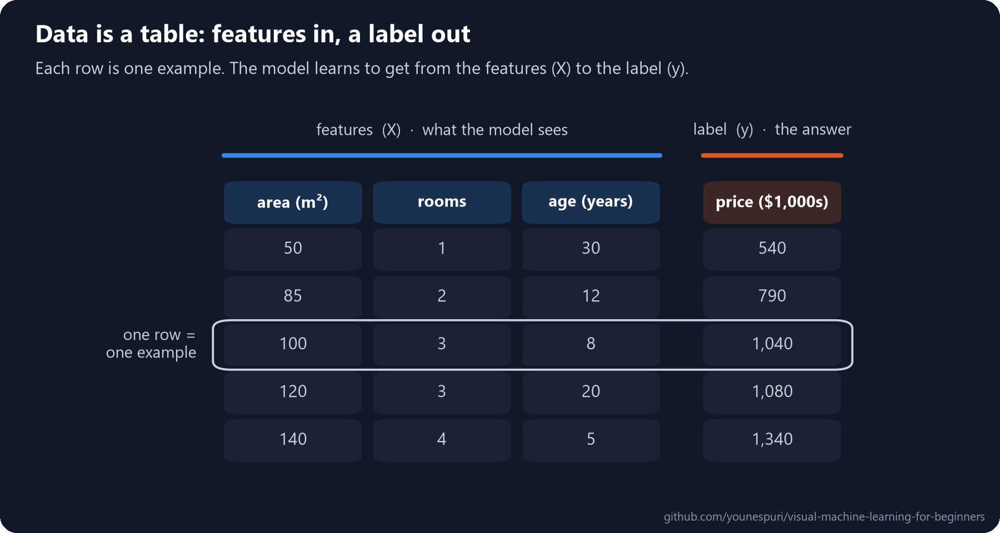
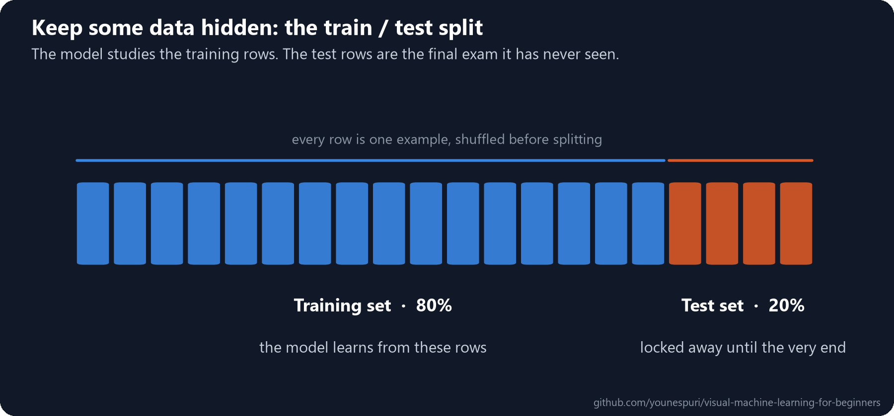

[Course home](../../README.md) · Lesson 00 of 09

# 00 · Start Here: Your First Machine Learning Model

**Everything you need before lesson 01: your tools, the key words, and the recipe every ML project follows.**

`Beginner` · `~20 min` · [](https://colab.research.google.com/github/younespuri/visual-machine-learning-for-beginners/blob/main/lessons/00-start-here/notebook.ipynb)



### What you'll learn

- How to run every lesson's code, in your browser or on your own computer.
- Why all machine learning data is a table of **features** and **labels**.
- The six-step recipe you'll repeat in every lesson.
- Why we always hide part of the data from the model.
- How to train your very first model, in a few lines.

**Before you start:** basic Python, meaning variables, lists, loops and functions. That's all. Any math is explained when you need it.

---

## How this course works

Every lesson follows the same path, so you always know where you are:

1. **The idea in plain words.** No jargon, just what's going on.
2. **An everyday example.** Where you've already met the idea.
3. **How it really works.** The details, with a diagram for every key idea.
4. **Code it.** Short, runnable steps with the real output shown.
5. **Practice.** Exercises, a mini project, and a quiz with hidden answers.

Take your time with the diagrams. They're drawn to be the thing you remember.

## Set up in two minutes

**Option A: in your browser (easiest).** Click the **Open in Colab** button at the top of any lesson. Google Colab runs the notebook for free with everything already installed. Press **Shift + Enter** to run a cell.

**Option B: on your computer.** Install Python 3.12 or newer, then in a terminal:

```bash
git clone https://github.com/younespuri/visual-machine-learning-for-beginners.git
cd visual-machine-learning-for-beginners
pip install -r requirements.txt
jupyter notebook
```

Open any `lessons/.../notebook.ipynb` and run the cells from top to bottom.

## The idea in plain words

Machine learning is teaching a computer by **example** instead of by instructions. You show it many examples where you already know the answer, and it works out the pattern by itself. Then it can use that pattern on new cases it has never seen.

Everything in this course, from the simplest line to a forest of decision trees, is a different way of finding that pattern.

## An everyday example

Imagine a teacher who hands out practice questions, then puts **the exact same questions** on the final exam. Every student scores 100%, but the teacher has learned nothing: did they understand the material, or just memorize the answers?

A good teacher keeps some questions back for the exam. Machine learning does the same thing. We hide part of the data while the model learns, then use it as the final exam.

## How it really works

### Data is a table: features and labels



- Each **row** is one **example** (also called a **sample**): here, one house.
- The **features** are the columns the model gets to see: area, rooms, age. Together they're called **X**.
- The **label** (or **target**) is the answer we want to predict: the price. It's called **y**.

A capital **X** for features and a small **y** for the label is a habit you'll see in every ML library and tutorial. X is a whole table; y is a single column.

### The six-step recipe

Look at the diagram at the top of this lesson. Nearly every project runs through the same six steps:

1. **Collect data.** Rows of examples.
2. **Choose X and y.** Which columns are the inputs, and which one is the answer?
3. **Split.** Set aside some rows as a test set.
4. **Fit.** The model learns from the training rows. This is the only step that changes from lesson to lesson.
5. **Predict.** The model guesses the answers for the test rows.
6. **Evaluate.** Compare its guesses with the real answers.

### Why we hide some of the data



This is the teacher's trick from above. The **training set** (usually 70 to 80% of the rows) is what the model learns from. The **test set** is locked away until the end, and it is the only fair way to measure how the model will do on data it has never seen.

We shuffle the rows before splitting, so the test set is a fair sample and not, say, just the most expensive houses.

---

## Code it

### Step 1 · NumPy arrays: lists that do math

```python
import numpy as np

a = np.array([50, 60, 70, 85, 100])
print(a * 2)        # math on every element at once
print(a.mean())
print(a.shape)      # 5 elements in one dimension
# [100 120 140 170 200]
# 73.0
# (5,)

table = a.reshape(-1, 1)   # the same numbers as one column: 5 rows, 1 column
print(table.shape)
# (5, 1)
```

- A **NumPy array** is like a Python list that can do math on all its numbers at once, fast.
- `shape` tells you the size of each dimension. `(5,)` is a flat list of 5; `(5, 1)` is a table with 5 rows and 1 column.
- `reshape(-1, 1)` turns a flat list into a one-column table. You'll use it in [lesson 02](../02-linear-regression/README.md), because models want their inputs as tables.

### Step 2 · pandas DataFrames: tables with column names

```python
import pandas as pd

df = pd.DataFrame({
    "area":  [50, 60, 70, 85, 100, 120, 140, 65, 95, 110],
    "rooms": [1, 2, 2, 2, 3, 3, 4, 2, 3, 3],
    "age":   [30, 25, 15, 12, 8, 20, 5, 18, 10, 7],
    "price": [540, 560, 780, 790, 1040, 1080, 1340, 700, 960, 1150],
})
print(df.head(3))
print(df.shape)
#    area  rooms  age  price
# 0    50      1   30    540
# 1    60      2   25    560
# 2    70      2   15    780
# (10, 4)
```

- A **DataFrame** is a table with named columns, like a spreadsheet in Python.
- `df.head(3)` shows the first 3 rows; `df.shape` says 10 rows and 4 columns.

### Step 3 · Choose X and y

```python
X = df[["area", "rooms", "age"]]   # the features: a table
y = df["price"]                    # the label: one column
print(X.shape, y.shape)
# (10, 3) (10,)
```

- Double brackets `[[...]]` pick several columns and give back a table; single brackets pick one column.
- X has 10 rows and 3 features. y has 10 answers, one per row.

### Step 4 · Split into training and test sets

```python
from sklearn.model_selection import train_test_split

X_train, X_test, y_train, y_test = train_test_split(X, y, test_size=0.2, random_state=42)
print("train:", X_train.shape, " test:", X_test.shape)
print(X_test)
# train: (8, 3)  test: (2, 3)
#    area  rooms  age
# 8    95      3   10
# 1    60      2   25
```

- `test_size=0.2` keeps 20% of the rows for testing: 2 of our 10 houses.
- `train_test_split` shuffles before splitting, which is why the test rows are 8 and 1, not the last two.
- `random_state=42` makes the shuffle repeatable, so you get the same split as this lesson. Any number works; 42 is just a popular choice.

### Step 5 · Your first model, start to finish

Here is the whole six-step recipe on a classic real dataset: 150 iris flowers, measured by petal and sepal size, from three species. Don't worry about how the model works yet. Decision trees get their own lesson ([04](../04-decision-trees-and-random-forests/README.md)).

```python
from sklearn.datasets import load_iris
from sklearn.tree import DecisionTreeClassifier
from sklearn.metrics import accuracy_score

# 1-2. collect the data, then choose X and y
iris = load_iris(as_frame=True)
X = iris.data
y = iris.target
print(X.shape)
print(iris.target_names)
# (150, 4)
# ['setosa' 'versicolor' 'virginica']

# 3. split
X_train, X_test, y_train, y_test = train_test_split(X, y, test_size=0.2, random_state=42, stratify=y)

# 4. fit
model = DecisionTreeClassifier(random_state=42)
model.fit(X_train, y_train)

# 5. predict
y_pred = model.predict(X_test)
print("guesses:", iris.target_names[y_pred[:4]])
print("answers:", iris.target_names[y_test.values[:4]])
# guesses: ['setosa' 'virginica' 'versicolor' 'versicolor']
# answers: ['setosa' 'virginica' 'versicolor' 'versicolor']

# 6. evaluate
print("accuracy:", round(accuracy_score(y_test, y_pred), 3))
# accuracy: 0.933
```

- The model got **93%** of the 30 test flowers right: flowers it had never seen during training.
- `stratify=y` keeps the same mix of the three species in both sets, so the test isn't accidentally lopsided.
- Notice the pattern: create a model, `fit`, `predict`, evaluate. It stays the same for every model in this course. Only the one line that creates the model changes.

---

## Common mistakes

- **Testing on the training data.** The model has seen those answers, so its score is flattering and tells you little. Always evaluate on the test set.
- **Mixing up X and y.** X is the table of inputs, y is the column of answers. The label must never appear inside X, or the model can simply read off the answer.
- **Running notebook cells out of order.** A cell can use variables from earlier cells. If something breaks, use "Restart and run all" to start clean.
- **Expecting 100%.** Real data is messy, and a model that looks perfect is usually cheating somehow, for example by testing on data it trained on.

## Remember

- ML data is a table: rows are **examples**, the columns you learn from are **features (X)**, and the answer is the **label (y)**.
- The recipe: **collect, choose X and y, split, fit, predict, evaluate.**
- The **test set** stays hidden until the end. It's the only honest measure of how the model does on new data.
- In scikit-learn, every model follows the same `fit` then `predict` pattern.

## Practice

**Easy.** In Step 4, change `test_size` to `0.3`. How many houses end up in the test set now?

**Medium.** In Step 5, change `random_state` in `train_test_split` to a few other numbers. Does the accuracy change? Why might a different split give a different score?

**Hard.** In Step 5, try `test_size=0.5` and then `test_size=0.1`. Write down the accuracy for each and explain the trade-off: what do you gain and lose by keeping more data for testing?

### Mini project

Pick something in your own life you'd like to predict, such as your commute time, a plant's growth, or tomorrow's coffee sales. Sketch its data table on paper: what would one row be, what features would you collect, and what is the label? You'll come back to it once you know more models.

## Check yourself

<details>
<summary><b>1.</b> In a data table, what are features and what is the label?</summary>

The **features** (X) are the input columns the model gets to see, like area and rooms. The **label** (y) is the answer column we want to predict, like the price.
</details>

<details>
<summary><b>2.</b> Why do we keep a test set that the model never sees during training?</summary>

Because it's the only fair way to measure how the model will do on new data. A score on the training data mostly shows how well the model memorized examples it has already seen.
</details>

<details>
<summary><b>3.</b> What are the six steps of the recipe, and which one changes from lesson to lesson?</summary>

Collect data, choose X and y, split, fit, predict, evaluate. Only step 4, **fit**, really changes, because each lesson brings a different model. The rest stays the same.
</details>

<details>
<summary><b>4.</b> What does <code>random_state=42</code> do in <code>train_test_split</code>?</summary>

It fixes the random shuffle so the split is the same every time you run the code. That makes results repeatable. The number itself doesn't matter.
</details>

---

[Course home](../../README.md) · [01 · What is machine learning? →](../01-what-is-machine-learning/README.md)
