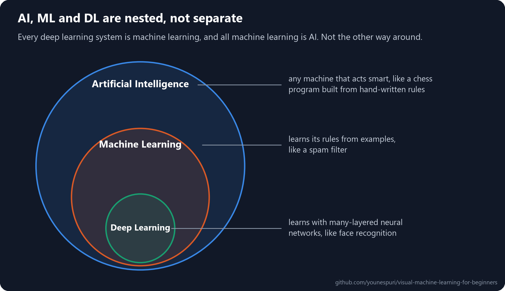
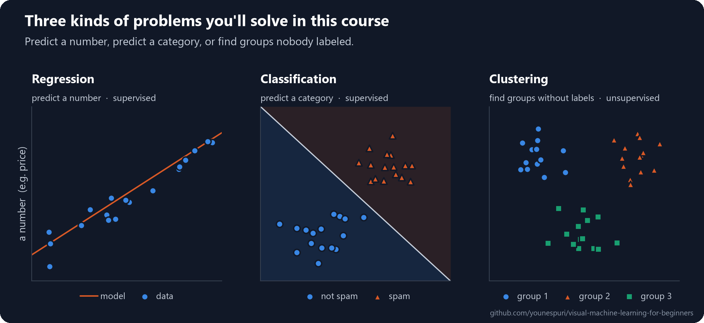

[Course home](../../README.md) · Lesson 01 of 09

# 01 · What Is Machine Learning?

**Stop writing the rules yourself. Show the computer examples and let it find the rules.**

`Beginner` · `~25 min` · [](https://colab.research.google.com/github/younespuri/visual-machine-learning-for-beginners/blob/main/lessons/01-what-is-machine-learning/notebook.ipynb)


### What you'll learn

- How AI, machine learning and deep learning relate to each other.
- The big mental switch: from *writing* rules to *learning* them from data.
- The three kinds of learning: supervised, unsupervised and reinforcement.
- The three kinds of problems: regression, classification and clustering.
- The `fit` / `predict` pattern you'll use with every model in scikit-learn.

**Before you start:** [Lesson 00](../00-start-here/README.md), where you met features, labels and the train/test split.

---

## The idea in plain words

In ordinary programming, **you write the rules**. You give the program data and your rules, and it gives you answers: *rules + data → answers*.

Now try to write a program that says whether a photo shows a dog. You could try rules: "four legs, fur and a tail means dog." It breaks almost immediately. Cats have four legs, fur and a tail too. Some dogs have almost no fur. In some photos you only see a dog's head. Every rule you add, reality finds a new exception.

Machine learning turns the whole thing around. Instead of writing the rules, you give the computer thousands of photos that are already labeled "dog" or "not dog," and let it **find the rules by itself**: *data + answers → rules*.

It's how you'd teach a small child what a dog is. You never hand them a rulebook. You point at dogs and not-dogs and say "that's a dog, that's not," and before long they recognize dogs they've never seen before. **That switch, from writing rules to learning them from examples, is the most important idea in this whole course.**

## An everyday example

Think about a spam filter. The old way is to write rules by hand: *"if the email contains 'you're a winner', it's spam."* Spammers quickly learn to change a word or two and slip past your rule.

Gmail does something different. It feeds millions of emails that people have already marked as spam or not spam into a machine learning model. The model learns patterns far too subtle and numerous for anyone to write by hand. And when spammers change tactics, the model is simply retrained on fresh data and adapts.

## How it really works

### AI, ML and DL are nested



- **Artificial intelligence (AI)** is the widest idea: any attempt to make a machine do something that seems to need intelligence. A chess program built entirely from hand-written rules is AI.
- **Machine learning (ML)** is one approach to AI: instead of coding the rules by hand, the model **learns them from data**.
- **Deep learning (DL)** is one approach to ML: it learns with **neural networks** that have many layers, and it shines on complex data like images, sound and text.

So every deep learning system is machine learning, and all machine learning is AI. The reverse isn't true: that rule-based chess program is AI, but not ML.

### Three ways a model can learn

| Kind of learning | What the data looks like | Goal | Example |
| --- | --- | --- | --- |
| **Supervised** | Inputs **plus** the right answers (labels) | Learn to map inputs to answers | Predicting house prices, spotting spam |
| **Unsupervised** | Inputs only, no answers | Discover hidden structure or groups | Grouping customers by how they shop |
| **Reinforcement** | Actions in an environment, plus rewards or penalties | Learn the best actions by trial and error | Game-playing AI |

- **Supervised learning** is like a student with a stack of questions *and* the answer key. The model learns how to get from question to answer. Most of this course is supervised.
- **Unsupervised learning** is like someone dumping a pile of mixed-up objects in front of you and asking you to put similar things together, without telling you what the groups are.
- **Reinforcement learning** is like training a dog with treats: the model acts, gets rewarded or penalized, and slowly learns what works. It's introduced here but not covered further in this course.

### Three kinds of problems



| Problem | What the model outputs | Supervised? | Example |
| --- | --- | --- | --- |
| **Regression** | A number on a continuous scale | Yes | A house's price |
| **Classification** | One category from a fixed set | Yes | Spam or not spam |
| **Clustering** | Groups of similar rows, with no labels given | No | Customer segments |

The quickest test: look at the answer you want. **Any number on a scale?** Regression. **One of a few fixed options?** Classification. **No answers at all, and you want to find groups?** Clustering.

---

## Code it

### Step 1 · Your first model: the fit / predict pattern

```python
from sklearn.linear_model import LinearRegression

# inputs (X) and their right answers (y): supervised data
X = [[1], [2], [3], [4]]
y = [10, 20, 30, 40]

model = LinearRegression()
model.fit(X, y)                  # learning happens here

prediction = model.predict([[5]])
print(prediction)
# [50.]
```

- `model.fit(X, y)` is the moment of learning. The model looks at the inputs and the right answers and finds the rule connecting them: here, "multiply by 10".
- `model.predict(...)` applies that learned rule to new inputs it has never seen.
- This exact pattern, **create, `fit`, `predict`**, is the same for almost every model in scikit-learn. Only the class name changes.

### Step 2 · Writing rules vs. learning them

First the traditional way: we write the rule ourselves.

```python
def is_spam_rules(email):
    spam_words = ["winner", "click here", "free"]
    return any(word in email.lower() for word in spam_words)

print(is_spam_rules("You are a WINNER! Click here"))
print(is_spam_rules("Congrats, you won a cash prize"))
# True
# False
```

- The second email is obviously spam, but none of our words appear in it, so the rule misses it. Every new trick needs another hand-written rule, and the list never ends.

Now the machine learning way: we give examples and let the model find the rules.

```python
from sklearn.feature_extraction.text import CountVectorizer
from sklearn.naive_bayes import MultinomialNB

emails = [
    "win a free prize now", "you won a cash prize", "claim your free reward", "winner winner click now",
    "meeting moved to 3pm", "lunch tomorrow?", "project report attached", "see you at the meeting",
]
labels = [1, 1, 1, 1, 0, 0, 0, 0]   # 1 = spam, 0 = not spam

vectorizer = CountVectorizer()
X_words = vectorizer.fit_transform(emails)   # turn each email into word counts

spam_model = MultinomialNB()
spam_model.fit(X_words, labels)              # learn the rules from the examples

new_emails = ["Congrats, you won a cash prize", "report for the meeting"]
print(spam_model.predict(vectorizer.transform(new_emails)))
# [1 0]
```

- Nobody told this model which words are spammy. From just eight examples, it worked out that words like "won" and "prize" point to spam, and it caught the email our rule missed.
- `CountVectorizer` turns text into numbers (how often each word appears), because models only understand numbers.
- Don't worry about how this particular model works yet. It's called Naive Bayes, and it gets its own lesson ([06](../06-naive-bayes-and-unsupervised-learning/README.md)).

### Step 3 · Spot the problem type from the answer

```python
def problem_type(answer):
    if answer is None:
        return "clustering (no answers given: find the groups)"
    if isinstance(answer, str):
        return "classification (the answer is a category)"
    return "regression (the answer is a number)"

examples = {"house price": 420_000, "email": "spam", "customer": None}
for name, answer in examples.items():
    print(f"{name:12} -> {problem_type(answer)}")
# house price  -> regression (the answer is a number)
# email        -> classification (the answer is a category)
# customer     -> clustering (no answers given: find the groups)
```

- A house price can be any value on a scale, so it's **regression**.
- An email is one of a few fixed options (spam or not), so it's **classification**.
- For customers we have no answers at all; the model must discover the groups itself, which is **clustering**.
- In real datasets, categories are often stored as numbers like 0 and 1. What matters isn't the data type but the question: **one of a few fixed options, or any value on a scale?**

---

## Where you'll see it in the real world

**Classification** is everywhere: Gmail's spam filter, spotting disease in medical scans, and flagging fraudulent card payments, each trained on millions of labeled examples. **Regression** is just as common: property sites estimating home prices, ride-hailing apps predicting your fare and arrival time, and insurers estimating premiums.

**Clustering** runs behind the scenes in marketing. Online shops feed the shopping behavior of millions of customers into a model that discovers groups like "loyal regulars" or "holiday-only shoppers" without anyone defining them first. And **reinforcement learning** is behind game-playing systems like AlphaGo, which learned winning strategies by playing millions of games and being rewarded for wins.

## Common mistakes

- **Treating AI, ML and DL as three separate things.** They're nested: DL sits inside ML, which sits inside AI.
- **Assuming every problem needs deep learning.** On ordinary tables of data, the simpler models in this course are often faster to train and just as accurate, sometimes more.
- **Mixing up regression and classification.** "Predict a house's price" is regression, because the answer is a number on a scale, even though it's a prediction.
- **Thinking unsupervised learning needs no human judgment.** Someone still has to decide things like how many groups to look for, and whether the groups make any sense.

## Remember

- **AI ⊃ ML ⊃ DL.** ML learns rules from data instead of having them written by hand; DL does it with deep neural networks.
- Traditional programming: **rules + data → answers.** Machine learning: **data + answers → rules.**
- Three kinds of learning: **supervised** (with answers), **unsupervised** (no answers, find structure), **reinforcement** (trial and error with rewards).
- Three kinds of problems: **regression** (a number), **classification** (a category), **clustering** (groups without labels).
- In scikit-learn, almost every model works the same way: `model.fit(X, y)`, then `model.predict(X_new)`.

## Practice

**Easy.** Label each problem as regression, classification or clustering: (1) tomorrow's temperature; (2) whether a tumor is benign or malignant; (3) grouping news articles by topic when no topics are given; (4) a salary from years of experience; (5) which language a text is written in, out of English, Spanish or French.

**Medium.** In your own words, and without copying this lesson, explain why machine learning "flips" traditional programming. Use an example that isn't dogs or spam.

**Hard.** In Step 2, add two new emails to the training data, one spam and one not, then write a tricky new email that fools the model. Why did it get fooled, and what kind of training data would fix it?

### Mini project

Write a short case study, one paragraph and no code. Pick a real problem you care about, from your work, a hobby or daily life. Say whether it's regression, classification or clustering, and whether it's supervised or unsupervised. If it's supervised, describe exactly what the features and the label would be: where would the data come from, and what format would it have?

## Check yourself

<details>
<summary><b>1.</b> Describe how AI, ML and DL relate, in one sentence.</summary>

They're nested: deep learning is a kind of machine learning, and machine learning is a kind of artificial intelligence, but not every AI system learns from data.
</details>

<details>
<summary><b>2.</b> What's the difference between "rules + data → answers" and "data + answers → rules"?</summary>

The first is traditional programming: a person writes the rules and the program applies them. The second is machine learning: we provide examples with their answers and the model works out the rules itself.
</details>

<details>
<summary><b>3.</b> Give one example of supervised learning and one of unsupervised learning that aren't in this lesson.</summary>

Supervised: predicting whether a customer will cancel a subscription, trained on past customers who did or didn't cancel. Unsupervised: grouping songs by how similar they sound, with no genre labels given. Many other answers work too.
</details>

<details>
<summary><b>4.</b> Why is predicting a house price regression, while detecting spam is classification?</summary>

A price can be any number on a continuous scale, so it's regression. Spam detection picks one of a small, fixed set of options (spam or not spam), so it's classification.
</details>

<details>
<summary><b>5.</b> In scikit-learn, what's the difference between <code>fit</code> and <code>predict</code>?</summary>

`fit` is where the model learns from the training data and the right answers. `predict` uses what it learned to produce answers for new inputs.
</details>

---

[← 00 · Start here](../00-start-here/README.md) · [Course home](../../README.md) · [02 · Linear regression →](../02-linear-regression/README.md)
