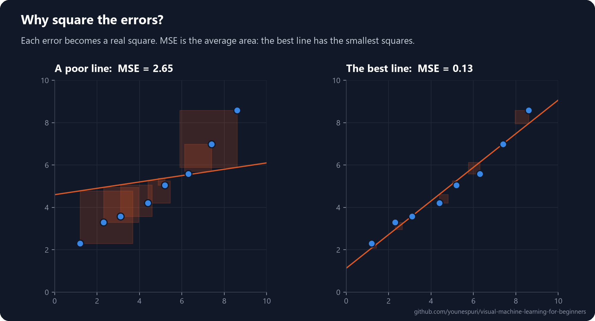

[Course home](../../README.md) · Lesson 02 of 09

# 02 · Linear Regression

**Draw the best straight line through your data, then use it to predict.**

`Beginner` · `~35 min` · [](https://colab.research.google.com/github/younespuri/visual-machine-learning-for-beginners/blob/main/lessons/02-linear-regression/notebook.ipynb)


### What you'll learn

- What linear regression does: find the best straight line for predicting a number.
- What "best" means, using a **loss function** called Mean Squared Error (MSE).
- How a model *learns* that line with **gradient descent**, step by step.
- How to train, use and grade a linear regression model in scikit-learn.

**Before you start:** [Lesson 01](../01-what-is-machine-learning/README.md). Every bit of math is explained right here.

---

## The idea in plain words

You know how long a few friends studied and what they scored on an exam: 1 hour got 50, 3 hours got 70, 5 hours got 90. Put those points on a chart (hours across, score up) and a pattern jumps out: more study, higher score, roughly in a straight line.

A new friend studied for 4 hours and asks, *"What will I get?"* You'd draw a straight line through the points by eye and read off the value at 4 hours. That line is your guess about how study time and score are related.

**Linear regression does exactly this.** It just replaces "by eye" with math, so it finds the *best* possible line and can tell you how good that line is.

## An everyday example

A real-estate agent looks at a few homes that sold in a neighborhood, each with its size and price, and quickly builds a rule of thumb: *"around this much per square meter."* When a new home comes up, they estimate its price from that rule without doing a full calculation. Linear regression turns that gut feeling into something precise you can compute and check.

## How it really works

### The model is just a line

With one input, the model is

$$\text{price} = w \times \text{area} + b$$

- **area** is the input, called a **feature**.
- **w** is the **weight**: the slope of the line, or how much the price goes up per extra m².
- **b** is the **bias**: where the line crosses the price axis.

With more features (area, rooms, age...) it's the same idea with one weight per feature: $\hat{y} = w_1x_1 + w_2x_2 + \dots + w_nx_n + b$. The little hat on $\hat{y}$ means "predicted".

There are endless possible lines. Which **w** and **b** are the *best*?

### How wrong is a line? The loss function

To pick the best line we first need a number that says how *bad* a line is. That number is called the **loss** (or cost). For regression, the most common one is the **Mean Squared Error**:

$$\text{MSE} = \frac{1}{n}\sum_{i=1}^{n}\left(y_i - \hat{y}_i\right)^2$$

In words: for every house, take the gap between the real price and the line's guess, square it, then average all those squares.



Why square the gaps?

- **Positive and negative errors can't cancel out.** A guess that's 100 too high and one that's 100 too low would otherwise add up to zero error.
- **Big mistakes cost much more than small ones.** An error of 10 costs 100, but an error of 30 costs 900. The model works hardest to avoid being badly wrong.

### Learning = finding the line with the smallest loss

"Training" a linear regression model means exactly one thing: **finding the w and b that make the MSE as small as possible.**

The classic way to do it is **gradient descent**. Picture the loss as a valley and the model standing somewhere on its slope:

1. Start with any line (even a terrible one).
2. Measure the loss, and work out which direction is *downhill* for w and for b. That direction is the **gradient**.
3. Take a small step downhill. The size of the step is the **learning rate**.
4. Repeat until the loss stops going down.


You won't usually write this loop yourself; scikit-learn does the optimization for you, often with an exact math shortcut. But it's the same idea that trains almost every model in this course, including huge neural networks. There's a 10-line version in the [bonus section](#bonus--gradient-descent-in-10-lines-of-numpy) below.

### Two ways to grade a regression model

| Metric | What it measures | Range | How to read it |
| --- | --- | --- | --- |
| **MSE** | The average squared gap between prediction and truth | 0 to ∞ | Smaller is better; 0 means perfect predictions |
| **R²** (R-squared) | How much of the variation in *y* the model explains | Usually 0 to 1 (can go below 0) | Close to 1 is a great fit; close to 0 means the model barely helps |

---

## Code it

Open the [notebook in Colab](https://colab.research.google.com/github/younespuri/visual-machine-learning-for-beginners/blob/main/lessons/02-linear-regression/notebook.ipynb) to run everything below without installing anything.

### Step 1 · A tiny dataset: area vs. price

```python
import numpy as np
import pandas as pd

area = np.array([50, 60, 70, 85, 100, 120, 140])          # square meters
price = np.array([540, 560, 780, 790, 1040, 1080, 1340])  # thousands of dollars

df = pd.DataFrame({"area": area, "price": price})
print(df)
#    area  price
# 0    50    540
# 1    60    560
# 2    70    780
# 3    85    790
# 4   100   1040
# 5   120   1080
# 6   140   1340
```

- Bigger homes cost more, roughly in proportion: a nearly linear relationship with a little real-world noise.
- The DataFrame is just for a tidy printout; the model works with the NumPy arrays underneath.

### Step 2 · Fit the model and read w and b

```python
from sklearn.linear_model import LinearRegression

# scikit-learn always wants X as a 2-D table: (n_samples, n_features)
X = area.reshape(-1, 1)
y = price

model = LinearRegression()
model.fit(X, y)

print("w (coef_):", model.coef_)
print("b (intercept_):", model.intercept_)
# w (coef_): [8.756396]
# b (intercept_): 93.89321468298101
```

- `reshape(-1, 1)` turns the 1-D array of shape `(7,)` into a 2-D table of shape `(7, 1)`: 7 rows, 1 feature. Forgetting it is the most common beginner error in scikit-learn.
- `model.fit(X, y)` is where learning happens: it finds the w and b with the lowest MSE.
- The model learned **price ≈ 8.76 × area + 93.9**: each extra m² adds about $8,760.

### Step 3 · Predict prices for new houses

```python
new_areas = np.array([[90], [110], [200]])
predicted = model.predict(new_areas)

for a, p in zip(new_areas.flatten(), predicted):
    print(f"{a} m² -> ${p:,.0f}k")
# 90 m² -> $882k
# 110 m² -> $1,057k
# 200 m² -> $1,845k
```

- `new_areas` must be 2-D too: `predict` expects the same shape of input that `fit` saw.
- Careful with the 200 m² house. It's far outside the training range (50 to 140 m²), and predicting outside the data you've seen, called **extrapolation**, is always less trustworthy.

### Step 4 · How good is the fit?

```python
from sklearn.metrics import mean_squared_error, r2_score

y_pred = model.predict(X)

print("MSE:", round(mean_squared_error(y, y_pred), 1))
print("R²: ", round(r2_score(y, y_pred), 3))
print("model.score:", round(model.score(X, y), 3))
# MSE: 2973.1
# R²:  0.959
# model.score: 0.959
```

- An R² of 0.959 means the line explains about 96% of the variation in price. Area alone predicts price very well here.
- For regression models, `model.score(X, y)` is a shortcut for R².
- We graded the model on the same houses it learned from, which flatters it. A fair grade uses data the model has **never seen**; you'll do that in the mini project, and lesson 08 is all about it.

### See it

```python
import matplotlib.pyplot as plt

xs = np.linspace(40, 150, 100).reshape(-1, 1)
plt.scatter(area, price, label="houses")
plt.plot(xs, model.predict(xs), color="tab:orange", label="model")
plt.xlabel("area (m²)")
plt.ylabel("price ($1,000s)")
plt.legend()
plt.show()
```

### Bonus · Gradient descent in 10 lines of NumPy

This is the learning loop from the animation, written out by hand. It finds the same line as scikit-learn.

```python
x = area / 100          # area in hundreds of m²: small numbers keep learning stable
w, b = 0.0, 0.0         # start with a flat line at zero
lr = 0.5                # learning rate: the size of each step

for step in range(1, 501):
    error = (w * x + b) - price          # how wrong is the line right now?
    w -= lr * 2 * np.mean(error * x)     # nudge w downhill
    b -= lr * 2 * np.mean(error)         # nudge b downhill
    if step in (1, 10, 100, 500):
        print(f"step {step:>3}:  w = {w / 100:5.2f}   b = {b:6.1f}   MSE = {np.mean(error ** 2):9,.0f}")
# step   1:  w =  8.62   b =  875.7   MSE =   840,186
# step  10:  w =  5.46   b =  245.3   MSE =    44,376
# step 100:  w =  8.73   b =   96.2   MSE =     2,974
# step 500:  w =  8.76   b =   93.9   MSE =     2,973
```

- `2 * np.mean(error * x)` and `2 * np.mean(error)` are the slopes of the MSE valley with respect to w and b. That's the gradient.
- The loss drops from 840,186 to 2,973, and w and b land on the exact values scikit-learn found.
- Try `lr = 2.0`: the steps are too big, the model jumps over the valley, and the loss explodes. Picking a good learning rate matters.

---

## Where you'll see it in the real world

Linear regression is the simplest model in machine learning, and it's still everywhere: pricing homes and cars from their features, forecasting next month's sales from past trends, estimating salaries from experience and education, and spotting trends in financial and economic data.

It even hides inside deep learning. The last layer of many neural networks is a weighted sum of its inputs plus a bias: a linear regression. What makes deep networks more powerful is stacking many of these layers with non-linear functions in between, so they can learn curves and patterns that no single straight line can.

## Common mistakes

- **Forgetting `reshape(-1, 1)` for a single feature.** scikit-learn always wants a 2-D `X` of shape `(n_samples, n_features)`, even with one feature.
- **Expecting a line to fit every relationship.** If the true pattern is a curve, a straight line will always miss by a lot. Plot your data first.
- **Mixing features on very different scales.** If one feature runs from 0 to 1 and another from 0 to 100,000, scale them first. It matters a lot for gradient descent, and you'll see more of it in lesson 05.
- **Grading the model on its own training data.** It makes the model look better than it is. Always test on data it hasn't seen.

## Remember

- Linear regression finds the best line (or plane, with more features) to predict a **number**: $\hat{y} = w \cdot x + b$.
- A **loss function** turns "how bad is this line?" into a number. MSE averages the squared errors, so big mistakes weigh the most.
- **Training** means finding the w and b with the lowest loss. Gradient descent does it by repeatedly stepping downhill.
- In scikit-learn: `fit` trains, `predict` predicts, and `coef_` and `intercept_` hold the learned w and b.
- Grade regression with MSE or R², and always on data the model hasn't seen.

## Practice

**Easy.** Using this lesson's houses, fit a `LinearRegression` and print the predicted price of a 75 m² home.

**Medium.** Compute the MSE by hand, without `sklearn.metrics`: subtract, square, average. Check that you get exactly the same number as `mean_squared_error`.

**Hard.** Add an outlier to the data, such as a 60 m² home priced at $2,000k. Refit, then compare the new `coef_`, `intercept_` and R² with the old ones. Explain why one weird point can drag the whole line.

### Mini project

Invent a dataset of 15 to 20 homes, each with an **area**, a **number of rooms** and a **price**. Build the price from a formula plus random noise so the relationship isn't perfect, for example `price = 9.5 * area + 25 * rooms + noise`.

1. Split the data into training and test sets with `train_test_split` from `sklearn.model_selection` (80% / 20%).
2. Fit a `LinearRegression` on the training set only.
3. Report MSE and R² on the **test** set, the data the model has never seen.
4. Predict the price of a 150 m², 3-room home.

Your numbers will differ from anyone else's because of the random noise. That's expected.

## Check yourself

<details>
<summary><b>1.</b> What is the formula of a one-feature linear regression model, and what do w and b mean?</summary>

$\hat{y} = w \times x + b$. The weight **w** is the slope, meaning how much the prediction changes when x goes up by one. The bias **b** is the prediction when x is zero, where the line crosses the y-axis.
</details>

<details>
<summary><b>2.</b> Why does MSE square the errors instead of just adding them up?</summary>

Adding raw errors lets positive and negative ones cancel out, so a very wrong model could score zero. Squaring makes every error count as positive and punishes big errors far more than small ones.
</details>

<details>
<summary><b>3.</b> What exactly does it mean to "train" a linear regression model?</summary>

It means finding the values of w and b that make the loss (MSE) as small as possible on the training data, for example with gradient descent: repeatedly nudging w and b in the direction that lowers the loss.
</details>

<details>
<summary><b>4.</b> Why do we reshape X before calling <code>LinearRegression.fit</code>?</summary>

scikit-learn expects `X` to be a 2-D table of shape `(n_samples, n_features)`. A single feature stored as a 1-D array has to become one column, which is what `reshape(-1, 1)` does.
</details>

<details>
<summary><b>5.</b> Why can grading a model on its own training data be misleading?</summary>

The model has already seen those exact answers, so its score shows how well it memorized them, not how well it will do on new data. Only data it has never seen gives an honest grade.
</details>

---

[← 01 · What is machine learning?](../01-what-is-machine-learning/README.md) · [Course home](../../README.md) · [03 · Logistic regression →](../03-logistic-regression/README.md)
