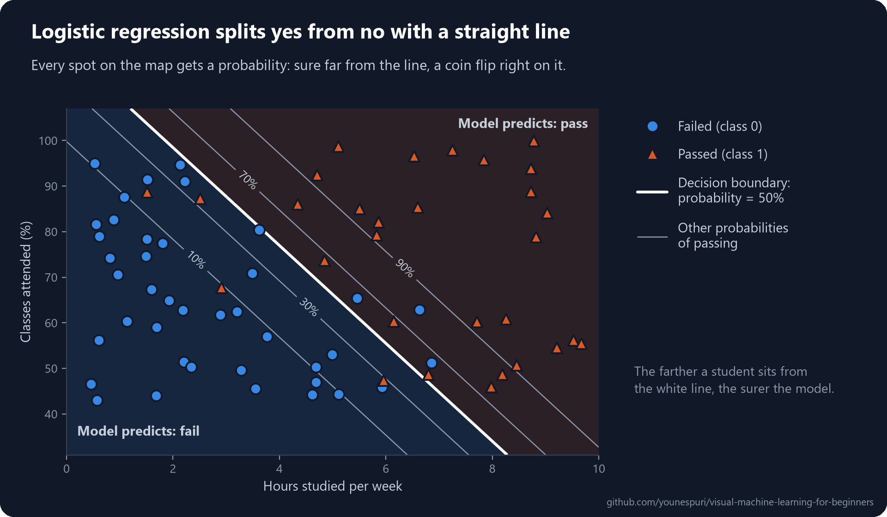
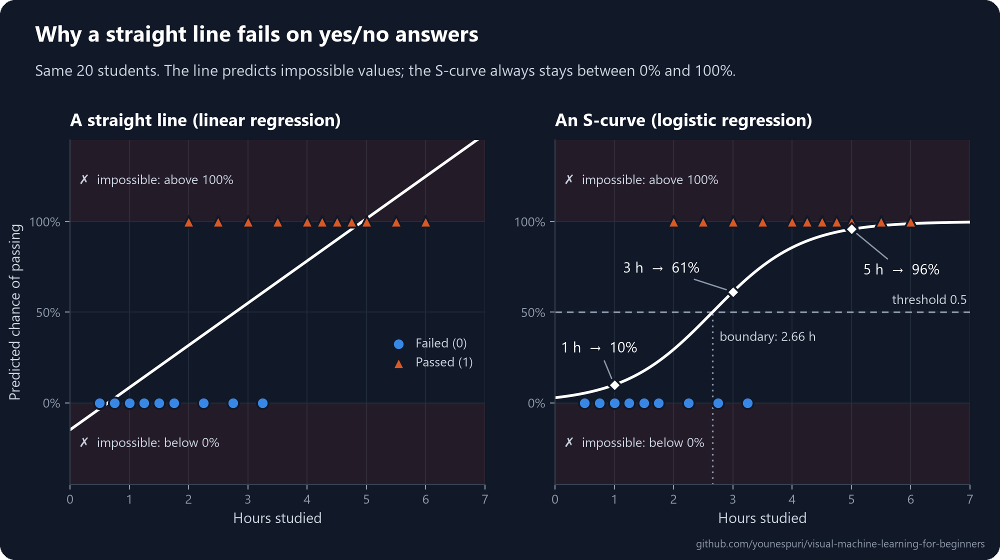
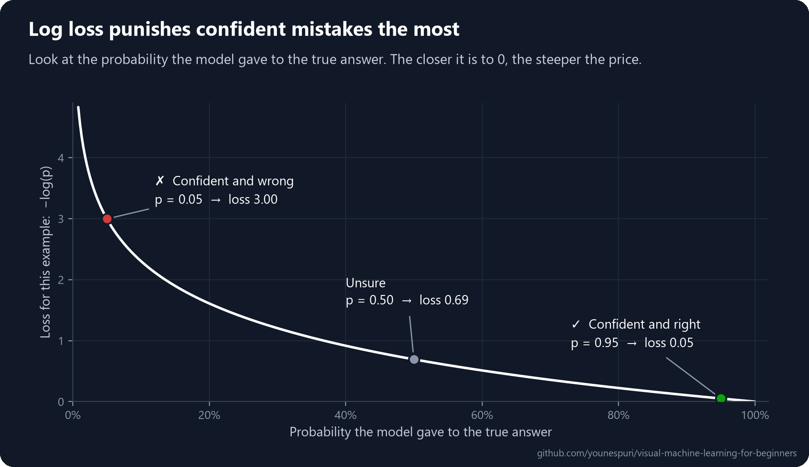
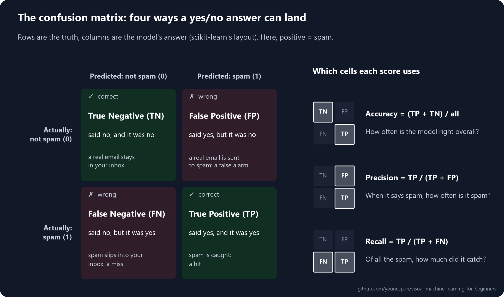
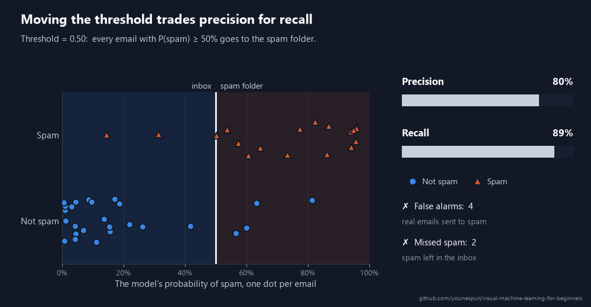

[Course home](../../README.md) · Lesson 03 of 09

# 03 · Logistic Regression and the Confusion Matrix, Explained Visually

**Answer yes-or-no questions with a probability, then grade those answers honestly.**

`Beginner` · `~45 min` · [](https://colab.research.google.com/github/younespuri/visual-machine-learning-for-beginners/blob/main/lessons/03-logistic-regression/notebook.ipynb)



### What you'll learn

- Why a straight line can't answer yes/no questions, and how the **sigmoid** turns a score into a probability.
- How a **threshold** turns that probability into a decision, and what the **decision boundary** is.
- How the model learns by making its **log loss** as small as possible.
- How to grade any classifier with the **confusion matrix**, **precision**, **recall** and **F1**, and why **accuracy** alone can fool you.

**Before you start:** [Lesson 02](../02-linear-regression/README.md), because logistic regression builds on its straight line and its idea of a loss. Every new bit of math is explained right here.

---

## The idea in plain words

In lesson 02 you predicted a number: a price. But lots of questions have only two possible answers. Will this student pass? Is this email spam? Is this tumor cancerous? Predicting which group something belongs to is called **classification**, and each group is a **class**. With two classes, we call one **positive** (1, the thing we're looking for) and the other **negative** (0).

**Logistic regression** is the classic way to answer them. Don't let the name fool you: it's a classification method, not a way to predict numbers. And it doesn't just blurt out yes or no. It tells you how likely *yes* is: *"82% chance this email is spam."* Then a cut-off called the **threshold**, usually 50%, turns that probability into a decision.

Under the hood it's a small upgrade of lesson 02. It computes the same kind of straight-line score, then squeezes it into the range 0 to 1 so it can be read as a probability.

Once a model makes yes/no decisions, it will sometimes be wrong, and the *kind* of mistake matters. Think of a smoke detector. Make it too sensitive and it shrieks every time you make toast. Make it too relaxed and it might sleep through a real fire. The second half of this lesson gives you the numbers to measure exactly that.

## An everyday example

Your email's spam filter works just like this. For every incoming email it computes a probability, say *"92% spam"*, and anything above the threshold goes to the spam folder.

Now compare two mistakes. A promo email slips into your inbox: mildly annoying, you delete it. A job offer lands in spam and you never see it: that's a disaster. Both count as one mistake, but they're not equally bad. That's why "what share of the answers were right" (**accuracy**) is not enough. You need to know *which kind* of mistakes a model makes, and what each one costs you.

## How it really works

### Why a straight line fails

Here's a small dataset: 20 students, how many hours each one studied, and whether they passed (1) or failed (0). What happens if you fit lesson 02's linear regression to it?



The line goes up with study time, which sounds right. But look at what it predicts:

- Below about 40 minutes of study it predicts **less than 0%**, and past about 5 hours **more than 100%**. A "−10% chance of passing" makes no sense.
- The data looks like a *step*: mostly 0s, then mostly 1s. A straight line is simply the wrong shape to follow a step.

You need a curve that stays between 0 and 1 and bends like the data: an **S-curve**. That's the right panel, and it's what logistic regression draws.

### The sigmoid turns a score into a probability

Logistic regression works in two steps:

1. Compute a **score** exactly like linear regression: $z = w \cdot x + b$. The score can be any number, from hugely negative to hugely positive.
2. Squash the score with the **sigmoid** function, which turns any number into a value between 0 and 1:

$$\sigma(z) = \frac{1}{1 + e^{-z}}$$

Here $e$ is a math constant, about 2.718. You don't need to love the formula; just look at what it does:

| Score $z$ | −4 | −2 | 0 | 2 | 4 |
| --- | --- | --- | --- | --- | --- |
| Probability $\sigma(z)$ | 0.02 | 0.12 | 0.50 | 0.88 | 0.98 |

- A big positive score gives a probability close to 1: *almost surely yes*.
- A big negative score gives a probability close to 0: *almost surely no*.
- A score of exactly 0 gives 0.5: *a coin flip*.

The result is the model's **probability** that the example belongs to class 1. For the students, the model learns the score $z = 1.33 \times \text{hours} - 3.54$, and the sigmoid of that score is the S-curve in the right panel above.

### The threshold turns a probability into a decision

A probability isn't a decision yet. To get a yes/no answer, you pick a **threshold**: predict 1 if the probability is at least the threshold, otherwise predict 0. The default is 0.5.

| Hours studied | Score $z$ | P(pass) | Decision at 0.5 | Decision at 0.7 |
| --- | --- | --- | --- | --- |
| 1 | −2.21 | 0.10 | fail (0) | fail (0) |
| 3 | 0.46 | 0.61 | pass (1) | fail (0) |
| 5 | 3.12 | 0.96 | pass (1) | pass (1) |

The 0.5 isn't sacred. Raise the threshold and the model says *yes* only when it's very sure. Lower it and the model says *yes* more easily. Which way to move it depends on which mistake costs you more, as you'll see below.

### The decision boundary

The probability is exactly 0.5 when the score is exactly 0. So the threshold draws a dividing line through your data, called the **decision boundary**: on one side the model predicts 1, on the other side 0.

- With one feature, the boundary is a single point. For the students, the score is 0 at $\text{hours} = -b / w \approx 2.66$: study more than about 2 hours 40 minutes and the model predicts a pass.
- With two features, it's a straight line, like the white line in the diagram at the top of this lesson. With three features it's a flat plane, and so on.
- The farther a point sits from the boundary, the more confident the model is. Right on the boundary, it's a coin flip.

Because the score is a straight-line formula, the boundary is always straight. That makes logistic regression a **linear classifier**: great when the classes can be split with a straight cut, weak when they can't. You'll meet models that draw other shapes in lessons 04 and 05.

### How it learns: log loss

Training works just like in lesson 02: find the w and b that make a **loss** as small as possible. But MSE is a poor fit for probabilities, so logistic regression uses **log loss** (also called **cross-entropy**).

The idea is simple. For each example, look at the probability the model gave to the *true* answer, and take minus its logarithm.



| Probability given to the true answer | 0.99 | 0.9 | 0.5 | 0.1 | 0.01 |
| --- | --- | --- | --- | --- | --- |
| Log loss | 0.01 | 0.11 | 0.69 | 2.30 | 4.61 |

- **Confident and right** costs almost nothing.
- **Unsure** costs a bit.
- **Confident and wrong** costs a lot, and the cost keeps growing without limit as the probability heads to 0. Log loss punishes overconfident mistakes the hardest.

Averaged over all $n$ examples, where $p_i$ is the predicted probability of class 1 and $y_i$ is the true label (0 or 1):

$$\text{Log loss} = -\frac{1}{n}\sum_{i=1}^{n}\Big[y_i \log(p_i) + (1 - y_i)\log(1 - p_i)\Big]$$

It looks scary, but it's the same idea. When $y_i = 1$ only the first term is switched on, giving $-\log(p_i)$. When $y_i = 0$ only the second one is, giving $-\log(1 - p_i)$. Either way, it's minus the log of the probability given to the true answer.

Unlike linear regression, there's no exact shortcut formula for the best w and b, so the model always finds them step by step, with gradient descent or a smarter cousin of it. The good news: log loss is shaped like a smooth bowl, with no false valleys to get stuck in, so the search reliably finds the best w and b.

### Grading a classifier: the confusion matrix

To grade a classifier, first sort its answers into four buckets. The 2×2 table of those counts is called the **confusion matrix**. Here is its layout in scikit-learn: rows are the truth, columns are the model's answer, and class 0 comes first.

| | Predicted 0 (no) | Predicted 1 (yes) |
| --- | --- | --- |
| **Actually 0 (no)** | True Negative (TN) | False Positive (FP) |
| **Actually 1 (yes)** | False Negative (FN) | True Positive (TP) |

- **True Positive (TP):** said yes, and it was yes. A hit.
- **True Negative (TN):** said no, and it was no. A correct all-clear.
- **False Positive (FP):** said yes, but it was no. A **false alarm**: the smoke detector going off over toast.
- **False Negative (FN):** said no, but it was yes. A **miss**: sleeping through the fire.

A trick for the names: the second word is what the model *said* (positive or negative), and the first word is whether it was *right* (true or false).



### Four scores from four cells

| Metric | Formula | The question it answers |
| --- | --- | --- |
| **Accuracy** | (TP + TN) / everything | What share of all the answers were right? |
| **Precision** | TP / (TP + FP) | When the model says yes, how often is it right? |
| **Recall** | TP / (TP + FN) | Of all the real yeses, how many did the model find? |
| **F1 score** | 2 × precision × recall / (precision + recall) | One number that balances precision and recall |

- **Precision** looks only at the model's *yes* answers (the right-hand column). It's about trust: can you believe a *yes*?
- **Recall** looks only at the real *yes* cases (the bottom row). It's about coverage: did you catch them all? Doctors call it **sensitivity**.
- **F1** is the **harmonic mean** of the two: a kind of average that stays low unless *both* are high. With a precision of 1.0 and a recall of 0.0, the plain average is 0.5, but F1 is 0.

### Why accuracy can lie

Picture a rare disease that affects 1 person in 100. A "model" that always says *healthy*, without even looking at the patient, is right 99% of the time. That's 99% accuracy! Yet it finds zero sick people, so its recall is 0%.

Data where one class is much rarer than the other is called **imbalanced**, and it's everywhere: fraud, rare diseases, factory defects. On imbalanced data, never trust accuracy alone. Check precision and recall for the rare class, and compare your model against a do-nothing baseline like this one. You'll build exactly this trap in the code below.

### Precision or recall? Move the threshold

You usually can't max out both at once. **Lower the threshold** and the model says yes more easily: it catches more real positives (recall goes up) but raises more false alarms (precision goes down). **Raise the threshold** and the opposite happens.



Which one matters more depends on what each mistake costs:

| Problem | The costlier mistake | Favor |
| --- | --- | --- |
| Spam filter | FP: an important email gets hidden in spam | Precision |
| Disease screening | FN: a sick patient is sent home | Recall |
| Fraud detection | Both: missed fraud costs money, blocked cards anger customers | F1, or a carefully tuned threshold |

One more score grades the model across *every* threshold at once: **ROC-AUC**. It measures how well the model *ranks* examples, before you ever pick a threshold. A score of 0.5 means no better than a coin flip; 1.0 means every positive gets a higher probability than every negative. In Step 8 below you'll see all of this on real cancer data.

---

## Code it

Open the [notebook in Colab](https://colab.research.google.com/github/younespuri/visual-machine-learning-for-beginners/blob/main/lessons/03-logistic-regression/notebook.ipynb) to run everything below without installing anything.

### Step 1 · Pass or fail: fit the model

```python
import numpy as np
from sklearn.linear_model import LogisticRegression

# Hours each of 20 students studied, and whether they passed (1) or failed (0)
hours = np.array([0.5, 0.75, 1.0, 1.25, 1.5, 1.75, 2.0, 2.25, 2.5, 2.75,
                  3.0, 3.25, 3.5, 4.0, 4.25, 4.5, 4.75, 5.0, 5.5, 6.0])
passed = np.array([0, 0, 0, 0, 0, 0, 1, 0, 1, 0,
                   1, 0, 1, 1, 1, 1, 1, 1, 1, 1])

X = hours.reshape(-1, 1)   # scikit-learn wants a 2-D table: (n_samples, n_features)
y = passed

model = LogisticRegression()
model.fit(X, y)

print("w (coef_):", model.coef_)
print("b (intercept_):", model.intercept_)
# w (coef_): [[1.33189817]]
# b (intercept_): [-3.53787376]
```

- The target `y` holds only 0s and 1s (fail or pass), not a continuous number like a price. That's what makes this a classification problem.
- `fit` finds the w and b with the lowest log loss. The model learned the score **z = 1.33 × hours − 3.54**: each extra hour of study adds 1.33 to the score.
- `coef_` comes back as a 2-D array with one weight per feature. With a single feature, that's just one number.

### Step 2 · Probabilities first, decisions second

```python
new_hours = np.array([[1.0], [3.0], [5.0]])

proba = model.predict_proba(new_hours)   # one column per class: [P(fail), P(pass)]
labels = model.predict(new_hours)        # the final 0/1 answer

print(proba.round(2))
for h, p, label in zip(new_hours.ravel(), proba[:, 1], labels):
    print(f"{h} hours -> P(pass) = {p:.2f} -> predicted class {label}")
# [[0.9  0.1 ]
#  [0.39 0.61]
#  [0.04 0.96]]
# 1.0 hours -> P(pass) = 0.10 -> predicted class 0
# 3.0 hours -> P(pass) = 0.61 -> predicted class 1
# 5.0 hours -> P(pass) = 0.96 -> predicted class 1
```

- `predict_proba` returns one column per class, and each row adds up to 1. Column 1, `proba[:, 1]`, is the probability of the positive class: passing.
- `predict` applies the 0.5 threshold for you: 0.10 becomes a fail, while 0.61 and 0.96 become a pass.
- 0.61 and 0.96 are both a "pass", but the model is much surer about the second one. `predict` throws that information away; `predict_proba` keeps it.

### Step 3 · Open the box: score, sigmoid, threshold

```python
def sigmoid(z):
    return 1 / (1 + np.exp(-z))

w, b = model.coef_[0, 0], model.intercept_[0]

score = w * new_hours.ravel() + b     # 1. a straight-line score, as in lesson 02
prob = sigmoid(score)                 # 2. squash it into a probability
decision = (prob >= 0.5).astype(int)  # 3. apply the threshold

print("scores:       ", score.round(2))
print("probabilities:", prob.round(2))
print("decisions:    ", decision)
print("with a 0.7 threshold:", (prob >= 0.7).astype(int))
print("decision boundary: hours =", round(-b / w, 2))
# scores:        [-2.21  0.46  3.12]
# probabilities: [0.1  0.61 0.96]
# decisions:     [0 1 1]
# with a 0.7 threshold: [0 0 1]
# decision boundary: hours = 2.66
```

- Three short lines reproduce `predict_proba` and `predict` exactly. Logistic regression really is *straight-line score → sigmoid → threshold*.
- With a stricter threshold of 0.7, the 3-hour student (61%) is now predicted to fail. Same probabilities, different decisions.
- The score is 0 (a probability of exactly 0.5) at hours = −b / w ≈ 2.66. That point is the decision boundary for one feature.

### Step 4 · Log loss: grading the probabilities

```python
from sklearn.metrics import log_loss

# A student who really passed (y = 1), and three possible predictions
for p in [0.95, 0.5, 0.05]:
    print(f"P(pass) = {p:.2f}  ->  loss = {-np.log(p):.2f}")

print("our model:        ", round(log_loss(y, model.predict_proba(X)[:, 1]), 3))
print("always guess 0.55:", round(log_loss(y, np.full(len(y), 0.55)), 3))
# P(pass) = 0.95  ->  loss = 0.05
# P(pass) = 0.50  ->  loss = 0.69
# P(pass) = 0.05  ->  loss = 3.00
# our model:         0.325
# always guess 0.55: 0.688
```

- For one example, log loss is minus the log of the probability given to the true answer. Being 95% sure and right costs 0.05; being 95% sure and wrong costs 3.00, sixty times more.
- `log_loss` averages that over every student. It takes probabilities (from `predict_proba`), not 0/1 labels.
- A lazy guess that ignores study time and always says 0.55 (the share of students who passed: 11 of 20) scores 0.688. Our model's 0.325 is far better. Lower is better, and 0 would be perfect.

### Step 5 · A real problem: finding malignant tumors

```python
from sklearn.datasets import load_breast_cancer
from sklearn.model_selection import train_test_split
from sklearn.pipeline import make_pipeline
from sklearn.preprocessing import StandardScaler

data = load_breast_cancer()
X_all = data.data           # 569 tumors, 30 measurements each
y_all = 1 - data.target     # flip the labels so that 1 = malignant, the case we must catch

X_train, X_test, y_train, y_test = train_test_split(
    X_all, y_all, test_size=0.25, stratify=y_all, random_state=42)

cancer_model = make_pipeline(StandardScaler(), LogisticRegression())
cancer_model.fit(X_train, y_train)
y_pred = cancer_model.predict(X_test)

print("train:", X_train.shape, "| test:", X_test.shape)
print("malignant tumors in the test set:", y_test.sum())
# train: (426, 30) | test: (143, 30)
# malignant tumors in the test set: 53
```

- `load_breast_cancer` is a real medical dataset that ships with scikit-learn: 30 measurements of cell nuclei (size, texture, smoothness...) computed from microscope images of 569 breast tumor samples. Its labels say 0 = malignant and 1 = benign, so we flip them. The **positive** class should be the thing you're hunting for.
- `train_test_split` hides 25% of the tumors in a **test set**. The model never sees them during training, so they give an honest grade. `stratify=y_all` keeps the same share of malignant tumors in both parts, and `random_state` fixes the shuffle so you get the same numbers as here.
- `StandardScaler` puts every feature on a similar scale so training runs smoothly, and `make_pipeline` glues it to the model so that `fit` and `predict` run both steps. More on scaling in lesson 05.

### Step 6 · The confusion matrix

```python
from sklearn.metrics import confusion_matrix

cm = confusion_matrix(y_test, y_pred)
print(cm)

tn, fp, fn, tp = cm.ravel()
print(f"TN={tn}  FP={fp}  FN={fn}  TP={tp}")
# [[89  1]
#  [ 4 49]]
# TN=89  FP=1  FN=4  TP=49
```

- Rows are the truth and columns are the prediction, class 0 first: the same layout as the diagram above.
- `cm.ravel()` unrolls the table into TN, FP, FN, TP, in that order.
- 138 of the 143 tumors are classified correctly. But the 5 mistakes are not equal: 1 false alarm (a benign tumor flagged, which costs an extra test) and 4 missed cancers (which could cost a life).

### Step 7 · Accuracy, precision, recall and F1

```python
from sklearn.metrics import accuracy_score, precision_score, recall_score, f1_score
from sklearn.metrics import classification_report

print(f"accuracy:  {accuracy_score(y_test, y_pred):.3f}")
print(f"precision: {precision_score(y_test, y_pred):.3f}")
print(f"recall:    {recall_score(y_test, y_pred):.3f}")
print(f"F1:        {f1_score(y_test, y_pred):.3f}")
print()
print(classification_report(y_test, y_pred, target_names=["benign", "malignant"]))
# accuracy:  0.965
# precision: 0.980
# recall:    0.925
# F1:        0.951
#
#               precision    recall  f1-score   support
#
#       benign       0.96      0.99      0.97        90
#    malignant       0.98      0.92      0.95        53
#
#     accuracy                           0.97       143
#    macro avg       0.97      0.96      0.96       143
# weighted avg       0.97      0.97      0.96       143
```

- Precision 0.980: when the model says *malignant*, it's right 98% of the time (49 of 50).
- Recall 0.925: it found 49 of the 53 malignant tumors and missed 4. For a cancer screen, that's the number to worry about.
- `classification_report` shows precision, recall and F1 for *each* class, plus the **support**: how many test examples each class has. It's the quickest way to see everything at once.

### Step 8 · Move the threshold

```python
from sklearn.metrics import roc_auc_score

p_malignant = cancer_model.predict_proba(X_test)[:, 1]   # P(malignant) for each test tumor

for t in [0.1, 0.3, 0.5, 0.7, 0.9]:
    pred_t = (p_malignant >= t).astype(int)
    _, false_alarms, missed, _ = confusion_matrix(y_test, pred_t).ravel()
    print(f"threshold {t}:  precision {precision_score(y_test, pred_t):.2f}   "
          f"recall {recall_score(y_test, pred_t):.2f}   "
          f"false alarms {false_alarms}   missed cancers {missed}")

print("ROC-AUC:", round(roc_auc_score(y_test, p_malignant), 3))
# threshold 0.1:  precision 0.90   recall 0.98   false alarms 6   missed cancers 1
# threshold 0.3:  precision 0.98   recall 0.96   false alarms 1   missed cancers 2
# threshold 0.5:  precision 0.98   recall 0.92   false alarms 1   missed cancers 4
# threshold 0.7:  precision 1.00   recall 0.91   false alarms 0   missed cancers 5
# threshold 0.9:  precision 1.00   recall 0.81   false alarms 0   missed cancers 10
# ROC-AUC: 0.996
```

- Lowering the threshold makes the model say *malignant* more easily: recall rises (fewer missed cancers) and precision falls (more false alarms). Raising it does the opposite.
- For cancer screening, a false alarm means an extra test, while a miss can cost a life. So a low threshold, like 0.3 or even 0.1, is the sensible choice here.
- In a real project, pick the threshold on data set aside for that job, not on the test set, or the test grade stops being honest. Lesson 08 shows how.
- A ROC-AUC of 0.996 means that for a random malignant tumor and a random benign one, the model gives the malignant one the higher probability 99.6% of the time.

### Step 9 · The accuracy trap

```python
from sklearn.dummy import DummyClassifier

# A rare disease: only 2 of 200 people are sick (1%)
y_rare = np.zeros(200, dtype=int)
y_rare[:2] = 1
X_rare = np.zeros((200, 1))    # this "model" ignores the features anyway

lazy = DummyClassifier(strategy="most_frequent")   # always answers the most common class
lazy.fit(X_rare, y_rare)
y_lazy = lazy.predict(X_rare)

print("accuracy:", accuracy_score(y_rare, y_lazy))
print("recall:  ", recall_score(y_rare, y_lazy))
print(confusion_matrix(y_rare, y_lazy))
# accuracy: 0.99
# recall:   0.0
# [[198   0]
#  [  2   0]]
```

- `DummyClassifier` learns nothing: it always answers "healthy", the most common class. That makes it a useful **baseline**, a floor that any real model has to beat.
- 99% accuracy, yet a recall of 0. The confusion matrix shows why: TP = 0, and both sick people land in FN.
- On imbalanced data, never trust accuracy alone. Check precision and recall for the rare class, and compare against a baseline like this one.

### See it

```python
import matplotlib.pyplot as plt
from sklearn.metrics import ConfusionMatrixDisplay

# The S-curve the student model learned
xs = np.linspace(0, 7, 200).reshape(-1, 1)
plt.scatter(hours, passed, label="students (1 = passed)")
plt.plot(xs, model.predict_proba(xs)[:, 1], color="tab:orange", label="P(pass)")
plt.axhline(0.5, color="gray", linestyle="--", label="threshold 0.5")
plt.xlabel("hours studied")
plt.ylabel("probability of passing")
plt.legend()
plt.show()

# The cancer model's confusion matrix from Step 6, drawn as a picture
ConfusionMatrixDisplay.from_predictions(y_test, y_pred, display_labels=["benign", "malignant"])
plt.show()
```

---

## Where you'll see it in the real world

Logistic regression is often the first model people try on any yes/no problem. It's fast, works with little data, and its weights are easy to explain, which matters when a decision has to be justified. You'll find it in credit scoring (will this loan be repaid?), medical risk scores, spam filters, and in predicting whether someone will click an ad or cancel a subscription.

It also lives inside deep learning. Many neural networks that answer yes/no questions end with a sigmoid and are trained with log loss. That last step is a logistic regression.

The grading tools travel even further. Every classifier in the rest of this course, starting with decision trees in lesson 04, gets graded with the same confusion matrix, precision, recall and F1. And choosing between them always comes down to costs: a cancer screen favors recall, a spam filter favors precision, and fraud detection needs a careful balance.

## Common mistakes

- **Thinking "regression" means it predicts numbers.** Despite the name, logistic regression is a classifier.
- **Trusting accuracy on imbalanced data.** A model that always predicts the common class can score 99% and still be useless. Check precision and recall on the rare class.
- **Mixing up precision and recall.** Precision starts from the model's *yes* answers: "of everything I flagged, how much was right?" Recall starts from the real *yes* cases: "of everything that was really there, how much did I find?"
- **Using the 0.5 threshold without thinking.** If one kind of mistake costs far more than the other, move the threshold.
- **Ignoring `predict_proba`.** A 51% yes and a 99% yes look identical after `predict`. The probability tells you how sure the model is.
- **Getting the positive class backwards.** `precision_score` and `recall_score` grade class 1 by default. In `load_breast_cancer`, 1 means *benign*, which is why the code flips the labels.

## Remember

- Logistic regression is a **classifier**. It predicts the probability of class 1, and a **threshold** (0.5 by default) turns that into a yes/no answer.
- Inside, a straight-line score $z = w \cdot x + b$ goes through the **sigmoid** $\sigma(z) = 1 / (1 + e^{-z})$, which squashes it between 0 and 1.
- The **decision boundary** is where the probability is exactly 0.5. It's always straight: a point, a line, a plane.
- Training minimizes **log loss**, which punishes confident mistakes the hardest.
- The **confusion matrix** counts TP, FP, FN and TN. **Precision** = TP / (TP + FP), **recall** = TP / (TP + FN), and **F1** balances the two.
- Accuracy can lie on imbalanced data. Decide which mistake costs more, then move the threshold to trade precision for recall.

## Practice

**Easy.** A new student studied for 2 hours. Using this lesson's student `model`, print both `predict` and `predict_proba` for them. How sure is the model?

**Medium.** Build the confusion matrix of the student model on its own 20 students. Then compute precision and recall by hand from TP, FP and FN, without `precision_score` or `recall_score`. Check that you get the same numbers as scikit-learn.

**Hard.** Make an imbalanced dataset with `make_classification(n_samples=1000, weights=[0.95], random_state=0)` from `sklearn.datasets`: about 95% class 0 and 5% class 1. Split it into training and test sets, then train a `DummyClassifier(strategy="most_frequent")` and a `LogisticRegression`. Compare their accuracy and recall on the test set. What does that tell you about trusting accuracy?

### Mini project

Build a full report card for a classifier.

1. Invent 200 students with two features: **hours studied** (0 to 10) and **classes attended** (40% to 100%). Decide who passes with a formula plus random noise, for example `score = 0.8 * hours + 0.06 * attendance - 8 + noise` with `noise = rng.normal(0, 1.5, 200)`, and `passed = score > 0`.
2. Split the students into training and test sets (75% / 25%, with `stratify`).
3. Fit a `LogisticRegression` on the training set only.
4. On the test set, print the confusion matrix and the full `classification_report`.
5. Plot the students and draw the decision boundary, like the diagram at the top of this lesson. Hint: the boundary is where $w_1 x_1 + w_2 x_2 + b = 0$; solve it for attendance.
6. Imagine this model decides university admissions. Write one sentence on whether precision or recall matters more, and why. Hint: compare the cost of rejecting a student who would have succeeded with the cost of admitting one who isn't ready.

Your numbers will differ from anyone else's because of the random noise. That's expected.

## Check yourself

<details>
<summary><b>1.</b> Why is logistic regression a classification method, despite its name?</summary>

It predicts the probability that an example belongs to class 1, and a threshold turns that probability into a class label. The "regression" in its name comes from the straight-line score inside it, the same $w \cdot x + b$ as in linear regression, not from what it predicts.
</details>

<details>
<summary><b>2.</b> What does the sigmoid do, and why does logistic regression need it?</summary>

It squashes any score, from hugely negative to hugely positive, into a number between 0 and 1. Without it, the straight-line score could be −3 or 7, which can't be read as a probability. A score of 0 becomes exactly 0.5.
</details>

<details>
<summary><b>3.</b> What's the difference between <code>predict()</code> and <code>predict_proba()</code>?</summary>

`predict_proba` returns the probability of each class, and each row adds up to 1. `predict` returns the final label after applying the 0.5 threshold. The probability also tells you how sure the model is, which the label hides.
</details>

<details>
<summary><b>4.</b> What does log loss punish the most, and why is that useful?</summary>

Confident mistakes: giving a tiny probability to the answer that turns out to be true. Since $-\log(p)$ shoots up as $p$ approaches 0, the model is pushed to be honest about its uncertainty and to be sure only when the evidence supports it.
</details>

<details>
<summary><b>5.</b> Why can a high accuracy be misleading on a rare-disease problem?</summary>

If only 1% of patients are sick, a model that always says "healthy" gets 99% accuracy while finding none of the sick patients: its recall is 0. Accuracy is dominated by the common class. Precision and recall on the rare class show what's really going on.
</details>

<details>
<summary><b>6.</b> Why does a spam filter usually favor precision, while disease screening favors recall? And how would you push a model toward recall?</summary>

For a spam filter, the costly mistake is a false positive: a real email hidden in spam. Precision measures how many flagged emails really are spam. For disease screening, the costly mistake is a false negative: a sick patient sent home. Recall measures how many sick patients get found. To push a model toward recall, lower its threshold.
</details>

---

[← 02 · Linear regression](../02-linear-regression/README.md) · [Course home](../../README.md) · [04 · Decision trees and random forests →](../04-decision-trees-and-random-forests/README.md)
