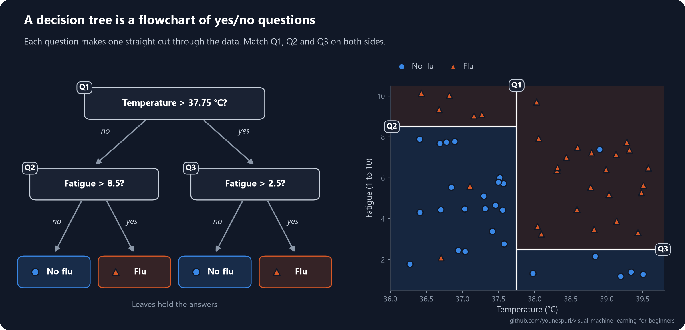
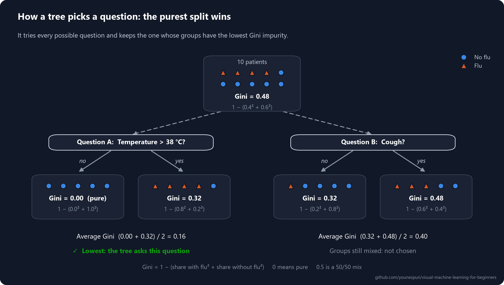
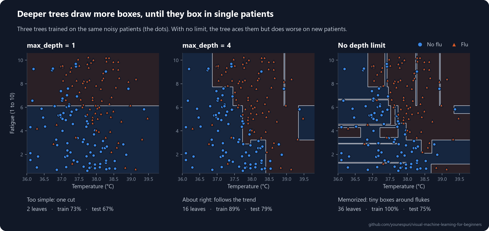
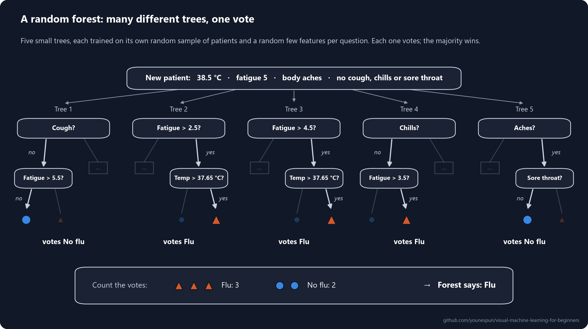

[Course home](../../README.md) · Lesson 04 of 09

# 04 · Decision Trees vs. Random Forests, Explained Visually

**Ask a few yes/no questions to reach an answer, then let a whole forest of trees vote on it.**

`Beginner` · `~40 min` · [](https://colab.research.google.com/github/younespuri/visual-machine-learning-for-beginners/blob/main/lessons/04-decision-trees-and-random-forests/notebook.ipynb)



### What you'll learn

- How a **decision tree** reaches a prediction with a chain of yes/no questions, and why it's so easy to read.
- How the tree picks each question, using a purity score called **Gini impurity**.
- Why a tree that grows too deep memorizes its training data, and how `max_depth` reins it in.
- How a **random forest** trains many different trees and lets them vote, and why that usually beats a single tree.
- How to train, draw and read trees in scikit-learn, including which features they leaned on.

**Before you start:** [Lesson 03](../03-logistic-regression/README.md), where you met classification and accuracy. The only math here is fractions and squares, all worked out below.

---

## The idea in plain words

Remember the game 20 Questions? Instead of guessing the answer in one go, you ask a string of yes/no questions. Each answer rules out part of the possibilities, until only one answer is left.

A doctor does something similar in their head: *"Is the temperature above 38 °C? Yes. Is there a cough too? Yes. Then it's probably the flu."* A **decision tree** is exactly that: a flowchart of yes/no questions that ends in an answer.

Linear and logistic regression boil what they learned down to a list of numeric weights. A tree's knowledge is a flowchart you can read, check and explain to anyone, which makes it one of the most human-readable models in machine learning.

There's a catch. Let a single tree ask as many questions as it likes and it gets obsessive: it asks ever more specific questions, until each one fits only a handful of training examples. The fix is to stop trusting one tree and ask a crowd. A **random forest** is like asking 100 doctors instead of one, each with slightly different experience, and going with the majority. The crowd is usually more reliable than any single member, because their individual mistakes happen for different reasons and tend to cancel out in the vote.

## An everyday example

A support technician helps you with a laptop that won't turn on, following a checklist: *"Is the charging light on? No: check the charger cable. Yes: do you hear anything when you press the power button? No: it's probably the battery or the motherboard."* That checklist is a decision tree. Each question narrows down the possibilities until you reach a diagnosis.

Now imagine asking 50 technicians instead, each with a slightly different checklist because each has repaired different machines, and going with the most common diagnosis. You're more likely to get it right. That's a random forest.

## How it really works

### A tree is a chain of yes/no questions

A tree is built from a few simple parts:

- Each question is a **node**. The first question, at the top, is the **root**. (In machine learning, trees grow upside down.)
- Each answer, yes or no, leads down a **branch** to the next question.
- The end points are **leaves**. Each leaf holds an answer: the most common class among the training examples that ended up there.
- The **depth** of a tree is the number of questions on its longest path from the root to a leaf.

To predict, start at the root, answer each question about your example, follow the branches, and read the answer in the leaf you land in.

Every question looks at **one feature** and compares it with a threshold, like `temperature > 37.75`. On a chart, that's a straight cut across one axis, so a tree chops the data into rectangles. Look back at the picture at the top: it shows the small tree you'll train in Step 2. Q1 is the vertical cut, Q2 and Q3 are the horizontal ones, and each rectangle is a leaf.

A nice side effect: because a tree only ever compares one feature with a threshold, it doesn't care about units or scale. You never need to rescale features for a tree.

### How does the tree pick a question? The purest split wins

A good question splits a mixed group of patients into groups that are each mostly one class: **purer** groups. To measure how mixed a group is, trees usually use the **Gini impurity** (scikit-learn's default):

$$\text{Gini} = 1 - \sum_{k} p_k^2$$

Here $p_k$ is the share of the group in class $k$. With two classes, that's $1 - (p_{\text{flu}}^2 + p_{\text{no flu}}^2)$. An intuitive way to read it: pick two patients from the group at random (putting the first one back). Gini is the chance that they have different labels.

- A **pure** group, where everyone has the same label, has a Gini of **0**.
- A 50/50 mix of two classes has a Gini of **0.5**, the most mixed possible.

Let's try it on 10 patients, 4 with flu and 6 without. The whole group scores $1 - (0.4^2 + 0.6^2) = 1 - (0.16 + 0.36) = 0.48$: quite mixed. The tree tries two questions:



- **Question A, "Temperature > 38 °C?"** The "yes" group has 4 patients with flu and 1 without: $1 - (0.8^2 + 0.2^2) = 0.32$. The "no" group is 5 patients without flu: pure, so 0. Average: **0.16**.
- **Question B, "Cough?"** The groups are 3 with flu and 2 without (0.48), and 1 with flu and 4 without (0.32). Average: **0.40**.

The tree picks question A, because it lowers the impurity the most: from 0.48 down to 0.16. When the two groups have different sizes, the average is weighted by size, so bigger groups count more:

$$\text{Gini}_{\text{split}} = \frac{n_{\text{yes}}}{n}\,\text{Gini}_{\text{yes}} + \frac{n_{\text{no}}}{n}\,\text{Gini}_{\text{no}}$$

In real training, the tree runs this test for **every feature and every possible threshold**, keeps the best question, and then repeats the whole search inside each new group. You don't need to memorize the formula. Just remember that at every node, the tree picks the question that leaves the purest groups. You'll write this search yourself in the [bonus section](#bonus--find-the-first-question-by-hand) below.

### How deep should a tree grow?

If you never tell it to stop, a tree keeps asking questions until every leaf is pure, often until a leaf holds a single training example. It then scores close to 100% on its training data, because it has memorized it, including every fluke and every mislabeled record. On new data those memorized quirks are useless, or worse. This is **overfitting**: great on the data the model has seen, worse on data it hasn't.



The simplest brake is **`max_depth`**, the maximum number of questions in a row. A shallower tree can't chase single patients, so it has to learn the broad pattern. Too shallow is bad too: with `max_depth=1` the tree gets a single cut and misses most of the pattern, which is called **underfitting**. Other brakes work the same way, like `min_samples_leaf`, which makes every leaf hold at least that many training examples.

To spot overfitting, compare the model's score on its training data with its score on test data it has never seen. A big gap means it memorized instead of learning. [Lesson 08](../08-overfitting-and-cross-validation/README.md) shows how to choose a good depth properly, with cross-validation.

### Which features mattered? Feature importance

Every time a tree splits on a feature, the impurity drops. Add up those drops for each feature across the whole tree (splits on bigger groups count more), then scale them so they sum to 1: that's each feature's **importance**. A forest averages the importances of all its trees. In scikit-learn it's the `feature_importances_` attribute. It tells you what the model leaned on most, which is useful for debugging a model and for explaining it to other people.

It does **not** tell you what *causes* the outcome, only what was useful for predicting in this data. More on that in [Common mistakes](#common-mistakes).

### Random forests: many different trees, one vote

A single deep tree is **unstable**: change a few training examples and it can grow a very different set of questions. A random forest turns that weakness into a strength. It trains many trees (100 by default in scikit-learn) and makes them different on purpose, with two tricks:

1. **Each tree gets its own random sample of rows.** It trains on a **bootstrap sample**: patients drawn at random *with replacement* from the training set, as many as there are in the original. Picture pulling names from a hat and putting each one back. Some patients get picked two or three times, and about a third (37%) aren't picked at all. Training many models on bootstrap samples and combining them is called **bagging**.
2. **Each question may only use a random few features.** Whenever a tree looks for its next question, it can only choose among a random handful of the features. For classification, scikit-learn's default is the square root of the number of features: with 6 features, 2 at a time. So a tree can't always reach for the strongest feature, and some trees have to find good questions about the others.

To predict, every tree gives its answer and the forest goes with the majority. (Strictly, scikit-learn averages the trees' class probabilities rather than counting votes, which almost always picks the same winner.)

Here's a tiny forest of five shallow trees, trained on this lesson's patients, deciding about one new patient:



Why does this beat a single tree? Each tree overfits, but to a different sample and in a different way. Where one tree memorized a mislabeled patient, most of the others never saw that patient or split on something else, and they outvote it. The real pattern shows up in every sample, so that's what the trees agree on.

It's the wisdom of the crowd: if 25 voters are each right 70% of the time and make their mistakes independently, the majority is right about 98% of the time. Real trees aren't fully independent, since they all learn from the same data, so the gain is smaller. That's exactly why the forest injects randomness: the more different the trees, the more their mistakes cancel out.

### Tree or forest?

| | Decision tree | Random forest |
| --- | --- | --- |
| **Readability** | Very high: you can read and check every rule | Low: the answer comes from a vote of many trees |
| **Risk of overfitting** | High, especially without `max_depth` | Lower: the vote cancels out many individual mistakes |
| **Speed** | Fast: one tree to train and ask | Slower: every tree must be trained and asked |
| **Typical accuracy** | Medium, and depends on tuning `max_depth` | Usually higher and more stable, with little tuning |
| **Needs feature scaling?** | No | No |

---

## Code it

Open the [notebook in Colab](https://colab.research.google.com/github/younespuri/visual-machine-learning-for-beginners/blob/main/lessons/04-decision-trees-and-random-forests/notebook.ipynb) to run everything below without installing anything.

### Step 1 · Make up 500 patients

```python
import numpy as np
import pandas as pd

rng = np.random.default_rng(367)
n = 500
df = pd.DataFrame({
    "temperature": rng.normal(37.7, 0.8, n).round(1),  # body temperature in °C
    "fatigue": rng.integers(1, 11, n),                 # tiredness from 1 to 10
    "cough": rng.integers(0, 2, n),                    # 1 = yes, 0 = no
    "aches": rng.integers(0, 2, n),
    "chills": rng.integers(0, 2, n),
    "sore_throat": rng.integers(0, 2, n),
})

# The hidden rule: fever counts most, then a cough, then everything else
points = (2 * (df.temperature - 36) + 1.5 * df.cough + df.aches + df.chills
          + df.sore_throat + df.fatigue / 4)
df["flu"] = (points > 7).astype(int)

# Real records contain mistakes, so flip 12% of the diagnoses at random
wrong = rng.random(n) < 0.12
df.loc[wrong, "flu"] = 1 - df.loc[wrong, "flu"]

print(df.head())
print("patients with flu:", df["flu"].sum(), "of", n)
#    temperature  fatigue  cough  aches  chills  sore_throat  flu
# 0         38.2        7      0      0       0            1    1
# 1         37.4        2      0      0       0            0    0
# 2         39.7        8      1      0       1            0    1
# 3         37.8        1      1      1       0            1    1
# 4         38.4        6      1      0       0            0    1
# patients with flu: 250 of 500
```

- Each row is a patient with six features: body temperature, a tiredness score from 1 to 10, and four yes/no symptoms stored as 1 or 0. The last column, `flu`, is the label to predict.
- The hidden rule adds up points and calls it flu above 7. Knowing the true rule lets us check what the models learn; with real data you never get to see it.
- Flipping 12% of the labels mimics real records, where some diagnoses are simply wrong. Keep those wrong labels in mind: an unlimited tree will memorize them.

### Step 2 · Train a small tree and read its questions

```python
from sklearn.model_selection import train_test_split
from sklearn.tree import DecisionTreeClassifier, export_text

X = df.drop(columns="flu")
y = df["flu"]
X_train, X_test, y_train, y_test = train_test_split(
    X, y, test_size=0.3, random_state=42, stratify=y)

small_tree = DecisionTreeClassifier(max_depth=2, random_state=42)
small_tree.fit(X_train, y_train)

print("test accuracy:", round(small_tree.score(X_test, y_test), 2))
print(export_text(small_tree, feature_names=list(X.columns), class_names=["no flu", "flu"]))
# test accuracy: 0.67
# |--- temperature <= 37.75
# |   |--- fatigue <= 8.50
# |   |   |--- class: no flu
# |   |--- fatigue >  8.50
# |   |   |--- class: flu
# |--- temperature >  37.75
# |   |--- fatigue <= 2.50
# |   |   |--- class: no flu
# |   |--- fatigue >  2.50
# |   |   |--- class: flu
```

- `max_depth=2` allows at most two questions in a row, so this tree has three questions and four leaves. It's the same tree as the flowchart at the top of this lesson.
- `export_text` prints the tree as indented rules. Read `temperature <= 37.75` as "no" to *"Is the temperature above 37.75 °C?"*, and each `class:` line as a leaf's answer.
- The tree found its own fever line at 37.75 °C, close to the 38 °C that doctors use, just by searching for the purest split.
- `stratify=y` keeps the same flu/no-flu mix in the training and test sets, and `random_state=42` makes the tree break ties the same way every run. For classifiers, `model.score(X, y)` is accuracy: three questions already get 67% of new patients right.

### Step 3 · Draw the tree

```python
import matplotlib.pyplot as plt
from sklearn.tree import plot_tree

plt.figure(figsize=(11, 5))
plot_tree(small_tree, feature_names=list(X.columns), class_names=["no flu", "flu"],
          filled=True, rounded=True)
plt.show()
```

- Each box shows its question, then **gini** (how mixed the patients who reached it are), **samples** (how many training patients reached it), **value** (how many of them had no flu and flu) and **class** (the majority answer). The arrows marked True and False tell you whether the box's condition, like `temperature <= 37.75`, holds.
- The root holds all 350 training patients, half with flu: a Gini of 0.5, the most mixed possible. The two big leaves are much purer (0.33 and 0.35), while two small ones stay almost 50/50. A split lowers the *average* impurity, not every group's.
- With `filled=True`, the color shows each box's majority class, and a stronger color means a purer group. scikit-learn picks its own colors, so they don't match this lesson's diagrams.

### Step 4 · Let the tree grow: overfitting in action

```python
deep_tree = DecisionTreeClassifier(random_state=42).fit(X_train, y_train)
short_tree = DecisionTreeClassifier(max_depth=4, random_state=42).fit(X_train, y_train)

for name, model in [("no limit", deep_tree), ("max_depth=4", short_tree)]:
    print(f"{name:>11}  depth {model.get_depth():>2}  leaves {model.get_n_leaves():>3}  "
          f"train {model.score(X_train, y_train):.2f}  test {model.score(X_test, y_test):.2f}")
#    no limit  depth 14  leaves 117  train 0.99  test 0.70
# max_depth=4  depth  4  leaves  16  train 0.79  test 0.73
```

- With no limit, the tree grew 14 questions deep and 117 leaves for 350 patients: about 3 patients per leaf. It matches 99% of the training labels, including the wrong ones. The few it misses have exactly the same symptoms as another patient but a different diagnosis, so no question can tell them apart.
- On new patients it drops to 70%. That big gap between train and test is the classic sign of overfitting.
- The `max_depth=4` tree looks worse on its training data (79%) but does better on new patients (73%), because it learned the broad pattern instead of the noise.
- `fit` returns the model itself, so you can create and train a model in one line.

### Step 5 · Plant a random forest

```python
from sklearn.ensemble import RandomForestClassifier

forest = RandomForestClassifier(n_estimators=100, random_state=42)
forest.fit(X_train, y_train)

for name, model in [("one tree, no limit", deep_tree), ("one tree, max_depth=4", short_tree),
                    ("random forest", forest)]:
    print(f"{name:>21}  test {model.score(X_test, y_test):.2f}")
#    one tree, no limit  test 0.70
# one tree, max_depth=4  test 0.73
#         random forest  test 0.79
```

- `n_estimators=100` means 100 trees (also the default). Each one trains on its own bootstrap sample and chooses among 2 random features at each question.
- It's the same `fit` / `score` pattern as every scikit-learn model, so switching models usually means changing one line.
- The forest beats both single trees without any tuning. Its trees have no depth limit, so each one memorizes its own sample, yet together they do far better on new patients: their mistakes land in different places and mostly cancel out in the vote.
- Change the seed in Step 1 and these numbers will shift, but the ranking almost always holds. Across 100 random versions of this dataset, the forest beat the unlimited tree 98 times.

### Step 6 · Peek inside the forest

```python
new_patient = pd.DataFrame([{"temperature": 38.5, "fatigue": 5, "cough": 0,
                             "aches": 1, "chills": 0, "sore_throat": 0}])
names = ["no flu", "flu"]

votes = [int(t.predict(new_patient.to_numpy())[0]) for t in forest.estimators_]
for i, t in enumerate(forest.estimators_[:5]):
    first = X.columns[t.tree_.feature[0]]
    print(f"tree {i + 1}: first question about {first:<12} -> votes {names[votes[i]]}")

verdict = names[forest.predict(new_patient)[0]]
print(f"all trees: {sum(votes)} of {len(votes)} vote flu -> the forest says {verdict}")
# tree 1: first question about fatigue      -> votes no flu
# tree 2: first question about cough        -> votes flu
# tree 3: first question about chills       -> votes no flu
# tree 4: first question about sore_throat  -> votes flu
# tree 5: first question about temperature  -> votes flu
# all trees: 63 of 100 vote flu -> the forest says flu
```

- `forest.estimators_` is the list of the forest's 100 trained trees, and `t.tree_.feature[0]` is the feature that a tree's first question (its root) asks about.
- The trees start with different questions, thanks to their bootstrap samples and random feature choices. Even temperature, the strongest feature, is the first question in only about a third of them.
- This patient is a borderline case, and the trees disagree: 63 vote flu and 37 vote no flu, so the majority says flu. (By the hidden rule, this patient does have the flu.)
- The trees inside a forest were trained on plain NumPy arrays, so we hand them `new_patient.to_numpy()`. The forest itself happily takes the DataFrame.

### Step 7 · Which features mattered?

```python
importances = pd.Series(forest.feature_importances_, index=X.columns)
print(importances.sort_values(ascending=False).round(2))
# temperature    0.50
# fatigue        0.25
# cough          0.07
# chills         0.07
# sore_throat    0.06
# aches          0.05
# dtype: float64
```

- The importances add up to 1. Temperature did half of all the impurity-lowering work, which matches the hidden rule, where fever counts most.
- Be careful with fatigue in second place. In the hidden rule, fatigue and a cough matter about equally, but fatigue has 10 possible values and cough only 2. A feature with many values offers more places to cut, including cuts that only fit noise, and that pads its score.
- A common cross-check is `permutation_importance` from `sklearn.inspection`: it shuffles one feature at a time and measures how much the test score drops, so it doesn't favor features with many values.
- Either way, importance shows what the model *used*, not what *causes* the flu.

### Bonus · Find the first question by hand

This is the Gini search from the diagram above, written out in NumPy. Like the tree, it tries every feature and every possible cut, and keeps the purest split.

```python
def gini(labels):
    p = labels.mean()                    # share of patients with flu
    return 1 - (p ** 2 + (1 - p) ** 2)

best = (1.0, None, None)                 # (average Gini, feature, cut)
for feature in X_train.columns:
    values = np.sort(X_train[feature].unique())
    for cut in (values[:-1] + values[1:]) / 2:        # halfway between neighbors
        yes = y_train[X_train[feature] > cut]
        no = y_train[X_train[feature] <= cut]
        score = (len(yes) * gini(yes) + len(no) * gini(no)) / len(y_train)
        if score < best[0]:
            best = (score, feature, cut)

root = small_tree.tree_
print(f"Gini before any question: {gini(y_train):.2f}")
print(f"best first question: {best[1]} > {best[2]:.2f}  (average Gini {best[0]:.3f})")
print(f"the tree's first question: {X.columns[root.feature[0]]} > {root.threshold[0]:.2f}")
# Gini before any question: 0.50
# best first question: temperature > 37.75  (average Gini 0.408)
# the tree's first question: temperature > 37.75
```

- `score` is the average Gini of the two groups, weighted by their sizes, so bigger groups count more.
- Cuts sit halfway between neighboring values, which is why the tree's threshold is 37.75: halfway between 37.7 and 37.8 °C.
- Your loop found exactly the question scikit-learn chose, lowering the impurity from 0.50 to 0.41. A full tree simply repeats this search inside every new group.

---

## Where you'll see it in the real world

Random forests and their relatives are among the most popular models for **tabular data**, the rows-and-columns kind that banks, insurers and hospitals run on. In credit scoring, banks use tree-based models to estimate how likely a borrower is to miss payments. They value them for their accuracy, and because feature importances show which factors (income, payment history, debt) drove the model, which matters when you have to explain decisions to customers and regulators. Hospitals use them to estimate the risk of a disease, or of an illness coming back, from lab results. They're also a workhorse for fraud detection and for predicting which customers are about to leave.

The tree family keeps evolving. **Gradient boosting** libraries such as XGBoost and LightGBM also combine many trees, but build them one after another, each new tree correcting the mistakes of the ones before. On tabular data they regularly win machine learning competitions and often match or beat deep learning, even though deep learning dominates images and text.

## Common mistakes

- **Letting a single tree grow with no limit.** It will almost always overfit, memorizing the training data instead of learning the pattern. Set `max_depth` (or `min_samples_leaf`), or use a forest.
- **Judging a model by its training score.** A tree can score nearly 100% on data it has memorized. Only comparing the train and test scores reveals overfitting.
- **Reading `feature_importances_` as cause and effect.** It shows what the model found useful for predicting, not what causes the outcome. A feature can score high just because it goes hand in hand with the real cause, and impurity-based importances also favor features with many distinct values.
- **Assuming more trees are always better.** Past a few hundred trees, adding more rarely improves accuracy; it just makes training and prediction slower. (Extra trees don't cause overfitting either, so it's a question of speed, not safety.)

## Remember

- A **decision tree** predicts with a chain of yes/no questions, each comparing one feature with a threshold. You can read every rule.
- At each node, the tree picks the question that leaves the purest groups: the biggest drop in **Gini impurity** (0 = pure, 0.5 = a 50/50 mix).
- An unlimited tree memorizes its training data (**overfitting**). Rein it in with `max_depth`, and always compare train and test scores.
- A **random forest** trains many trees on bootstrap samples, with a random few features at each question, and lets them vote.
- Different trees make different mistakes, so the vote cancels many of them out. Forests are usually more accurate and stable than one tree, at the cost of readability and speed.
- In scikit-learn, both models use `fit`, `predict` and `score`. `export_text` and `plot_tree` show a tree's rules, and `feature_importances_` shows what a model leaned on, not what causes what.

## Practice

**Easy.** Train a `DecisionTreeClassifier` with `max_depth=1` on this lesson's patients. It can ask only one question; a tree this small is called a **decision stump**. Print its question with `export_text`, and its test accuracy. Did it pick the question you expected?

**Medium.** For `max_depth` values of 1, 2, 3, 5, 8 and `None` (no limit), train a tree and print its train and test accuracy. At which depth is the gap between train and test largest? Which depth does best on the test set, and why? (Picking a depth by peeking at the test score is a small cheat, because the test set should stay unseen until the very end. Lesson 08 shows the honest way.)

**Hard.** Train one `RandomForestClassifier` with `n_estimators=10` and another with `n_estimators=200` on the same data. Compare their test accuracy, and time each `fit()` with `time.perf_counter()` from the `time` module. Was going from 10 to 200 trees worth the extra time?

### Mini project

Build a **tiny flu detector**. Make your own DataFrame of 15 to 20 patients with 3 or 4 features (for example temperature, cough, aches and fatigue, as in this lesson) and a `flu` column of 0s and 1s. Type it in by hand or generate it.

1. Split it into training and test sets with `train_test_split`.
2. Fit a `DecisionTreeClassifier` and a `RandomForestClassifier` on the same training data.
3. Compare both models on the test set with `classification_report` from `sklearn.metrics`, which prints accuracy, precision, recall and F1 ([lesson 03](../03-logistic-regression/README.md) explains them).
4. Print the forest's `feature_importances_`. Which feature mattered most?
5. In one sentence, say which model you'd pick and why.

Then change the `random_state` of your split and run everything again. With so few patients, the scores can jump a lot from one split to the next. That's what "small data is noisy" looks like, and it's a good reason not to trust any single score too much.

## Check yourself

<details>
<summary><b>1.</b> Why are decision trees called one of the most readable models in machine learning?</summary>

A tree's whole logic is a set of plain if/then rules that you can print, read and check by hand, like a flowchart. Any single prediction can be explained by the path of questions that led to it. Linear and logistic regression give you a list of weights instead, which are much harder to explain to someone.
</details>

<details>
<summary><b>2.</b> What does impurity mean, and what kind of split does a tree look for?</summary>

Impurity measures how mixed the classes in a group are. Gini impurity is 0 when everyone in the group has the same label, and 0.5 for a 50/50 mix of two classes. At each node, the tree tries every feature and threshold and picks the split whose two groups have the lowest size-weighted average impurity: the biggest drop in impurity.
</details>

<details>
<summary><b>3.</b> What is the Gini impurity of a group with 3 flu patients and 1 without?</summary>

The shares are 0.75 and 0.25, so Gini = 1 − (0.75² + 0.25²) = 1 − (0.5625 + 0.0625) = 0.375. That's fairly mixed, but purer than a 50/50 group (0.5).
</details>

<details>
<summary><b>4.</b> Why does a tree without <code>max_depth</code> tend to overfit, and how does <code>max_depth</code> help?</summary>

With no limit, the tree keeps splitting until its leaves are pure, often down to single training examples, so it memorizes noise and mislabeled records along with the real pattern. `max_depth` caps the number of questions in a row, so every leaf has to cover a bigger group of examples, and the tree can only capture broad patterns that also hold for new data.
</details>

<details>
<summary><b>5.</b> How does a random forest reduce the overfitting of a single tree?</summary>

It trains many trees, each on a different bootstrap sample of the rows and with a random few features to choose from at each question, so the trees differ and make different mistakes. When they vote, those individual mistakes tend to cancel out, while the real pattern, which every tree picks up, wins the vote.
</details>

<details>
<summary><b>6.</b> What does <code>feature_importances_</code> show, and why shouldn't you read it as cause and effect?</summary>

It shows how much each feature lowered the impurity across the model's splits, scaled so all features add up to 1: in other words, how much the model leaned on each one. That reflects what was useful for predicting in this data, not what causes the outcome. A feature can look important just because it goes hand in hand with the real cause, and impurity-based importances are also inflated for features with many distinct values.
</details>

---

[← 03 · Logistic regression](../03-logistic-regression/README.md) · [Course home](../../README.md) · [05 · KNN and SVM →](../05-knn-and-svm/README.md)
