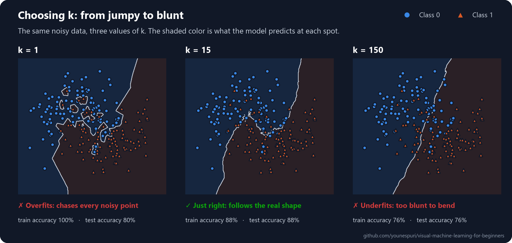
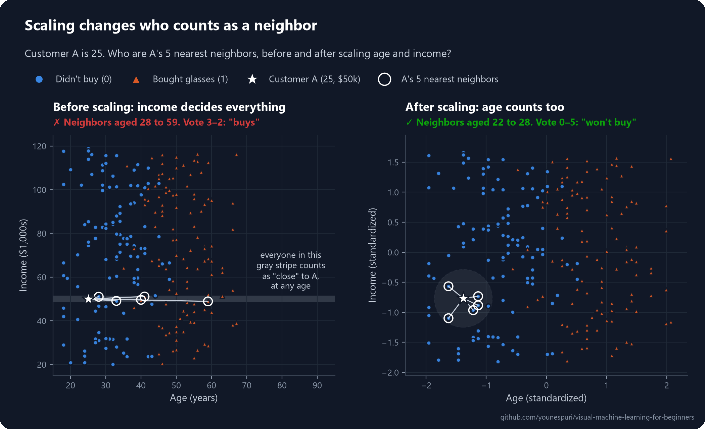
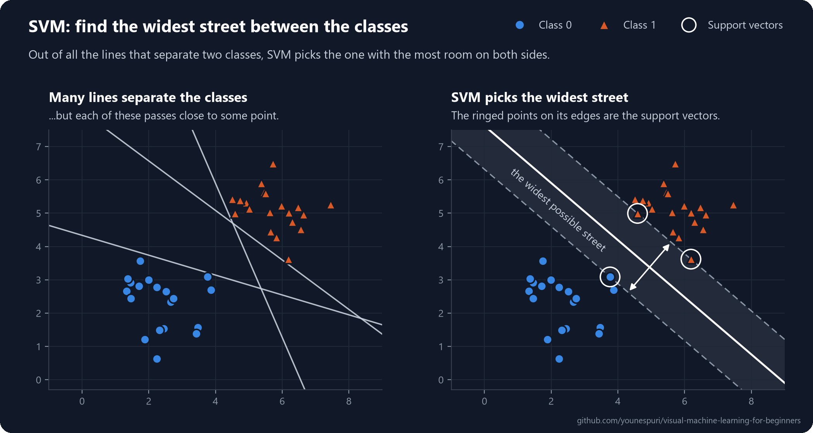
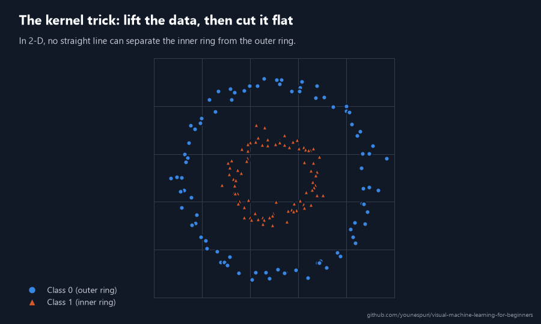

[Course home](../../README.md) · Lesson 05 of 09

# 05 · KNN and SVM

**Two ways to classify: ask the nearest neighbors, or draw the widest possible street between the classes.**

`Beginner` · `~45 min` · [](https://colab.research.google.com/github/younespuri/visual-machine-learning-for-beginners/blob/main/lessons/05-knn-and-svm/notebook.ipynb)


### What you'll learn

- How **k-nearest neighbors (KNN)** classifies a new point: it lets the k closest training examples vote.
- How to measure "close" with **Euclidean distance**, and how to choose a good k.
- Why **feature scaling** can make or break a distance-based model, and how to do it safely with a **Pipeline**.
- How a **support vector machine (SVM)** finds the widest street between two classes, what its **C** knob does, and how the **kernel trick** handles data that no straight line can split.

**Before you start:** [Lesson 03](../03-logistic-regression/README.md) (classification and accuracy) and [lesson 04](../04-decision-trees-and-random-forests/README.md) (train/test splits and decision trees). Every bit of math is explained right here.

---

## The idea in plain words

There's an old saying: *you are the average of the people you spend the most time with.* **K-nearest neighbors (KNN)** takes it literally. When a new, unlabeled example shows up, KNN finds the **k** training examples closest to it (say, the 5 closest), looks at their labels, and gives the newcomer whichever label most of them have. No formula to fit, no line to draw: just a vote among neighbors.

A **support vector machine (SVM)** sees the problem differently. Think about parking between two cars. A beginner squeezes into any gap that fits. An expert parks right in the middle, as far from both cars as possible, so a small wobble won't scrape anything. SVM does the same with the border between two classes: out of all the lines that separate them, it picks the one that leaves the **widest empty street** on both sides. That extra room means new points that look a little different from the training data still land on the correct side.

Both methods decide by measuring how far apart points are. So they share one weak spot, **feature scaling**, and learning to handle it is the most useful practical skill on this page.

## An everyday example

Online stores use the KNN idea all the time: *"customers like you also bought..."* The store finds shoppers whose buying history is closest to yours (your neighbors in the data), checks what else they bought, and recommends it to you.

For SVM, picture a phone app that reads handwritten digits and has to tell a **1** from a **7**. An SVM looks for the border that stays as far as possible from both groups, so even a sloppy, slanted 7 still lands on the 7 side.

## How it really works

### KNN: let the neighbors vote

To classify a new point, KNN does three things:

1. Measure the distance from the new point to **every** training example.
2. Keep the **k** closest ones: its nearest neighbors.
3. Let them vote. The majority label wins.

That's the picture at the top: the new point's 5 nearest neighbors are 3 orange triangles and 2 blue circles, so it's classified as class 1. (To predict a number instead of a class, KNN averages the neighbors' values instead of voting. That version is `KNeighborsRegressor`.)

Notice what's missing: KNN never learns a formula. `fit` just stores the training data, and all the work happens when you call `predict`. That's why KNN is called a **lazy learner**. Training is instant, but every prediction has to measure the distance to every stored point, which gets slow on big datasets. The whole algorithm fits in 3 lines of NumPy; see the [bonus section](#bonus--knn-from-scratch-in-3-lines-of-numpy) below.

### How far is "near"? Euclidean distance

The usual measure of closeness is **Euclidean distance**: the straight-line distance you'd measure with a ruler. For two points $a$ and $b$ with $n$ features:

$$d(a, b) = \sqrt{(a_1 - b_1)^2 + (a_2 - b_2)^2 + \dots + (a_n - b_n)^2}$$

It's Pythagoras' theorem: subtract feature by feature, square, add everything up, take the square root. For the points (1, 2) and (4, 6), that's $\sqrt{3^2 + 4^2} = \sqrt{25} = 5$. In NumPy it's one call: `np.linalg.norm(a - b)`.

### Choosing k

**k** is a **hyperparameter**: a setting *you* choose before training, not something the model learns from the data. It controls how smooth the model's **decision boundary** is: the border where its prediction flips from one class to the other. Here's KNN on the same noisy, curvy data with three different values of k:



- **k = 1** trusts a single neighbor. Every noisy point grows its own little island, so the model scores 100% on its training data but worse on new data. It has memorized the noise instead of learning the pattern: that's **overfitting**.
- **A huge k** asks so many neighbors that the local detail averages away. The boundary becomes too blunt to follow the real shape: that's **underfitting**.
- **Somewhere in between** works best. There's no magic value, so try a few and compare them on data the model hasn't seen. [Lesson 08](../08-overfitting-and-cross-validation/README.md) shows the proper way to do that with cross-validation.

With two classes, pick an **odd** k (3, 5, 7...) so the vote can never end in a tie.

### Why scaling matters: one feature can hijack the distance

The distance formula adds up differences in raw numbers, whatever units they happen to be in. That's a trap when features live on very different scales.

Say you describe customers by **age** (in years) and **yearly income** (in dollars), and you want to know who is most similar to customer A:

| Customer | Age | Income | Compared with A |
| --- | --- | --- | --- |
| A | 25 | $50,000 | the new customer |
| B | 60 | $51,000 | 35 years older, almost the same income |
| C | 25 | $70,000 | the same age, $20,000 more income |

Common sense says C is more like A: a 35-year age gap is huge, while a $20,000 income gap is fairly ordinary. Now look at the distances:

$$d(A, B) = \sqrt{35^2 + 1{,}000^2} = \sqrt{1{,}225 + 1{,}000{,}000} \approx 1{,}001$$

$$d(A, C) = \sqrt{0^2 + 20{,}000^2} = 20{,}000$$

By the numbers, B is **20 times closer** than C. The 35-year age gap adds a mere 1,225 to the sum, while even a small $1,000 income gap adds a million. Income wins simply because its numbers are bigger, and age barely counts at all.

Now imagine a shop predicting who will buy reading glasses, which mostly depends on age. Unscaled KNN would compare a 25-year-old with 60-year-olds who happen to earn the same. The picture below shows exactly that, using the customers from this lesson's code:



The fix is to put every feature on the same footing before measuring anything. The most common way is **standardization**: for each feature, subtract its average and divide by its **standard deviation**, a measure of how far the values typically spread around that average:

$$z = \frac{x - \mu}{\sigma}$$

Here $\mu$ (mu) is the feature's mean and $\sigma$ (sigma) is its standard deviation. After this, every feature is measured in the same unit: "how many typical spreads away from average".

In this lesson's data, ages spread by about 12 years and incomes by about $28,000, so:

$$d(A, B) \approx \sqrt{\left(\tfrac{35}{12}\right)^2 + \left(\tfrac{1{,}000}{28{,}400}\right)^2} \approx 2.9 \qquad d(A, C) \approx \tfrac{20{,}000}{28{,}400} \approx 0.7$$

Now C is the nearest neighbor, as it should be. In scikit-learn, standardization is done by `StandardScaler`.

Two rules keep scaling honest:

- **Learn the mean and standard deviation from the training data only**, then reuse those same numbers for the test data and for every future point. If the test data helps set the scale, information about the test set leaks into training. That's called **data leakage**, and it makes your test score look better than the model really is.
- **Put the scaler and the model in one `Pipeline`.** A **pipeline** chains several steps into a single model: `fit` learns the scaling from the training data and then trains the model on the scaled data, and `predict` scales every new point the same way, automatically. You can't forget a step or leak data by accident.

Not every model cares about scale. The decision trees from [lesson 04](../04-decision-trees-and-random-forests/README.md) split one feature at a time with questions like *"is age > 40?"*, and rescaling a feature doesn't change which question works best. Models built on distances, like KNN, SVM and the clustering you'll meet in [lesson 07](../07-clustering-and-pca/README.md), need it badly.

### SVM: the widest street

Now a different idea. Suppose a straight line can separate two classes. Then there are usually endless lines that do it, and most of them pass uncomfortably close to some points. A new point that lands just a little differently could end up on the wrong side.



An SVM picks the line with the biggest **margin**: the widest empty street between the classes, with the separating line running down the middle. The points sitting right on the edges of the street are the **support vectors**. They alone decide where the street goes: move any other point around (without stepping into the street) and nothing changes. That's where the name comes from.

In math terms, the separating line is $w_1x_1 + w_2x_2 + b = 0$: the same weighted sum you met in [lesson 02](../02-linear-regression/README.md), set to zero. Points where the sum is positive belong to one class, and points where it's negative belong to the other. Like logistic regression, a linear SVM draws a straight boundary; what's different is *how it chooses* that boundary. The two edges of the street are where the sum equals $+1$ and $-1$, and the width of the street works out to

$$\text{width} = \frac{2}{\lVert w \rVert}, \qquad \lVert w \rVert = \sqrt{w_1^2 + w_2^2}$$

So "find the widest street" is the same as "find the smallest weights that still keep every point on its own side of the street". Training an SVM solves exactly that problem.

### Soft margins: the C knob

Real data is rarely perfectly separable; the classes usually overlap a little. So SVM uses a **soft margin**: it lets some points sit inside the street, or even on the wrong side, but charges a penalty for each one. The hyperparameter **C** sets the price of those violations:

| C | Violations are... | The street | Risk |
| --- | --- | --- | --- |
| Small (e.g. 0.01) | cheap | wide, with many points allowed inside | too relaxed: may underfit |
| Large (e.g. 100) | expensive | narrow, squeezed to fit almost every training point | too strict: may overfit |

Every point on the edge of the street *or inside it* counts as a support vector, so a smaller C (a wider street) means more support vectors. scikit-learn's default is `C=1`. Like k in KNN, you choose C by trying a few values on data the model hasn't seen.

### The kernel trick: when no straight line will do

Some data can't be split by any straight line. In the animation below, one class forms a ring around the other, so every line you draw cuts through both.

The fix: add a new feature that makes the pattern flat. Here, a point's squared distance from the center, $z = x_1^2 + x_2^2$, works perfectly. Lift every point to the height $z$: the inner ring stays low, the outer ring rises high, and a flat plane slides right between them. Look back down from above and that flat cut is a circle.



Inventing and computing new features for every point gets expensive fast, and some useful lifts would need thousands of new features. Here's the clever part: to find the widest street, an SVM never needs the points' coordinates themselves, only a similarity score for every pair of points. A **kernel** is a formula that computes that score *as if* the points had been lifted, without ever lifting them. That shortcut is the **kernel trick**.

In scikit-learn you just pick a kernel:

- `SVC(kernel="linear")`: a straight boundary, no lifting.
- `SVC(kernel="rbf")`: the default. The **RBF** (radial basis function) kernel scores two points as similar when they are close together. It behaves as if the data were lifted into infinitely many dimensions, so it can draw smooth curves of almost any shape. It has its own knob, `gamma`: a larger gamma makes each training point's influence more local, which gives wigglier boundaries.

You don't need the math behind kernels to use them well. Just remember: a kernel lets a straight-line method draw curved boundaries.

### KNN vs. SVM at a glance

| | KNN | SVM |
| --- | --- | --- |
| Main idea | A majority vote of the k nearest training points | The widest street between the classes |
| What `fit` does | Just stores the data (a lazy learner) | Solves an optimization problem to find the street |
| Needs feature scaling? | Yes, badly: it's all distances | Yes, badly: it's all distances and similarity scores |
| Prediction speed | Slow on big data: measures the distance to every training point | Usually fast: only the support vectors matter |
| Training speed | Instant | Can be slow on very large datasets |
| Key hyperparameters | `n_neighbors` (k) | `C`, `kernel` (and `gamma` for RBF) |
| Easy to explain? | Yes: you can list the exact neighbors that voted | Fairly, with a linear kernel; hardly, with RBF |

---

## Code it

Open the [notebook in Colab](https://colab.research.google.com/github/younespuri/visual-machine-learning-for-beginners/blob/main/lessons/05-knn-and-svm/notebook.ipynb) to run everything below without installing anything.

### Step 1 · Measure a distance, and watch one feature take over

```python
import numpy as np

# Each customer: [age in years, yearly income in dollars]
A = np.array([25, 50_000])   # the new customer
B = np.array([60, 51_000])   # 35 years older, almost the same income
C = np.array([25, 70_000])   # the same age, $20,000 more income

print(f"A -> B: {np.linalg.norm(A - B):,.1f}")
print(f"A -> C: {np.linalg.norm(A - C):,.1f}")
# A -> B: 1,000.6
# A -> C: 20,000.0
```

- `np.linalg.norm(A - B)` is the Euclidean distance: subtract, square, add up, take the square root.
- By these numbers B is 20 times closer to A than C is, even though B is 35 years older. Income's big numbers drown out age completely.

### Step 2 · A dataset where only age matters

```python
import pandas as pd

rng = np.random.default_rng(34)
n = 300
bought = np.repeat([1, 0], n // 2)       # 1 = bought reading glasses, 0 = didn't
age = np.where(bought == 1, rng.normal(52, 8, n), rng.normal(32, 8, n))   # buyers are older
age = age.clip(18, 80).round().astype(int)
income = rng.uniform(20_000, 120_000, n).round(-2).astype(int)           # no link to buying at all

df = pd.DataFrame({"age": age, "income": income, "bought": bought})
print(df.sample(5, random_state=1))
print(df.groupby("bought")[["age", "income"]].mean().round())
#      age  income  bought
# 189   33   88000       0
# 123   59   96000       1
# 185   27   77800       0
# 213   24   96500       0
# 106   47   47800       1
#          age   income
# bought
# 0       32.0  71988.0
# 1       52.0  70853.0
```

- Meet the 300 customers of an optician's shop. Buyers are about 20 years older on average (52 vs. 32), while both groups earn about the same. Age is the useful feature; income is pure noise.
- But income's numbers are thousands of times bigger than age's. That's the trap.

### Step 3 · KNN without scaling: a coin flip

```python
from sklearn.model_selection import train_test_split
from sklearn.neighbors import KNeighborsClassifier

X = df[["age", "income"]].to_numpy()
y = df["bought"].to_numpy()
X_train, X_test, y_train, y_test = train_test_split(
    X, y, test_size=0.25, random_state=42, stratify=y)

knn_raw = KNeighborsClassifier(n_neighbors=5)
knn_raw.fit(X_train, y_train)                  # just stores the training data
print("Test accuracy without scaling:", round(knn_raw.score(X_test, y_test), 2))

dist, idx = knn_raw.kneighbors([A])            # A's 5 nearest training customers
neighbors = pd.DataFrame(X_train[idx[0]], columns=["age", "income"])
neighbors["bought"] = y_train[idx[0]]
print(neighbors)
print("Prediction for A:", knn_raw.predict([A]))
# Test accuracy without scaling: 0.47
#    age  income  bought
# 0   40   49600       1
# 1   33   49100       0
# 2   28   51000       0
# 3   41   51100       1
# 4   59   48900       1
# Prediction for A: [1]
```

- For classifiers, `score` returns **accuracy**: the share of test customers the model got right. 0.47 is no better than flipping a coin.
- `kneighbors` shows who voted. A's "nearest" neighbors all earn about $50,000, but their ages run from 28 to 59, and three of them bought glasses. So KNN predicts that our 25-year-old will buy reading glasses.
- `stratify=y` keeps the same share of buyers in the training and the test set.

### Step 4 · Standardize, using the training data only

```python
from sklearn.preprocessing import StandardScaler

scaler = StandardScaler()
scaler.fit(X_train)                  # learns each feature's mean and spread from the TRAINING data only
print(pd.DataFrame({"mean": scaler.mean_, "std": scaler.scale_}, index=["age", "income"]).round())

A_z, B_z, C_z = scaler.transform([A, B, C])
print(f"A -> B: {np.linalg.norm(A_z - B_z):.2f}")
print(f"A -> C: {np.linalg.norm(A_z - C_z):.2f}")
#            mean      std
# age        42.0     12.0
# income  71794.0  28403.0
# A -> B: 2.88
# A -> C: 0.70
```

- `fit` only measures each column's mean and standard deviation. `transform` then applies $z = (x - \mu) / \sigma$ with those numbers.
- In standard units, B is now four times farther from A than C is. Age finally counts, just like in the right half of the scaling picture.

### Step 5 · Scaler and KNN in one Pipeline

```python
from sklearn.pipeline import make_pipeline

knn = make_pipeline(StandardScaler(), KNeighborsClassifier(n_neighbors=5))
knn.fit(X_train, y_train)            # the scaler learns from X_train, then KNN stores the scaled points
print("Test accuracy with scaling:", round(knn.score(X_test, y_test), 2))
print("Prediction for A:", knn.predict([A]))
# Test accuracy with scaling: 0.92
# Prediction for A: [0]
```

- Same data, same algorithm, same k. Scaling alone lifts the accuracy from 0.47 to 0.92, and A is now predicted not to buy.
- When you call `knn.score(X_test, ...)` or `knn.predict(...)`, the pipeline scales the new data with the mean and standard deviation it learned from the training set. The test set never touches the scaler.
- From here on, every distance-based model gets its own scaler inside a pipeline.

### Step 6 · Choose k

```python
for k in [1, 5, 15, 51, 201]:
    model = make_pipeline(StandardScaler(), KNeighborsClassifier(n_neighbors=k))
    model.fit(X_train, y_train)
    print(f"k = {k:>3}   train: {model.score(X_train, y_train):.2f}   test: {model.score(X_test, y_test):.2f}")
# k =   1   train: 1.00   test: 0.85
# k =   5   train: 0.94   test: 0.92
# k =  15   train: 0.91   test: 0.93
# k =  51   train: 0.91   test: 0.95
# k = 201   train: 0.90   test: 0.87
```

- k = 1 scores a perfect 1.00 on the training data, because every training point's nearest neighbor is itself. That's memorizing, and the test score (0.85) tells the truth.
- The test score climbs as k grows, then drops at k = 201, where 201 of the 225 training customers vote on every single prediction. The true boundary here is simple (roughly "older than 42?"), so a big k fails late; on curvier data, like the moons in the "Choosing k" picture, it fails much sooner.
- We picked k by peeking at the test set, which is fine for a demo. In real projects, use cross-validation (lesson 08) so the test set stays a fair final exam.

### Step 7 · SVM: find the widest street

```python
from sklearn.svm import SVC

svm = make_pipeline(StandardScaler(), SVC(kernel="linear"))
svm.fit(X_train, y_train)
print("Test accuracy:", round(svm.score(X_test, y_test), 2))
print("Support vectors:", svm[-1].n_support_.sum(), "of", len(X_train), "training points")
print("Prediction for A:", svm.predict([A]))
# Test accuracy: 0.95
# Support vectors: 55 of 225 training points
# Prediction for A: [0]
```

- `SVC` is scikit-learn's support vector classifier, and `kernel="linear"` asks for a straight boundary. The scaler comes along in the pipeline, because an SVM measures distances too.
- `svm[-1]` grabs the last step of the pipeline (the SVC itself), and `n_support_` counts its support vectors in each class.
- The two classes overlap, so many customers sit inside the street, and each of them counts as a support vector.

### Step 8 · Turn the C knob

```python
for c in [0.01, 1, 100]:
    svm_c = make_pipeline(StandardScaler(), SVC(kernel="linear", C=c))
    svm_c.fit(X_train, y_train)
    width = 2 / np.linalg.norm(svm_c[-1].coef_)      # street width = 2 / ||w||
    n_sv = svm_c[-1].n_support_.sum()
    acc = svm_c.score(X_test, y_test)
    print(f"C = {c:<5}  street width: {width:.2f}   support vectors: {n_sv:>3}   test accuracy: {acc:.2f}")
# C = 0.01   street width: 2.35   support vectors: 162   test accuracy: 0.93
# C = 1      street width: 0.70   support vectors:  55   test accuracy: 0.95
# C = 100    street width: 0.55   support vectors:  45   test accuracy: 0.95
```

- For a linear SVM, `coef_` holds the weights $w$, so `2 / np.linalg.norm(coef_)` is the street width from the formula above (in standardized units).
- Cheap violations (C = 0.01) give a wide street with 162 points on or inside it. Expensive ones (C = 100) squeeze the street until only 45 points touch or enter it.
- Here C barely moves the accuracy, but on messier data it can matter a lot. Tune it the way you tune k.

### Step 9 · The kernel trick on circles

```python
from sklearn.datasets import make_circles

Xc, yc = make_circles(n_samples=300, factor=0.4, noise=0.1, random_state=0)
Xc_train, Xc_test, yc_train, yc_test = train_test_split(
    Xc, yc, test_size=0.25, random_state=42, stratify=yc)

for kernel in ["linear", "rbf"]:
    svm_k = make_pipeline(StandardScaler(), SVC(kernel=kernel))
    svm_k.fit(Xc_train, yc_train)
    print(f"{kernel:>6} kernel -> test accuracy: {svm_k.score(Xc_test, yc_test):.2f}")
# linear kernel -> test accuracy: 0.44
#    rbf kernel -> test accuracy: 1.00
```

- `make_circles` makes two noisy rings: class 1 inside, class 0 around it. No straight line can separate them, so the linear SVM does no better than guessing.
- The RBF kernel draws a curved boundary around the inner ring, as if it had lifted the data like in the animation.
- Both features here already share the same scale, so the scaler changes little. Keeping it in the pipeline is still a good habit for SVMs.

### See it

```python
import matplotlib.pyplot as plt
from sklearn.inspection import DecisionBoundaryDisplay

fig, axes = plt.subplots(1, 2, figsize=(10, 4.5))
for ax, kernel in zip(axes, ["linear", "rbf"]):
    model = make_pipeline(StandardScaler(), SVC(kernel=kernel)).fit(Xc_train, yc_train)
    DecisionBoundaryDisplay.from_estimator(model, Xc, response_method="predict",
                                           cmap="coolwarm", alpha=0.3, ax=ax)
    ax.scatter(Xc[:, 0], Xc[:, 1], c=yc, cmap="coolwarm", edgecolors="k", s=20)
    ax.set_title(f'kernel="{kernel}"')
plt.show()
```

### Bonus · KNN from scratch in 3 lines of NumPy

This is the whole KNN algorithm, written out by hand. It makes exactly the same predictions as scikit-learn.

```python
def knn_predict(X_train, y_train, x_new, k=5):
    distances = np.linalg.norm(X_train - x_new, axis=1)   # 1. distance to every training point
    nearest = np.argsort(distances)[:k]                   # 2. the k closest
    return np.bincount(y_train[nearest]).argmax()         # 3. majority vote

X_train_z = scaler.transform(X_train)     # scaled with the training data's mean and std (Step 4)
X_test_z = scaler.transform(X_test)
ours = np.array([knn_predict(X_train_z, y_train, x) for x in X_test_z])
print("Our accuracy:", round(np.mean(ours == y_test), 2))
print("Same predictions as scikit-learn?", np.array_equal(ours, knn.predict(X_test)))
# Our accuracy: 0.92
# Same predictions as scikit-learn? True
```

- `axis=1` gives one distance per training row. `np.argsort` returns the positions that would sort them, so `[:k]` keeps the k closest.
- `np.bincount` counts the votes for each label and `argmax` picks the label with the most. That's the entire model: no training at all, just stored data and a vote.

---

## Where you'll see it in the real world

KNN is the idea behind the simplest recommendation engines ("people like you also watched...") and behind similarity search: finding the most similar products, songs, photos or documents. Modern AI search works the same way at a huge scale. Text and images are turned into long lists of numbers called **embeddings**, and a vector database finds the nearest neighbors of your query. That's how many AI assistants look up relevant documents before they answer your question.

SVMs were among the most powerful classifiers before deep learning took over, and they still shine when you have limited data with many features: sorting text into topics or spam, classifying genes and proteins in biology, and recognizing objects in images. Reading handwritten digits was a classic showcase: on the famous MNIST dataset of handwritten digits, SVMs were among the most accurate methods of their time, and both SVM and KNN still do surprisingly well on it today.

## Common mistakes

- **Forgetting to scale features for KNN or SVM.** The feature with the biggest numbers silently takes over every distance. Put a `StandardScaler` in a pipeline by default.
- **Fitting the scaler on all the data before splitting.** The test set's mean and spread leak into training. Split first, then fit the scaler (or better, the whole pipeline) on the training set only.
- **Using k = 1, or an even k with two classes.** k = 1 memorizes noise, and an even k can end in a tied vote.
- **Assuming the default kernel is always best.** `SVC()` uses `kernel="rbf"` by default. Try `"linear"` too, and tune `C` (and `gamma`) the way you tune k.
- **Throwing in lots of useless features.** Every feature adds to every distance, so irrelevant ones only add noise to the neighborhoods, scaled or not.

## Remember

- **KNN** classifies a new point by a **majority vote of its k nearest neighbors**. `fit` only stores the data; the work happens at prediction time.
- "Near" usually means **Euclidean distance**: $d(a, b) = \sqrt{\sum_i (a_i - b_i)^2}$.
- **k is a hyperparameter**: k = 1 overfits and a huge k underfits. Use an odd k for two classes, and choose it on data the model hasn't seen.
- **Scale your features** for distance-based models, with the scaler fitted on the training data only. A `Pipeline` does this for you.
- An **SVM** finds the **widest street** between the classes. The points on its edges are the **support vectors**, and **C** sets how strictly the street must stay clear.
- The **kernel trick** (`kernel="rbf"`) lets an SVM draw curved boundaries without ever computing the lifted features.

## Practice

**Easy.** Fit a `KNeighborsClassifier(n_neighbors=3)` on the ten points `X = [[1, 2], [2, 3], [3, 3], [1, 1], [2, 2], [6, 7], [7, 8], [8, 8], [7, 7], [8, 7]]` with labels `y = [0, 0, 0, 0, 0, 1, 1, 1, 1, 1]`. Predict the class of `[4, 4]` and `[6, 5]`, then use `kneighbors` to see exactly which points voted.

**Medium.** In Step 5, swap `StandardScaler` for `MinMaxScaler` (also from `sklearn.preprocessing`), which squeezes every feature into the range 0 to 1, and compare the test accuracy. Then drop the `income` column and train on `age` alone. Does the model get better or worse than with both scaled features? Explain why in one sentence.

**Hard.** Do the kernel trick by hand. Add the lifted feature to the circles from Step 9 with `np.column_stack([Xc, (Xc ** 2).sum(axis=1)])`, then train a *linear* SVM on the three features and compare it with the two models from Step 9. Now try the same lift on `make_moons(n_samples=300, noise=0.2, random_state=0)`. Why does $x_1^2 + x_2^2$ rescue the circles but not the moons, and what does that tell you about why the RBF kernel is so useful?

### Mini project

**Does scaling matter on real data?** Load the wine dataset with `load_wine(return_X_y=True, as_frame=True)` from `sklearn.datasets`: 178 wines, 13 chemical measurements each, and 3 grape varieties to predict.

1. Print the standard deviation of every feature with `X.std()`. Which feature would dominate unscaled distances, and by how much?
2. Split the data 75% / 25% with `train_test_split`, using `stratify=y` and a fixed `random_state`.
3. Train four models and put their test accuracy in a small table: KNN (k = 5) without scaling, the same KNN in a pipeline with `StandardScaler`, a linear SVM with scaling, and an RBF SVM with scaling.
4. In a few sentences: why does the first model do worst? Which model would you ship, and why?
5. Stretch goal: try a few values of k and C and see how much your best model improves.

Your exact numbers will depend on the split, but the gap between unscaled and scaled KNN should be hard to miss.

## Check yourself

<details>
<summary><b>1.</b> How does KNN classify a new point, and why is it called a "lazy" learner?</summary>

It finds the k training points closest to the new point and gives it the majority label among them. It's lazy because `fit` learns nothing: it only stores the training data. All the work, measuring distances and voting, happens at prediction time.
</details>

<details>
<summary><b>2.</b> What is the Euclidean distance between (1, 2) and (4, 6), and how do you compute it in NumPy?</summary>

$\sqrt{(4-1)^2 + (6-2)^2} = \sqrt{9 + 16} = 5$. In NumPy: `np.linalg.norm(np.array([1, 2]) - np.array([4, 6]))`.
</details>

<details>
<summary><b>3.</b> What goes wrong when k is very small, like 1? And when it's very large?</summary>

With k = 1 the model follows every noisy point and memorizes the training data: perfect training accuracy, worse test accuracy. That's overfitting. With a huge k, each vote averages over so many points that the boundary becomes too blunt to follow the real pattern. That's underfitting.
</details>

<details>
<summary><b>4.</b> In the code, KNN scored 0.47 without scaling and 0.92 with it. What happened?</summary>

Income is measured in tens of thousands and age in tens, so without scaling the distances were decided almost entirely by income, which says nothing about buying glasses. KNN's "neighbors" were simply people with similar incomes, of any age. After standardizing, both features count on the same scale, and age, the feature that actually matters, shapes the neighborhoods.
</details>

<details>
<summary><b>5.</b> Why must the scaler be fitted on the training data only, and how does a Pipeline help?</summary>

If the scaler learns its mean and standard deviation from the test data too, information about the test set leaks into training (data leakage) and the test score becomes too optimistic. A pipeline fits the scaler inside `fit`, on the training data only, and automatically reuses those same numbers in `predict` and `score`.
</details>

<details>
<summary><b>6.</b> What is an SVM looking for, and what are support vectors?</summary>

It looks for the separating line (or plane) with the widest margin: the widest empty street between the classes. The support vectors are the training points on the edges of the street, or inside it when the margin is soft. They alone decide where the boundary goes.
</details>

<details>
<summary><b>7.</b> What does C control in an SVM?</summary>

How expensive it is for a point to sit inside the street or on the wrong side of it. With a small C, violations are cheap, so the street is wide and the model is relaxed (risk of underfitting). With a large C, violations are expensive, so the street narrows to fit the training points (risk of overfitting).
</details>

<details>
<summary><b>8.</b> What problem does the kernel trick solve? And why don't decision trees need feature scaling, while KNN and SVM do?</summary>

The kernel trick lets an SVM draw curved boundaries for data that no straight line can separate. It works as if the data had been lifted into a higher-dimensional space where a flat cut is enough, without ever computing those extra features. Decision trees split one feature at a time on thresholds like "age > 40", so a feature's scale doesn't change which split is best. KNN and SVM compare points through distances that mix all the features together, so a large-scale feature takes over unless you scale.
</details>

---

[← 04 · Decision trees and random forests](../04-decision-trees-and-random-forests/README.md) · [Course home](../../README.md) · [06 · Naive Bayes and unsupervised learning →](../06-naive-bayes-and-unsupervised-learning/README.md)
