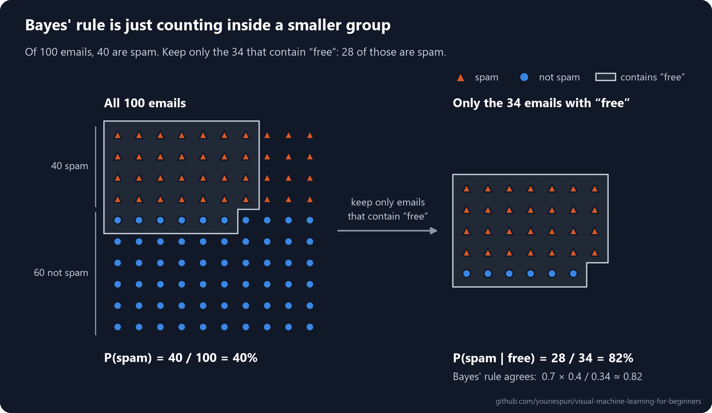
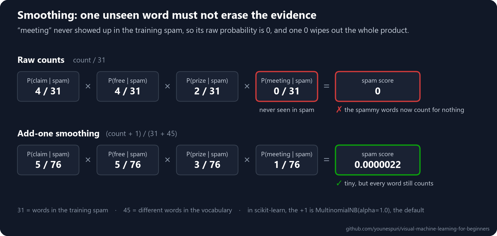
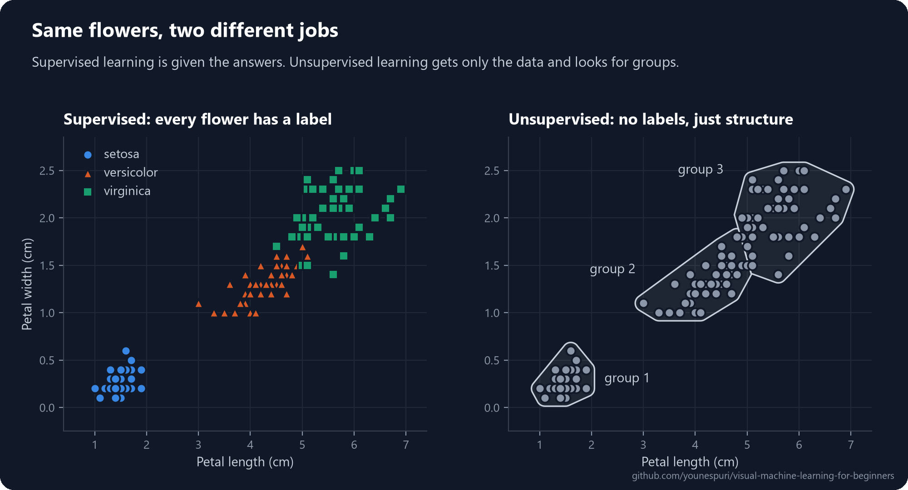

[Course home](../../README.md) · Lesson 06 of 09

# 06 · Naive Bayes and Unsupervised Learning

**Weigh every word as evidence to catch spam, then take the answers away and find the groups hiding in your data.**

`Beginner` · `~45 min` · [](https://colab.research.google.com/github/younespuri/visual-machine-learning-for-beginners/blob/main/lessons/06-naive-bayes-and-unsupervised-learning/notebook.ipynb)


### What you'll learn

- How **Bayes' rule** updates a belief when new evidence arrives, using nothing but counting.
- Why **Naive Bayes** is called "naive", and why it works so well anyway.
- How to build a spam filter from word counts, and why **smoothing** stops one unseen word from ruining everything.
- What **unsupervised learning** is: finding structure in data that comes with no answers at all.

**Before you start:** [Lesson 03](../03-logistic-regression/README.md), where you met classification and predicted probabilities. All the probability you need is explained right here.

---

## The idea in plain words

You step outside and see dark clouds. A minute ago you'd have said rain was unlikely today. The clouds are **evidence**, and they change your mind: now rain feels likely, so you grab an umbrella. You started with a belief, saw a clue, and updated the belief.

**Bayes' rule** is the math of exactly that update. **Naive Bayes** uses it to classify things: it starts from how common each class is, lets every clue nudge the odds up or down, and picks the class that ends up most likely. In [lesson 01](../01-what-is-machine-learning/README.md) you trained a spam filter in a few lines and were told not to worry about how it worked. This is how it works.

Then the lesson turns a corner. Every model so far learned from examples that came with the right answers. What if nobody ever wrote the answers down? **Unsupervised learning** looks at the data alone and finds structure in it by itself.

## An everyday example

An email arrives: *"Congratulations WINNER! Claim your FREE prize."* Each clue is suspicious on its own. "Free" alone could be innocent ("are you free for lunch?"), but "free" plus "winner" plus "claim" smells like a scam. You combine the clues without thinking. Naive Bayes does the same with numbers, and to keep the math simple it treats every word as a separate, independent clue, even though in real life "free" and "winner" love to show up together. Surprisingly, that shortcut rarely hurts.

Now picture a friend handing you 500 unsorted holiday photos. Nobody tells you the categories, yet within minutes you have piles: beaches, mountains, food, family. You found groups that nobody named for you. That's unsupervised learning.

## How it really works

### Bayes' rule is counting inside a smaller group

A **probability** is a fraction: how many cases out of all of them. If 40 of your 100 emails are spam, then $P(\text{spam}) = 40/100 = 0.4$.

A **conditional probability** asks the same question inside a smaller group. $P(\text{spam} \mid \text{free})$ reads *"the probability of spam, given that the email contains 'free'"*: set aside every email without "free", then count the spam among the ones left.



Of the 34 emails that contain "free", 28 are spam, so $P(\text{spam} \mid \text{free}) = 28/34 \approx 0.82$. One word moved your belief from 40% to 82%.

Careful: which side of the bar a word sits on matters. $P(\text{free} \mid \text{spam}) = 28/40 = 0.7$ is a different number, with the same 28 on top but divided by the 40 spam emails instead of the 34 emails with "free". **Bayes' rule** turns one into the other:

$$P(\text{spam} \mid \text{free}) = \frac{P(\text{free} \mid \text{spam}) \times P(\text{spam})}{P(\text{free})}$$

| Part | Name | In our example | What it means |
| --- | --- | --- | --- |
| $P(\text{spam})$ | **Prior** | 0.4 | How common spam is before you read a word |
| $P(\text{free} \mid \text{spam})$ | **Likelihood** | 0.7 | How typical the word is of spam |
| $P(\text{free})$ | **Evidence** | 0.34 | How common the word is overall, in any email |
| $P(\text{spam} \mid \text{free})$ | **Posterior** | 0.82 | Your updated belief after seeing the word |

The evidence adds up both ways an email can contain "free": spam that says it, plus normal email that says it, $0.7 \times 0.4 + 0.1 \times 0.6 = 0.34$. Plug everything in and you get $0.7 \times 0.4 / 0.34 \approx 0.82$, the same answer as counting.

Why bother with the formula if you can count? Because you learn likelihoods like $P(\text{free} \mid \text{spam})$ from your spam folder, one word at a time, and the formula flips them around into the question you actually care about.

### The "naive" part: many words at once

A real email has dozens of words. To use them all, you'd need $P(\text{free, winner, meeting} \mid \text{spam})$: how often that exact combination of words turns up in spam. Once you have more than a handful of words, no dataset on Earth has seen every combination.

So Naive Bayes takes a bold shortcut. Two things are **independent** when knowing one tells you nothing about the other, like two coin flips, and then the chance of both is simply the product of their chances. Naive Bayes *assumes* the words are independent of each other within each class, which lets it multiply one word at a time:

$$P(\text{spam} \mid w_1, \dots, w_n) \;\propto\; P(\text{spam}) \times P(w_1 \mid \text{spam}) \times \dots \times P(w_n \mid \text{spam})$$

The $\propto$ means "proportional to". The bottom of Bayes' rule, the evidence, is the same for every class, so you can skip it: compute a **score** for each class, then divide each score by their total so they add up to 1.

Here's an email that contains "free", "winner" and "meeting":

| Word | Share of spam that contains it | Share of normal email that contains it | Nudge |
| --- | --- | --- | --- |
| "free" | 0.7 | 0.1 | 7× toward spam |
| "winner" | 0.2 | 0.01 | 20× toward spam |
| "meeting" | 0.02 | 0.2 | 10× toward normal |

- Spam score: $0.4 \times 0.7 \times 0.2 \times 0.02 = 0.00112$
- Normal score: $0.6 \times 0.1 \times 0.01 \times 0.2 = 0.00012$
- $P(\text{spam} \mid \text{these three words}) = 0.00112 / (0.00112 + 0.00012) \approx 0.90$

That's exactly what the diagram at the top of this lesson shows, one word at a time: 40% → 82% → 99% → 90%.

**Why "naive"?** Because the assumption is almost always false. "Free", "winner" and "claim" travel together, so the model counts what is really one clue two or three times. That makes it **overconfident**: its probabilities get pushed toward 0 and 1.

**Why it works anyway:** to classify, all you need is for the right class to get the highest score, and overconfidence usually changes *how sure* the model sounds, not *which* class wins. On top of that, it needs very little data (just one number per word per class), and training is a single pass of counting, so it's lightning fast.

### Words become counts

Models need numbers, so text is turned into a **bag of words**: count how often each word appears and forget the order, as if you cut the message into words and shook them in a bag. The list of every distinct word seen in training is the **vocabulary**, and each message becomes one row of counts:

| Message | claim | free | prize | meeting | lunch |
| --- | --- | --- | --- | --- | --- |
| WINNER! Claim your free prize now | 1 | 1 | 1 | 0 | 0 |
| Are you free for lunch tomorrow? | 0 | 1 | 0 | 0 | 1 |
| The meeting moved to 3pm, agenda attached | 0 | 0 | 0 | 1 | 0 |

The word table in the previous section asked "what share of spam emails contain the word?". For text, scikit-learn's **MultinomialNB** asks a slightly different question: "what share of all the words in spam are this word?". In this lesson's code, "claim" appears 4 times among the 31 words of the training spam, so $P(\text{claim} \mid \text{spam}) = 4/31 \approx 0.13$. Same idea, and a word that appears three times gets to count three times.

### Smoothing: never multiply by zero

In this lesson's code, the word "meeting" never shows up in the six training spam messages, so raw counting gives $P(\text{meeting} \mid \text{spam}) = 0/31 = 0$. Now a spammer writes *"Claim your free prize at the meeting"*. The spam score is a product, and a single 0 makes the whole product 0: one innocent word vetoes all the evidence. (Spammers really do sprinkle innocent words into their messages to sneak past filters.)

The fix is **smoothing**: pretend you saw every word once more than you did. This is called **add-one** (or **Laplace**) **smoothing**:

$$P(\text{word} \mid \text{class}) = \frac{\text{count of the word in the class} + 1}{\text{total words in the class} + V}$$

Here $V$ is the size of the vocabulary. Adding 1 to each of the $V$ word counts adds $V$ to the total, which keeps the probabilities adding up to 1.



In scikit-learn, the "+1" is the `alpha` parameter, and `MultinomialNB(alpha=1.0)` is the default, so smoothing is on unless you turn it off. A bigger `alpha` smooths more. A word the model has *never* seen in training is a different case: it isn't in the vocabulary, so it's simply skipped. Smoothing is for words the model knows but has never seen with one of the classes.

### Two flavors in scikit-learn

Both use Bayes' rule and the naive shortcut. They differ only in how they model the chance of a feature within a class:

| Model | Use it when your features are... | How it models each feature |
| --- | --- | --- |
| **MultinomialNB** | Counts, like how often each word appears | Its share of all the counts in the class, smoothed |
| **GaussianNB** | Continuous numbers, like lengths or temperatures | A bell curve (a **normal distribution**) per class: most values sit near the class average, fewer far from it |

### Taking the answers away: unsupervised learning

Every model in this course so far, from linear regression to Naive Bayes, was **supervised**: you gave it inputs `X` *and* the right answers `y`, and it learned to predict `y`. But answers are expensive. Someone has to label every email as spam or not, every scan as healthy or not. Most of the world's data has no labels at all.

**Unsupervised learning** works with `X` alone. There's no right answer to predict. Instead, the model looks for **structure**: patterns that are already there in the data.

- **Clustering** finds groups of similar points, such as customers who shop alike.
- **Dimensionality reduction** finds a simpler description of the data, with fewer features, that keeps most of the information.
- **Anomaly detection** finds points that don't fit any pattern, such as a card payment unlike all the others.



On the left, every flower comes with its species, and a supervised model learns to predict it. On the right, the species are hidden, yet the flowers still fall into clumps. An unsupervised algorithm can find those groups, but it can't name them: it knows *which* flowers belong together, not what to call them. Naming the groups is your job.

| | Supervised | Unsupervised |
| --- | --- | --- |
| Needs answers (labels)? | Yes: pairs of `X` and `y` | No: just `X` |
| Goal | Learn to map inputs to known answers | Discover structure hidden in the data |
| Example algorithms | Naive Bayes, logistic regression, decision trees | K-Means clustering, PCA |
| Example uses | Spam filtering, house prices | Customer segments, anomaly detection |

In code, the difference is one argument: `model.fit(X, y)` versus `model.fit(X)`. You'll see it at the end of the code below, and [lesson 07](../07-clustering-and-pca/README.md) covers the two classic techniques properly: K-Means clustering and PCA.

---

## Code it

Open the [notebook in Colab](https://colab.research.google.com/github/younespuri/visual-machine-learning-for-beginners/blob/main/lessons/06-naive-bayes-and-unsupervised-learning/notebook.ipynb) to run everything below without installing anything. It's the same kind of spam filter you built in lesson 01, this time with probabilities and a look inside.

### Step 1 · Bayes' rule by hand

```python
# 100 emails: 40 spam and 60 normal
p_spam = 40 / 100                  # prior: how common spam is
p_not_spam = 60 / 100

p_free_given_spam = 28 / 40        # "free" is in 28 of the 40 spam emails...
p_free_given_not_spam = 6 / 60     # ...and in 6 of the 60 normal ones

# evidence: how common "free" is overall, in spam or not
p_free = p_free_given_spam * p_spam + p_free_given_not_spam * p_not_spam

# Bayes' rule: flip P(free | spam) into P(spam | free)
p_spam_given_free = p_free_given_spam * p_spam / p_free

print(f"P(free)        = {p_free:.2f}")
print(f"P(spam | free) = {p_spam_given_free:.4f}")
# P(free)        = 0.34
# P(spam | free) = 0.8235
```

- One word moved the belief from 40% (the prior) to about 82% (the posterior).
- It's the same answer the diagram gets by counting: 28 of the 34 emails with "free" are spam, and 28 / 34 = 0.8235.
- `p_free` adds up both ways an email can contain "free": spam that says it, plus normal email that says it.

### Step 2 · Turn messages into word counts

```python
import numpy as np
import pandas as pd
from sklearn.feature_extraction.text import CountVectorizer

texts = [
    "WINNER! Claim your free prize now",
    "Free cash bonus, click here to claim",
    "You won a free vacation, claim it today",
    "Urgent: claim your cash prize before midnight",
    "Congratulations, lucky winner! Click for your free gift",
    "Limited offer: earn cash from home, click now",
    "Are you free for lunch tomorrow?",
    "The meeting moved to 3pm, agenda attached",
    "Can you send me the project report?",
    "Mom says dinner is at 7 tonight",
    "Thanks for the notes from today's meeting",
    "Let's review the report before the meeting",
    "Happy birthday! See you at dinner",
    "Running late, start the meeting without me",
    "Your package was delivered this morning",
]
labels = np.array(["spam"] * 6 + ["not spam"] * 9)

vectorizer = CountVectorizer(stop_words="english")   # skip filler words like "the" and "you"
X_train = vectorizer.fit_transform(texts)            # learn the vocabulary, then count
words = vectorizer.get_feature_names_out()

print("Messages x words:", X_train.shape)
table = pd.DataFrame(X_train.toarray(), columns=words, index=labels)
print(table[["claim", "free", "prize", "meeting", "lunch"]].iloc[[0, 1, 6, 7]])
# Messages x words: (15, 45)
#           claim  free  prize  meeting  lunch
# spam          1     1      1        0      0
# spam          1     1      0        0      0
# not spam      0     1      0        0      1
# not spam      0     0      0        1      0
```

- 15 messages and 45 different words. Each message is now one row of counts, and the word order is gone: that's the bag of words.
- `stop_words="english"` drops very common filler words ("the", "you", "is" and so on), so the counts focus on words that carry meaning.
- "free" shows up in normal email too ("Are you free for lunch tomorrow?"). It's evidence, not proof.
- `X_train` is a **sparse matrix**: it stores only the non-zero counts, because most words are missing from most messages. `.toarray()` turns it into a normal table for printing.

### Step 3 · Train the filter and classify new messages

```python
from sklearn.naive_bayes import MultinomialNB

model = MultinomialNB()          # alpha=1.0 by default: smoothing is on (Step 5)
model.fit(X_train, labels)

new_texts = [
    "Claim your free cash prize now",
    "Lunch tomorrow before the meeting?",
    "Free pizza after the meeting",
]
X_new = vectorizer.transform(new_texts)      # transform, never fit_transform, on new text

print(model.classes_)
for text, label, p in zip(new_texts, model.predict(X_new), model.predict_proba(X_new)[:, 1]):
    print(f"{label:<8}  P(spam) = {p:.2f}   {text}")
# ['not spam' 'spam']
# spam      P(spam) = 0.99   Claim your free cash prize now
# not spam  P(spam) = 0.03   Lunch tomorrow before the meeting?
# not spam  P(spam) = 0.26   Free pizza after the meeting
```

- `predict_proba` returns one column per class, in the order of `model.classes_`, so `[:, 1]` is P(spam).
- The third message contains "free", but "meeting" pulls harder the other way. No single word decides; every word gets a vote.
- "pizza" never appeared in training, so it isn't in the vocabulary and is simply ignored.

### Step 4 · See which words weigh the most

```python
p_word = np.exp(model.feature_log_prob_)     # P(word | class): row 0 = not spam, row 1 = spam
spamminess = pd.Series(p_word[1] / p_word[0], index=words)

print("Toward spam:  ", spamminess.nlargest(5).round(1).to_dict())
print("Toward normal:", (1 / spamminess).nlargest(5).round(1).to_dict())
# Toward spam:   {'claim': 5.1, 'cash': 4.1, 'click': 4.1, 'prize': 3.1, 'winner': 3.1}
# Toward normal: {'meeting': 4.9, 'dinner': 2.9, 'report': 2.9, '3pm': 1.9, 'agenda': 1.9}
```

- These are the nudges from the diagram at the top: "claim" is about 5 times more likely in spam than in normal email, so it pushes hard toward spam.
- scikit-learn stores the logarithm of each probability in `feature_log_prob_`, and `np.exp` turns them back into plain probabilities.
- Nobody gave the model a list of spam words. It learned all of this from 15 messages, just by counting.

### Step 5 · Smoothing: why a missing word can't count as zero

```python
counts = X_train.toarray()
spam_counts = counts[labels == "spam"].sum(axis=0)       # times each word appears in spam
V = len(words)                                           # vocabulary size: 45

raw = spam_counts / spam_counts.sum()                    # plain fractions
smoothed = (spam_counts + 1) / (spam_counts.sum() + V)   # add-one smoothing

msg = "Claim your free prize at the meeting"
tokens = vectorizer.build_analyzer()(msg)                # the words the model will see
idx = [vectorizer.vocabulary_[t] for t in tokens]

print(tokens)
print("raw:     ", raw[idx].round(3), f"-> product {raw[idx].prod():.7f}")
print("smoothed:", smoothed[idx].round(3), f"-> product {smoothed[idx].prod():.7f}")
print("Same as scikit-learn:", np.allclose(smoothed, p_word[1]))
print("P(spam) =", model.predict_proba(vectorizer.transform([msg]))[0, 1].round(2))
# ['claim', 'free', 'prize', 'meeting']
# raw:      [0.129 0.129 0.065 0.   ] -> product 0.0000000
# smoothed: [0.066 0.066 0.039 0.013] -> product 0.0000022
# Same as scikit-learn: True
# P(spam) = 0.85
```

- Without smoothing, "meeting" gets exactly 0, and one 0 wipes out the product: this message could never be called spam, whatever else it said.
- Add-one smoothing gives "meeting" 1/76 instead. That's small, but the other words still count.
- `np.allclose` confirms that this is exactly what `MultinomialNB(alpha=1.0)` learned: `alpha` is the "+1".
- With smoothing on, the model sees through the trick: P(spam) = 0.85.

### Step 6 · Numbers instead of words: GaussianNB

```python
from sklearn.datasets import load_iris
from sklearn.model_selection import train_test_split
from sklearn.naive_bayes import GaussianNB

iris = load_iris()
X_iris, y_iris = iris.data, iris.target      # 150 flowers, 4 measurements in cm, 3 species

X_tr, X_te, y_tr, y_te = train_test_split(
    X_iris, y_iris, test_size=0.3, random_state=42, stratify=y_iris)

gnb = GaussianNB()
gnb.fit(X_tr, y_tr)
print("Test accuracy:", round(gnb.score(X_te, y_te), 3))
# Test accuracy: 0.911
```

- The iris dataset ships with scikit-learn: 150 iris flowers from 3 species, each described by 4 measurements in centimeters (sepal length and width, petal length and width).
- Same Bayes' rule, same naive shortcut, same `fit` and `score`. Only the per-feature model changes: a bell curve for each measurement and each species, instead of word counts.
- The measurements are far from independent (long petals are also wide petals), and the model still gets about 9 in 10 test flowers right.
- `stratify=y_iris` keeps the same mix of species in the training and test sets.

### Step 7 · Hide the labels: a first taste of clustering

```python
from sklearn.cluster import KMeans

kmeans = KMeans(n_clusters=3, n_init=10, random_state=42)
groups = kmeans.fit_predict(X_iris)          # only X: the species are never shown

species = iris.target_names[y_iris]          # the real names, used only to check afterwards
print(pd.crosstab(species, groups, rownames=["species"], colnames=["group"]))
# group        0   1   2
# species
# setosa       0  50   0
# versicolor  48   0   2
# virginica   14   0  36
```

- Look at the call: `fit_predict(X_iris)`, with no `y`. K-Means was only asked for 3 groups; it never saw a species name.
- It put all 50 setosa flowers in one group and mostly separated the other two species, which overlap in real life.
- Group numbers are just names: group 1 isn't "setosa" to the model, and on another computer the numbers may come out shuffled. Naming the groups is your job.
- The species are used only *after* clustering, to check the result. How K-Means works, and how to choose the number of groups, is [lesson 07](../07-clustering-and-pca/README.md).

### See it

```python
import matplotlib.pyplot as plt

fig, (left, right) = plt.subplots(1, 2, figsize=(10, 4), sharex=True, sharey=True)
left.scatter(X_iris[:, 2], X_iris[:, 3], c=y_iris)
left.set_title("With labels: the real species")
right.scatter(X_iris[:, 2], X_iris[:, 3], c=groups)
right.set_title("Without labels: the groups K-Means found")
for ax in (left, right):
    ax.set_xlabel("petal length (cm)")
left.set_ylabel("petal width (cm)")
plt.show()
```

- The colors don't line up between the two plots, because K-Means numbered its groups in its own order. Only *which* flowers end up together matters, not the numbers.

### Bonus · Naive Bayes by hand in a few lines of NumPy

This reproduces `predict_proba` for Step 5's message from nothing but the word counts.

```python
msg_counts = vectorizer.transform([msg]).toarray()[0]

log_scores = []
for c in model.classes_:                                     # "not spam", then "spam"
    rows = counts[labels == c]
    prior = len(rows) / len(counts)                          # P(class)
    p_words = (rows.sum(axis=0) + 1) / (rows.sum() + V)      # P(word | class), smoothed
    log_scores.append(np.log(prior) + np.sum(msg_counts * np.log(p_words)))

scores = np.exp(np.array(log_scores) - max(log_scores))      # undo the logs, safely
print("By hand:     ", (scores / scores.sum()).round(4))
print("scikit-learn:", model.predict_proba(vectorizer.transform([msg]))[0].round(4))
# By hand:      [0.1527 0.8473]
# scikit-learn: [0.1527 0.8473]
```

- That's the whole algorithm: a prior for each class, smoothed word probabilities for each class, and a product.
- Multiplying hundreds of small probabilities underflows to 0.0 on a computer, so real implementations add up **logarithms** instead, since log(a × b) = log(a) + log(b). Subtracting the largest log score before `np.exp` keeps the numbers in a safe range.
- Change `msg` in Step 5, rerun both cells, and the two lines will still match.

---

## Where you'll see it in the real world

Naive Bayes powered the first spam filters that really worked, in the early 2000s, and Bayesian filtering still runs inside many mail tools as one signal among many. It's a classic for text in general: sorting news articles by topic, detecting which language a message is written in, and **sentiment analysis**, deciding whether a review is positive or negative from its words. Because it trains by counting and predicts in microseconds, it's also the go-to quick baseline: before you train anything fancy, see how far Naive Bayes gets.

Unsupervised learning shows up wherever data comes without labels. Shops group customers by how they buy (**customer segmentation**) without deciding the groups in advance. Banks learn what normal card activity looks like and flag payments that don't fit (**anomaly detection**), which can catch new kinds of fraud that no labeled example could have taught. And your phone's photo app groups pictures of the same face before you've told it anyone's name.

## Common mistakes

- **Mixing up the probabilities.** P(spam) is your belief *before* reading, and P(spam | free) is your belief *after*. P(free | spam) is a third number: "70% of spam contains 'free'" is not "70% of emails with 'free' are spam". Bayes' rule is how you get from one to the other.
- **Calling `fit_transform` on new messages.** It builds a brand-new vocabulary, so the columns no longer match what the model learned. Fit the vectorizer once, on the training text, then only `transform` new text.
- **Turning smoothing off.** With `alpha` at or near 0, one word never seen with a class drives that class's score to zero. Keep the default `alpha=1.0` unless you have a reason to tune it.
- **Taking `predict_proba` literally.** Because it counts related words as separate clues, Naive Bayes is often overconfident: 0.99 may really mean "quite likely". Trust its ranking of the classes more than its exact numbers.
- **Writing Naive Bayes off because its assumption is wrong.** The assumption is almost never true, and the model often works well anyway, especially on text. Try it before reaching for something heavier.
- **Grading clusters with accuracy.** Clustering has no right answers to compare against, and group numbers are arbitrary names. That doesn't mean clusters can't be judged; lesson 07 shows how.

## Remember

- **Bayes' rule** updates a belief with evidence: posterior = likelihood × prior / evidence. Underneath, it's just counting inside a smaller group.
- **Naive Bayes** scores each class as its prior times the probability of every clue, assuming the clues are independent within a class. Wrong in theory, fast and strong in practice.
- For text, turn messages into word counts (a **bag of words**) and use **MultinomialNB**. For continuous numbers, use **GaussianNB**.
- **Smoothing** (`alpha`) adds a small count to every word, so one unseen word can't zero out a class.
- **Supervised** learning gets `X` and `y` and learns to predict `y`. **Unsupervised** learning gets only `X` and finds structure: groups, simpler descriptions, outliers.

## Practice

**Easy.** Spam makes up 30% of a mailbox. The word "discount" appears in 60% of spam and in 15% of normal email. Compute P(spam | discount) in Python, the way Step 1 does.

**Medium.** Write three messages of your own: one obvious spam, one obvious normal email, and one tricky mix such as "Free tickets for the team meeting". Classify them with the lesson's model, look at `predict_proba`, and use `spamminess` from Step 4 to explain which words tipped each decision.

**Hard.** Retrain the spam filter with `MultinomialNB(alpha=a)` for each `a` in `[0.01, 0.1, 1, 10, 100]`, and print P(spam) for "Free pizza after the meeting" each time. Describe the trend and explain it. Hint: when `alpha` is huge, what do all the word probabilities look like, and what's left to decide?

### Mini project

Build and test your own spam filter.

1. Write at least 40 short messages, about 40% of them spam, or extend this lesson's 15. Make the normal ones realistic, and include a few tricky cases.
2. Split them into training and test sets with `train_test_split`. Use `stratify=labels` so both sets get some spam.
3. Fit a `CountVectorizer` on the training text only, then `transform` both sets.
4. Train a `MultinomialNB` and report accuracy on the test set, plus the **precision** and **recall** you met in lesson 03: of the messages flagged as spam, how many really were, and of all the real spam, how much was caught. With text labels, pass `pos_label="spam"` to `precision_score` and `recall_score`.
5. Print the test messages it got wrong. Why do you think it missed them?
6. Pick one word and compute P(spam | word) by hand from your training messages, the way Step 1 does. Compare it with `predict_proba` for a message that contains only that word. They won't match exactly, since MultinomialNB counts words differently and adds smoothing, but they should point the same way.

## Check yourself

<details>
<summary><b>1.</b> Write Bayes' rule for P(spam | free) and name each part.</summary>

$P(\text{spam} \mid \text{free}) = P(\text{free} \mid \text{spam}) \times P(\text{spam}) / P(\text{free})$. $P(\text{spam})$ is the **prior**: how common spam is before you read anything. $P(\text{free} \mid \text{spam})$ is the **likelihood**: how typical the word is of spam. $P(\text{free})$ is the **evidence**: how common the word is overall. The result, $P(\text{spam} \mid \text{free})$, is the **posterior**: your updated belief after seeing the word.
</details>

<details>
<summary><b>2.</b> Why is Naive Bayes called "naive", and what does the assumption make easier?</summary>

It assumes all the features (here, words) are independent of each other within a class, which is rarely true: "free" and "winner" tend to appear together. The assumption lets the model multiply one simple probability per word instead of estimating how often every combination of words appears, which would need impossibly many examples. That's why it's fast and needs so little data.
</details>

<details>
<summary><b>3.</b> The word "meeting" never appeared in any training spam. What goes wrong without smoothing, and how does add-one smoothing fix it?</summary>

Without smoothing, P(meeting | spam) = 0. The spam score is a product, so any email containing "meeting" gets a spam score of exactly 0, however spammy its other words are. Add-one smoothing adds 1 to every word count (and the vocabulary size to the total), so an unseen word gets a small but non-zero probability and the other words still count.
</details>

<details>
<summary><b>4.</b> When would you use MultinomialNB, and when GaussianNB?</summary>

MultinomialNB is for counts, like how many times each word appears in a message, so it's the standard choice for text. GaussianNB is for continuous numbers, like flower measurements or sensor readings: it models each feature as a bell curve within each class.
</details>

<details>
<summary><b>5.</b> What's the difference between supervised and unsupervised learning? Name the two unsupervised techniques you'll meet in lesson 07.</summary>

Supervised learning trains on inputs together with the right answers (`X` and `y`) and learns to predict the answers. Unsupervised learning gets only the inputs (`X`) and looks for structure in them. Lesson 07 covers **clustering** (grouping similar points, with K-Means) and **dimensionality reduction** (describing the data with fewer features, with PCA).
</details>

<details>
<summary><b>6.</b> Why can't you grade a clustering result with accuracy, the way you grade a classifier?</summary>

Accuracy compares predictions with the right answers, and in unsupervised learning there are none. The group numbers a clustering algorithm hands out are also arbitrary names, so "group 0" doesn't have to mean anything in particular. Clusters are judged in other ways, which lesson 07 covers.
</details>

---

[← 05 · KNN and SVM](../05-knn-and-svm/README.md) · [Course home](../../README.md) · [07 · Clustering and PCA →](../07-clustering-and-pca/README.md)
