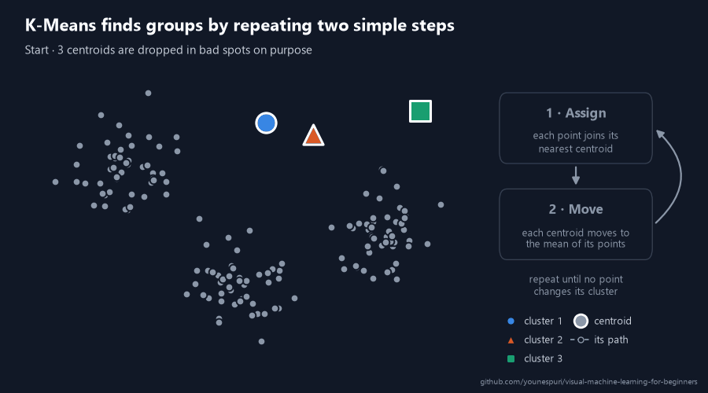
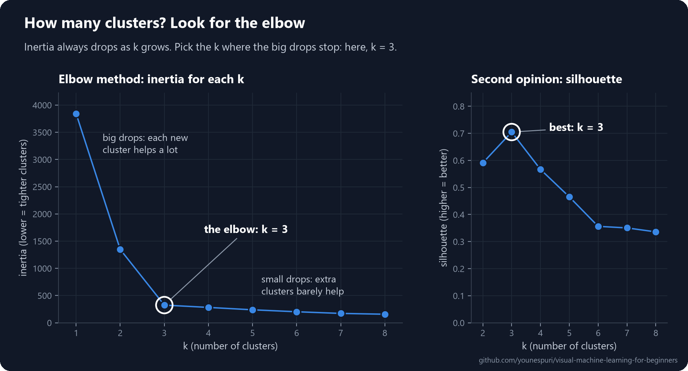
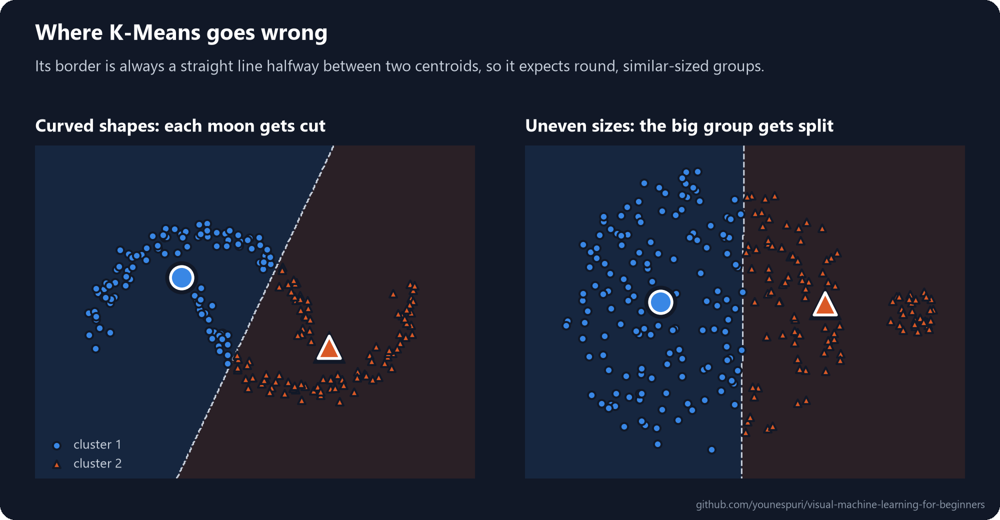
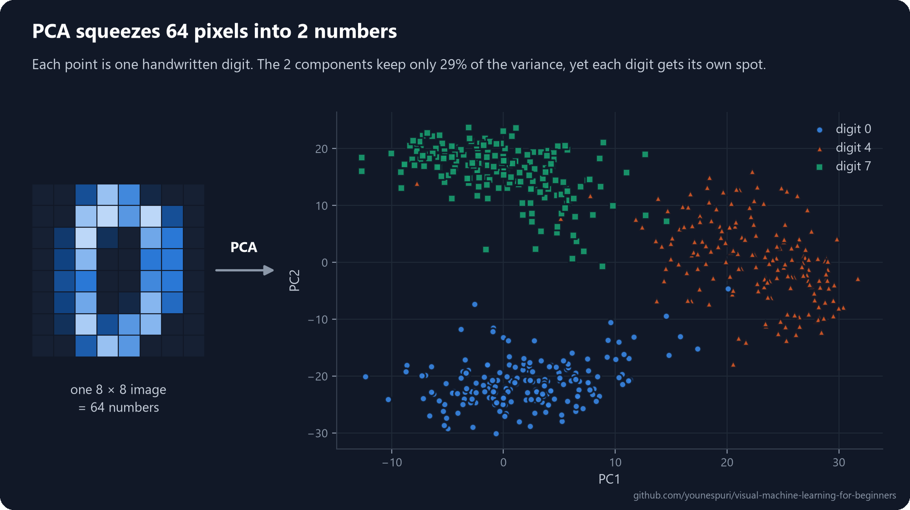

[Course home](../../README.md) · Lesson 07 of 09

# 07 · Clustering and PCA

**Let unlabeled data sort itself into groups, then squeeze dozens of features into a picture you can see.**

`Beginner` · `~50 min` · [](https://colab.research.google.com/github/younespuri/visual-machine-learning-for-beginners/blob/main/lessons/07-clustering-and-pca/notebook.ipynb)



### What you'll learn

- How **K-Means** finds groups in data with no labels, using a two-step loop you could run by hand.
- How to choose the number of groups with the **elbow method**, and how to judge clusters without labels using the **silhouette score**.
- Why you must **scale** your features before clustering, and the kinds of data where K-Means fails.
- How **PCA** squeezes many features into a few, and how to read its **explained variance ratio**.
- How to turn 64-pixel images of handwritten digits into a 2-D map you can look at.

**Before you start:** [Lesson 06](../06-naive-bayes-and-unsupervised-learning/README.md), where you met unsupervised learning, and [lesson 05](../05-knn-and-svm/README.md) for distance and feature scaling. Every bit of math is explained right here.

---

## The idea in plain words

At the end of [lesson 06](../06-naive-bayes-and-unsupervised-learning/README.md), K-Means sorted 150 iris flowers into three groups without seeing a single species name. This lesson opens that box.

Picture a shepherd looking over a field of scattered sheep. They belong to a few flocks, but nobody has said how many, or where one flock ends and the next begins. So the shepherd plants three flags at random spots: *"these are the centers of my flocks."* Every sheep walks to its nearest flag. Then each flag moves to the middle of the sheep that chose it. Now some sheep find that a different flag is closer, so they switch. The flags move to the middle again. After a few rounds nobody switches any more, and every sheep has settled with its flock.

**K-Means does exactly this with data.** The flags are called **centroids**, the flocks are **clusters**, and **k** is the number of flags you plant.

**PCA** solves a different problem: too many features. A full medical check-up can produce 50 numbers: blood pressure, blood sugar, cholesterol, weight and so on. But many of them move together. Someone with a higher weight often has higher blood pressure and blood sugar too, so those 50 numbers don't hold 50 separate pieces of information. An experienced doctor sums them up in a couple of overall scores, such as "metabolic health" and "heart health", that capture most of what matters.

**PCA does that summary with math.** It builds a few new, combined features that keep as much of the variation in the data as possible, so you can drop the rest.

## An everyday example

An online shop has thousands of customers and wants to send each kind of shopper a different offer. Nobody has labeled anyone a "young big spender" or a "careful regular", so there are no answers to learn from. K-Means can find those groups on its own from each customer's age and spending, and the marketing team then looks inside each group and gives it a name.

Now say the shop stores 20 features per customer: visits, purchases, average basket, time on the site, and so on. Nobody can draw a 20-D chart. PCA can squeeze those 20 features into 2 and put every customer on a flat scatter plot. It's like a flat map of the round Earth: some detail gets lost, but you can still see the continents.

## How it really works

### K-Means: assign, move, repeat

K-Means needs one thing from you: **k**, the number of clusters. Then it runs a loop:

1. **Place k centroids.** A **centroid** is the center point of a cluster. At the start, they're simply placed at random.
2. **Assign.** Every point joins the cluster of its nearest centroid.
3. **Move.** Every centroid moves to the **mean** (the average position) of the points that joined it. That averaging is where the "Means" in K-Means comes from.
4. **Repeat** steps 2 and 3 until no point changes its cluster.

That's the whole algorithm, and it's exactly what the animation at the top shows: three centroids dropped in bad spots find the middle of the three groups in five rounds.

"Nearest" means the straight-line **Euclidean distance** from lesson 05. For a point $x$ and a centroid $\mu$ (the Greek letter mu) with $n$ features:

$$d(x, \mu) = \sqrt{(x_1 - \mu_1)^2 + (x_2 - \mu_2)^2 + \dots + (x_n - \mu_n)^2}$$

Why does the loop always settle? Because K-Means is quietly shrinking one number, called **inertia**: the total of the squared distances from every point to its own centroid.

$$\text{inertia} = \sum_{i=1}^{n} d(x_i, \mu_{c_i})^2$$

Here $\mu_{c_i}$ is the centroid of the cluster that point $i$ belongs to. The assign step never raises inertia, since every point picks its closest centroid. Neither does the move step, since the mean is the one spot with the smallest total squared distance to a group of points. A number that never goes up can't keep changing forever, so the loop stops. Low inertia means tight clusters.

There's a catch: the result depends on where the centroids start. An unlucky start can get stuck in a poor answer, such as two centroids sharing one real group while a third one covers two. The fix is simple: run K-Means several times from different random starts and keep the run with the lowest inertia. In scikit-learn, that's `n_init=10`. (scikit-learn also picks its random starts with a trick called **k-means++**, which spreads the first centroids apart, so bad starts are rare.)

### How many clusters? The elbow method

K-Means won't choose k for you, and you can't just pick the k with the lowest inertia. More clusters always means lower inertia: with one cluster per point, inertia is exactly 0, and the "clusters" are useless.

Instead, run K-Means for k = 1, 2, 3, ... and plot the inertia of each. At first it drops fast, because every new cluster separates a real group. Then the drops suddenly get small, because extra clusters only chop real groups into pieces. The bend where that happens looks like an arm's elbow, and it's usually a good choice of k. That's the **elbow method**.



For a second opinion, use the **silhouette score**. Lesson 06 warned that you can't grade clusters with accuracy, because there are no right answers. The silhouette score grades them anyway, using only distances. For each point:

- $a$ = its average distance to the other points in its own cluster (how snug it is at home),
- $b$ = its average distance to the points of the nearest other cluster (how far away the neighbors are),

$$s = \frac{b - a}{\max(a, b)}$$

A score near **1** means the point sits deep inside its cluster, far from the others. Near **0** means it's on a border. **Below 0** means it's probably in the wrong cluster. Average $s$ over all points, and pick the k with the highest average. On the data above, both methods agree: k = 3.

### Scale your features first

K-Means is all distances, so it shares KNN's weak spot from lesson 05: a feature measured in big numbers takes over. Say you cluster customers by age, which spans a few decades, and by yearly income, which spans tens of thousands of dollars. A gap of 1,000 dollars in income then outweighs a gap of 50 years in age, and K-Means ends up splitting people by income alone.

The fix is **standardization**. For each feature, subtract its mean and divide by its **standard deviation**, which is the typical distance of a value from the mean:

$$z = \frac{x - \text{mean}}{\text{standard deviation}}$$

Afterwards, every feature has a mean of 0 and a typical spread of 1, so a big gap means the same thing in every feature. In scikit-learn, that's `StandardScaler`, and Step 3 below shows the difference on real numbers.

### Where K-Means goes wrong

K-Means gives every point to its nearest centroid, so the border between two clusters is always a straight line halfway between their centroids. That quietly assumes clusters are round blobs of similar size. When they aren't, K-Means cuts in the wrong place:



- **Curved or stretched shapes**, like the two moons on the left. No straight border can separate them, so each moon gets cut in two.
- **Very different sizes.** On the right, the border lands halfway between the centroids, deep inside the big group, so about a third of it gets lumped in with the small one.
- **Outliers.** One extreme point drags its cluster's mean toward it.
- **Every point must join a cluster**, even pure noise.

For data like this, there are other clustering algorithms. **DBSCAN** grows clusters from crowded regions, so it can follow any shape and leave noise out. **Gaussian mixture models** allow stretched clusters of different sizes. Both are in scikit-learn, and just like `KMeans`, they hand you the cluster labels with `fit_predict(X)`.

### PCA: keep the directions where the data spreads most

Now the second problem: too many features. Each feature is one **dimension**, so a table with 64 columns lives in a 64-dimensional space. You can't plot that, models get slower, and often many columns carry the same information: features that move together, like height and weight, repeat each other. **Dimensionality reduction** means describing the data with fewer features while losing as little as possible.

**PCA** (Principal Component Analysis) does it by measuring spread. The spread of a feature is its **variance**, the average squared distance from its mean $\bar{x}$ (read "x bar"):

$$\text{variance} = \frac{1}{n}\sum_{i=1}^{n}(x_i - \bar{x})^2$$

High variance means the values differ a lot from point to point, and those differences are the information that tells points apart. PCA looks for new axes, called **principal components**:

1. **PC1** is the direction in which the data spreads out the most.
2. **PC2** is at a right angle to PC1, and catches the most of the spread that's left.
3. PC3, PC4 and so on continue the same way, up to as many components as there are features.

Then it **projects** each point onto the new axes: a point's new coordinates are where its shadow lands on each axis. Keep the first few components, drop the rest, and you've reduced the dimensions.


In the picture, the two features are strongly related, so most of the spread runs along one diagonal, and PC1 captures 89% of it. Keep only PC1 and each point becomes a single number, its position along that line. You lose just the 11% of spread along PC2.

Under the hood, PCA finds these directions with some linear algebra (the eigenvectors of the data's covariance matrix). You don't need that math to use PCA well. One thing to keep in mind, though: each component is a weighted mix of all the original features, so it doesn't always have a meaning a person can name.

### How much did you keep? Explained variance

Every component comes with its **explained variance ratio**: the share of the data's total variance that it captures.

$$\text{explained variance ratio of PC}_k = \frac{\text{variance along PC}_k}{\text{total variance}}$$

The ratios come sorted from biggest to smallest and add up to 1 across all the components. Add up the ones you keep, and you know how much of the spread survived. Keep 2 components with ratios 0.60 and 0.30, and you've kept 90% of the variance in just 2 numbers. It's the number that tells you whether squeezing was safe.

Here's PCA on real images. Each handwritten digit is an 8 × 8 grid of pixel brightness values, so it has 64 features. PCA squeezes them down to 2 numbers, and every image becomes one dot:



The two components keep only 29% of the variance, yet each kind of digit already gets its own spot. That's often all you need to *look* at your data. To rebuild the images, or to feed a model, you'd keep more components, and Step 6 shows how many.

### Scale before PCA, too

PCA chases variance, and variance depends on units. Measure a length in millimeters instead of meters and its variance grows a million times, even though the information is the same. So when features use different units, the one with the biggest numbers wins PC1 just because of its units. You'll see it happen in Step 7: in a wine dataset, one measurement runs into the thousands while others stay near 1, and without scaling, PC1 is nothing but that one measurement.

The rule: **standardize first when your features have different units.** When they all share one unit, like the pixels of the digit images (all brightness values from 0 to 16), you can skip it.

### K-Means vs. PCA at a glance

| | K-Means | PCA |
| --- | --- | --- |
| **Goal** | Group similar rows | Squeeze many columns into a few |
| **Works on** | Rows (the samples) | Columns (the features) |
| **You choose** | The number of clusters, `n_clusters` | The number of components, `n_components` |
| **Main outputs** | `labels_`, `cluster_centers_`, `inertia_` | The transformed data, `components_`, `explained_variance_ratio_` |
| **Typical uses** | Customer segments, grouping unlabeled data | Plotting high-dimensional data, speeding up other models, removing noise |

They also work well together: PCA first to shrink the data, then K-Means on the result. Step 8 does exactly that.

---

## Code it

Open the [notebook in Colab](https://colab.research.google.com/github/younespuri/visual-machine-learning-for-beginners/blob/main/lessons/07-clustering-and-pca/notebook.ipynb) to run everything below without installing anything. You'll start with a handful of customers, move on to the blobs from the animation, and finish with real handwritten digits and wines.

### Step 1 · Group customers with K-Means

```python
import numpy as np
from sklearn.cluster import KMeans

# Each row is one customer: [age, spending score from 0 to 100]
customers = np.array([
    [22, 85],
    [25, 90],
    [23, 82],
    [45, 20],
    [48, 15],
    [50, 25],
    [24, 88],
    [47, 18],
])

kmeans = KMeans(n_clusters=2, n_init=10, random_state=42)
kmeans.fit(customers)                      # no labels: only the data itself

print(kmeans.labels_)
print(kmeans.cluster_centers_)
print(kmeans.predict([[30, 70], [55, 30]]))
# [0 0 0 1 1 1 0 1]
# [[23.5  86.25]
#  [47.5  19.5 ]]
# [0 1]
```

- `fit` gets the customers and nothing else. In unsupervised learning, there's no `y`.
- `n_clusters=2` is k. `n_init=10` runs K-Means from 10 different random starts and keeps the best one (the lowest inertia), and `random_state=42` makes those starts repeatable.
- `labels_` holds each customer's cluster. `cluster_centers_` holds the final centroids, which are the "average customer" of each group: about 24 years old with a spending score of 86, and about 48 with a score of 20.
- `predict` sends new customers to their nearest centroid: the 30-year-old big spender joins cluster 0, and the careful 55-year-old joins cluster 1.
- The cluster numbers are only names. Cluster 0 isn't first or best, and another run may swap them.

### Step 2 · Choose k with the elbow method

```python
from sklearn.datasets import make_blobs
from sklearn.metrics import silhouette_score

X, _ = make_blobs(n_samples=150, centers=3, random_state=38)   # "_" throws away the true groups

for k in range(1, 9):
    km = KMeans(n_clusters=k, n_init=10, random_state=42).fit(X)
    line = f"k = {k}   inertia = {km.inertia_:5.0f}"
    if k > 1:                                                   # silhouette needs 2+ clusters
        line += f"   silhouette = {silhouette_score(X, km.labels_):.2f}"
    print(line)
# k = 1   inertia =  3842
# k = 2   inertia =  1347   silhouette = 0.59
# k = 3   inertia =   325   silhouette = 0.70
# k = 4   inertia =   282   silhouette = 0.57
# k = 5   inertia =   238   silhouette = 0.47
# k = 6   inertia =   202   silhouette = 0.36
# k = 7   inertia =   172   silhouette = 0.35
# k = 8   inertia =   157   silhouette = 0.34
```

- `make_blobs` generates points around a few centers. These are the same 150 points as in the animation and the elbow chart. It also returns which center each point came from, but we throw that away and pretend we never had it.
- Inertia falls by about 2,500 from k = 1 to 2 and by about 1,000 from 2 to 3, then by only about 40 from 3 to 4. That's the elbow: k = 3.
- The silhouette score peaks at k = 3 too. When both methods agree, you can pick k with confidence.
- `km.inertia_` is the inertia of a fitted model, and `silhouette_score` needs the data plus the cluster labels.

### Step 3 · Scale before you cluster

```python
import pandas as pd
from sklearn.preprocessing import StandardScaler

rng = np.random.default_rng(0)
# 20 young people, 20 mid-career people and 20 retirees (incomes in $1,000s)
ages = np.concatenate([rng.normal(22, 2, 20), rng.normal(40, 3, 20), rng.normal(68, 3, 20)])
incomes = np.concatenate([rng.normal(25, 8, 20), rng.normal(90, 12, 20), rng.normal(30, 8, 20)])
people = pd.DataFrame({"age": ages.round().astype(int),
                       "income": incomes.round().astype(int) * 1000})

kmeans_3 = KMeans(n_clusters=3, n_init=10, random_state=42)
raw = kmeans_3.fit_predict(people)                                      # years vs. dollars
scaled = kmeans_3.fit_predict(StandardScaler().fit_transform(people))   # both standardized

for name, labels in [("Without scaling:", raw), ("With scaling:", scaled)]:
    summary = people.groupby(labels).agg(youngest=("age", "min"), oldest=("age", "max"),
                                         avg_income=("income", "mean"))
    print(name)
    print(summary.round().astype(int))
# Without scaling:
#    youngest  oldest  avg_income
# 0        37      44       89100
# 1        17      74       34750
# 2        19      73       19938
# With scaling:
#    youngest  oldest  avg_income
# 0        37      44       89100
# 1        64      74       30650
# 2        17      25       27000
```

- The data hides three groups: young people and retirees who both earn little, and mid-career people who earn a lot. `rng.normal(mean, spread, count)` draws random numbers around a mean.
- Each cluster's youngest and oldest member tell the story. Without scaling, two clusters each hold people from about 17 to 74 years old: K-Means split everyone by income alone, because income differences are over a thousand times bigger than age differences.
- `StandardScaler` rescales each column to mean 0 and standard deviation 1. Now age counts as much as income, and the three real groups come back: young people, mid-career people and retirees.
- `fit_predict` is `fit` plus `labels_` in one call.
- With real customers you wouldn't know the hidden groups, so you couldn't check like this. That's exactly why you scale by default before any method built on distances.

### Step 4 · Squeeze 64 pixels into 2 numbers with PCA

```python
from sklearn.datasets import load_digits
from sklearn.decomposition import PCA

digits = load_digits()
print(digits.data.shape)                   # 1,797 images, each 8 x 8 = 64 pixels

pca = PCA(n_components=2)
X_2d = pca.fit_transform(digits.data)
print(X_2d.shape)
print(pca.explained_variance_ratio_.round(3))
print(pca.explained_variance_ratio_.sum().round(3))
# (1797, 64)
# (1797, 2)
# [0.149 0.136]
# 0.285
```

- Each image is 64 numbers: the brightness of every pixel, from 0 (blank) to 16 (full ink). So each image has 64 features.
- `fit_transform` does two jobs in one call: `fit` finds the components, and `transform` projects every image onto them. 64 columns go in, 2 come out.
- PC1 keeps 14.9% of the variance and PC2 keeps 13.6%, so 28.5% together. That's not much, but as you'll see next, it's enough to tell some digits apart.
- All 64 features share one unit (pixel brightness), so there's no need to scale here.

### Step 5 · See the digits in 2-D

```python
import matplotlib.pyplot as plt

for digit, marker in [(0, "o"), (4, "^"), (7, "s")]:
    points = X_2d[digits.target == digit]
    plt.scatter(points[:, 0], points[:, 1], marker=marker, alpha=0.6, label=f"digit {digit}")
plt.xlabel("PC1")
plt.ylabel("PC2")
plt.legend()
plt.show()
```

- You should see the picture from earlier in this lesson: the 0s at the bottom, the 7s at the top and the 4s off to the right.
- `digits.target` holds the real digit of each image. It's used here only to color the plot, after PCA has done its work. PCA never saw it.
- Try the digits 5 and 8 instead: they land almost on top of each other. Two components aren't enough to separate every digit.

### Step 6 · How many components should you keep?

```python
pca_all = PCA().fit(digits.data)                 # keep all 64 components
running_total = np.cumsum(pca_all.explained_variance_ratio_)

for goal in (0.5, 0.8, 0.9, 0.95):
    n = np.argmax(running_total >= goal) + 1     # the first count that reaches the goal
    print(f"{goal:.0%} of the variance -> {n} components")
# 50% of the variance -> 5 components
# 80% of the variance -> 13 components
# 90% of the variance -> 21 components
# 95% of the variance -> 29 components
```

- `np.cumsum` gives a running total: the first value is PC1's share, the second is PC1 plus PC2, and so on.
- `np.argmax(running_total >= goal)` finds the first position where the total reaches the goal. Adding 1 turns that position into a count.
- 95% of the variance fits in 29 numbers instead of 64, less than half. The last components carry very little: mostly tiny details and noise.
- Shortcut: `PCA(n_components=0.95)` picks that number for you.

### Step 7 · Scale before PCA, too

```python
from sklearn.datasets import load_wine

wine = load_wine()
X_wine = wine.data                               # 178 wines, 13 chemical measurements each

raw_pca = PCA(n_components=2).fit(X_wine)
scaled_pca = PCA(n_components=2).fit(StandardScaler().fit_transform(X_wine))

print("without scaling:", raw_pca.explained_variance_ratio_.round(3))
print("with scaling:   ", scaled_pca.explained_variance_ratio_.round(3))
top = np.abs(raw_pca.components_[0]).argmax()   # the feature with the biggest weight in PC1
print("PC1 without scaling is mostly:", wine.feature_names[top])
# without scaling: [0.998 0.002]
# with scaling:    [0.362 0.192]
# PC1 without scaling is mostly: proline
```

- Most measurements in this dataset are small numbers. The wine's hue, for example, runs from about 0.5 to 1.7. But **proline** runs from 278 to 1,680.
- Without scaling, PC1 claims 99.8% of the variance and points almost straight along proline. PCA hasn't found a pattern; it has found the feature with the biggest numbers.
- `components_[0]` is PC1's recipe: one weight per original feature. The weight with the biggest size shows which feature PC1 mostly follows.
- After scaling, the variance is shared out fairly, 36% and 19%, and both components now mix many measurements.

### Step 8 · PCA and K-Means together

```python
from sklearn.pipeline import make_pipeline

model = make_pipeline(
    StandardScaler(),                                   # 1. put all 13 features on the same scale
    PCA(n_components=2),                                # 2. squeeze them into 2 numbers
    KMeans(n_clusters=3, n_init=10, random_state=42),   # 3. find 3 groups
)
clusters = model.fit_predict(X_wine)

print(pd.crosstab(wine.target, clusters, rownames=["wine type"], colnames=["cluster"]))
# cluster     0   1   2
# wine type
# 0          59   0   0
# 1           5   1  65
# 2           0  48   0
```

- `make_pipeline` chains the steps, so each one's output is the next one's input. It's the same pipeline idea as in lesson 05, now with PCA and K-Means as steps.
- K-Means never saw `wine.target`, the real grape variety of each wine. We use it only afterwards, to check.
- Each variety landed almost entirely in a cluster of its own: 172 of the 178 wines. From chemistry alone, with no labels, the pipeline rediscovered the three grape varieties.
- Why PCA first? With many features, K-Means gets slower, and distances between points start to look alike, which makes "nearest" less meaningful. Two components kept the structure that K-Means needed.

### Bonus · K-Means in 10 lines of NumPy

This is the loop from the animation, written out by hand. It lands on the same answer as scikit-learn.

```python
rng = np.random.default_rng(4)
centroids = X[rng.choice(len(X), size=3, replace=False)]        # 3 random points to start

for step in range(1, 21):
    distances = np.linalg.norm(X[:, None] - centroids, axis=2)   # every point to every centroid
    labels = distances.argmin(axis=1)                            # 1. assign: nearest centroid wins
    inertia = (distances.min(axis=1) ** 2).sum()
    print(f"step {step}:  inertia = {inertia:6.1f}")
    new_centroids = np.array([X[labels == j].mean(axis=0) for j in range(3)])  # 2. move
    if np.allclose(new_centroids, centroids):                    # nothing moved: done
        break
    centroids = new_centroids

print("scikit-learn:", round(KMeans(n_clusters=3, n_init=10, random_state=42).fit(X).inertia_, 1))
# step 1:  inertia = 4158.9
# step 2:  inertia = 1362.7
# step 3:  inertia = 1136.8
# step 4:  inertia =  649.9
# step 5:  inertia =  328.9
# step 6:  inertia =  324.6
# scikit-learn: 324.6
```

- `X[:, None] - centroids` subtracts every centroid from every point in one go, giving a stack of shape (150, 3, 2). `np.linalg.norm(..., axis=2)` turns each difference into a distance.
- Inertia only goes down, round after round, just as promised, and it ends at the same 324.6 as scikit-learn.
- Change the seed in `default_rng(4)`. Most starts reach 324.6, some in fewer steps, but an unlucky start can get stuck higher. That's why scikit-learn runs 10 starts with `n_init=10`.

---

## Where you'll see it in the real world

K-Means is the workhorse of **customer segmentation**: marketing teams cluster millions of shoppers by how they buy, with no groups decided in advance, and then design a campaign for each one. It also shrinks images: cluster the colors of a photo's pixels into 64 groups, repaint every pixel with its centroid's color, and a photo with many thousands of colors still looks almost the same. The same idea, grouping many things around a few typical ones, helps organize news stories, documents and product catalogs.

PCA shows up wherever data has many related columns. It compresses images by keeping only the top components, and it cleans up readings from dozens of sensors that measure overlapping things, keeping the main signal and dropping much of the noise. Very often it's a **preprocessing** step: squeeze hundreds of features down to a few dozen, then train the real model, whether a classifier or K-Means itself, on the smaller and faster version. And whenever researchers want a 2-D map of something with hundreds of dimensions, from gene measurements to the word **embeddings** inside language models (lists of numbers that describe each word), PCA is one of the first tools they reach for.

## Common mistakes

- **Picking k out of thin air.** Try a few values with the elbow method or the silhouette score. Even a quick check beats a guess.
- **Forgetting to scale.** K-Means runs on distances and PCA on variances, so one feature with big numbers (income next to age) quietly takes over. Standardize first.
- **Reading meaning into cluster numbers.** Cluster 0 isn't "first" or "best", and a rerun may swap the numbers. Describe each cluster by its members, such as their average age and spending, then name it yourself.
- **Using K-Means on the wrong shapes.** It expects round groups of similar size. For curved, stretched or very uneven groups, plot the result and consider another algorithm, such as DBSCAN.
- **Expecting PCA components to mean something.** Each component is a weighted mix of all the original features. Sometimes it matches an idea like "overall size", but often it doesn't.
- **Fitting the scaler or PCA on all the data before splitting.** Both learn from the data, so fitting them on the test set leaks information into training (lesson 05). Put them inside a pipeline, and they'll learn from the training data only.

## Remember

- **K-Means** splits unlabeled data into k clusters by repeating two steps: **assign** each point to its nearest centroid, then **move** each centroid to the mean of its points. It stops when no point changes cluster.
- "Nearest" means Euclidean distance, so **scale your features** first.
- **Inertia** is the total squared distance from the points to their centroids. It always falls as k grows, so pick k at the **elbow**, and check it with the **silhouette score** (higher is better).
- In scikit-learn, `labels_` holds each point's cluster, `cluster_centers_` the centroids and `inertia_` the inertia, while `n_init` reruns K-Means from several random starts.
- K-Means expects round clusters of similar size.
- **PCA** replaces many related features with a few **principal components**: the directions in which the data spreads the most.
- `explained_variance_ratio_` tells you how much of the variance each component keeps. Add the ratios up to see what survived.
- PCA is great for plotting high-dimensional data, and as a preprocessing step before other models, including K-Means.

## Practice

**Easy.** Make 6 points in 2-D that clearly form two groups, for example three near (1, 1) and three near (8, 8). Cluster them with `KMeans(n_clusters=2, n_init=10, random_state=0)` and print `labels_` and `cluster_centers_`. Do the centers land where you expected?

**Medium.** Run K-Means on your 6 points for k = 1 to 5, print `inertia_` each time, and plot inertia against k. In one sentence, which k does the elbow suggest, and why? Then predict the inertia for k = 6 before you run it, and explain your prediction.

**Hard.** Build a dataset with 100 rows and 5 features, where some columns depend on others: for example `f1` random, `f2 = 2 * f1 + noise`, `f3` random, `f4 = -1.5 * f3 + noise`, and `f5` pure noise. Standardize it, reduce it to 2 components with PCA, and print `explained_variance_ratio_`. Why can 2 components keep most of the variance of 5 features? Then run K-Means with k = 3 on the result and print the silhouette score. Your data has no real groups, yet K-Means still hands you 3 clusters. What does the silhouette score say about them, compared with the 0.70 of Step 2?

### Mini project

Segment the customers of a shop.

1. Invent 12 to 20 customers, each with an `age`, an `annual_income` and a `spending_score` from 0 to 100. Build in a few patterns, such as young customers with small incomes who spend a lot, and older customers with big incomes who spend little.
2. Standardize the three columns with `StandardScaler`, since income is on a much bigger scale than the other two.
3. Run K-Means for k = 1 to 6, record `inertia_` for each, and plot the elbow. Check your choice with the silhouette score.
4. Fit the final model. For each cluster, print the average age, income and spending score of its customers (use the unscaled data for this) and give the cluster a descriptive name, such as "young big spenders on a budget" or "well-off, careful shoppers".
5. Separately, reduce the scaled data to 2 components with PCA and print `explained_variance_ratio_`. How much of the variety in your 3 features survives in just 2 numbers? Plot the customers in 2-D, colored by cluster.

Your numbers will depend on the customers you invent. That's expected.

## Check yourself

<details>
<summary><b>1.</b> What two steps does K-Means repeat, and when does it stop?</summary>

**Assign**: every point joins the cluster of its nearest centroid. **Move**: every centroid moves to the mean (the average position) of the points assigned to it. It repeats the two steps until no point changes cluster, or until it reaches a maximum number of rounds.
</details>

<details>
<summary><b>2.</b> How does K-Means decide which centroid is "nearest", and why does that make scaling so important?</summary>

It uses Euclidean distance, the straight-line distance: square the difference in each feature, add them up and take the square root. Because the raw differences are added up, a feature measured in big numbers (like income in dollars) swamps one measured in small numbers (like age in years), and the clusters end up following that one feature. Standardizing puts every feature on the same footing.
</details>

<details>
<summary><b>3.</b> How does the elbow method help you choose k, and why not just pick the k with the lowest inertia?</summary>

Inertia always drops as k grows, and with one cluster per point it's exactly zero, so the lowest value tells you nothing. Instead, you run K-Means for several values of k and plot the inertia of each. Look for the elbow, where the big drops stop and the curve flattens: past that point, extra clusters only split real groups, so that k is a good choice. The silhouette score makes a good second opinion: pick the k with the highest average score.
</details>

<details>
<summary><b>4.</b> What does <code>explained_variance_ratio_</code> tell you, and how does it help you decide how many components to keep?</summary>

It gives the share of the data's total variance that each principal component captures, for example `[0.6, 0.3]`. Adding up the ratios of the components you keep tells you how much of the spread survived, 90% in this example. So you can pick the smallest number of components that keeps enough, such as 95%, like Step 6 does.
</details>

<details>
<summary><b>5.</b> Why is it common to run PCA before K-Means or another model?</summary>

With many features, models get slower, and many of the features repeat each other or add noise. Distances also start to look alike, which makes "nearest" less meaningful for K-Means. PCA squeezes the data into a few components that keep most of the variance, so the next model trains faster on cleaner input. As a bonus, 2 components let you plot the data and see the clusters.
</details>

<details>
<summary><b>6.</b> K-Means cuts a long, curved group of points in half. Why does that happen?</summary>

K-Means gives every point to its nearest centroid, so the border between two clusters is always a straight line halfway between their centroids. That works for round groups of similar size, but a curved or stretched group can't be separated by straight borders like that. For such shapes, try an algorithm that follows the density of the points, such as DBSCAN.
</details>

---

[← 06 · Naive Bayes and unsupervised learning](../06-naive-bayes-and-unsupervised-learning/README.md) · [Course home](../../README.md) · [08 · Overfitting and cross-validation →](../08-overfitting-and-cross-validation/README.md)
