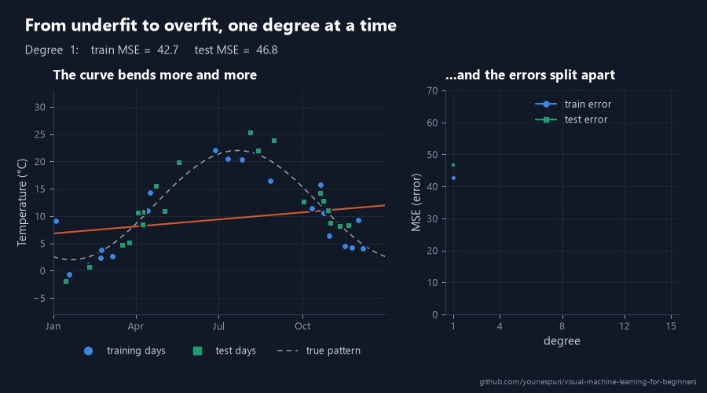

[Course home](../../README.md) · Lesson 08 of 09

# 08 · Overfitting vs. Underfitting and Cross-Validation, Explained Visually

**A model that aces its training data can still fail on new data. Learn to catch it, and to grade every model fairly.**

`Beginner` · `~50 min` · [](https://colab.research.google.com/github/younespuri/visual-machine-learning-for-beginners/blob/main/lessons/08-overfitting-and-cross-validation/notebook.ipynb)


### What you'll learn

- How to tell **underfitting** from **overfitting** by comparing a model's training and test scores.
- The **bias-variance trade-off** in plain words, with an archery target.
- The three jobs of **training**, **validation** and **test** data, and why you never tune a model on the test set.
- How **k-fold cross-validation** gives you a score you can trust, and why classification needs **stratified** folds.
- How to tune a model honestly with `GridSearchCV`, and how a pipeline stops preprocessing from leaking.

**Before you start:** [Lesson 02](../02-linear-regression/README.md) for MSE, [lesson 04](../04-decision-trees-and-random-forests/README.md) for decision trees, and [lesson 05](../05-knn-and-svm/README.md) for KNN, scaling and pipelines. Everything new is explained right here.

---

## The idea in plain words

Two students prepare for the same exam with the same practice sheet.

The first one memorizes the sheet: every question, every answer, even the typos. If the exam repeated the sheet word for word, she'd score 100%. But the real exam asks about the same ideas in new words, and she's lost. She memorized the answers instead of understanding them.

The second student barely looks at the sheet. He walks in with one vague rule of thumb and does badly on the practice questions and on the exam.

Machine learning models fail in exactly these two ways. **Overfitting** is the first student: the model memorizes its training data, noise and all, so it shines on examples it has seen and stumbles on new ones. **Underfitting** is the second: the model is too simple to learn even its training data. You want the student in between, who learns the ideas.

How do you tell them apart? Give them questions they have never seen. That's the job of a test set. And because one exam can be lucky, **cross-validation** sets five exams and averages the grades.

## An everyday example

A weather forecaster wants to predict the temperature for any day of the year. One forecaster builds an elaborate rule that fits every day of last year exactly: the cold snap on March 3rd, the warm spell on October 17th. It explains the past perfectly and predicts the future badly, because it treats random swings as if they were laws of nature.

A second forecaster says, *"Every day will be the yearly average."* That's too simple to even notice that summer is warmer than winter.

A good forecaster learns the seasons and ignores the random wobble from one day to the next. Every model has to strike this same balance. It's exactly the problem in the picture at the top: the three curves are three forecasters, and you'll build all of them in the code below.

## How it really works

### Too simple, too complex, and the knob in between

Every model has a **complexity** knob: a setting that decides how flexible the model is, and so how bendy the patterns it can learn. For the curves at the top, the knob is the **degree** of the polynomial. A degree-1 curve is a straight line, a degree-4 curve can turn around up to 3 times, and a degree-15 curve up to 14 times. You've met this knob before: `max_depth` for decision trees (lesson 04), and k for KNN, where a *small* k means a more flexible model (lesson 05).

- Turn it too low and the model **underfits**. The straight line can't see that summer is warmer than winter, so it's wrong on the training days and on new days alike.
- Turn it too high and the model **overfits**. The degree-15 curve has so much freedom that it bends through almost every training day, including each day's random noise. Between those days, it swings wildly.
- In between, the degree-4 curve follows the seasons and ignores the noise. It isn't the best on the training days, but it's the best on new days. Doing well on new data is called **generalization**, and it's the whole point of machine learning.

Watch the knob turn. As the degree climbs from 1 to 15, the training error only ever goes down, while the test error drops, levels off, and then shoots up:



### Spot it: compare training and validation scores

A model's score on its own training data is like a student grading their own homework. It always looks good, and it keeps improving as the model gets more complex. The score that matters comes from data the model didn't train on. While you're still building and choosing, that held-out data is called the **validation set** (more on it below).

Plot both errors against complexity, and you'll see the same picture again and again:


- **Left of the sweet spot**, both errors are high and close together: underfitting.
- **Right of it**, the training error keeps falling but the validation error turns up, so the **gap** between them grows: overfitting.
- **The sweet spot** is the bottom of the validation curve: the complexity that generalizes best.

So the telltale sign of overfitting is a big gap: great on training data, much worse on new data. Here's the whole diagnosis in one table:

| | Training score | Validation or test score | Usual cause | Usual fixes |
| --- | --- | --- | --- | --- |
| **Underfitting** | Poor | Poor, close to the training score | Model too simple (high bias) | A more flexible model, better features, less regularization |
| **Good fit** | Good | Good, close to the training score | Complexity matches the data | Keep it, and confirm it with cross-validation |
| **Overfitting** | Excellent | Much worse: a big gap | Model too complex (high variance), or too little data | A simpler model, more regularization, more data |

**Regularization** means any brake on complexity, such as limiting a tree's depth or lowering C in an SVM (lesson 05). As for the *bias* and *variance* in the table, they're the subject of the next section.

### Bias and variance: two ways to miss

Imagine training the same kind of model many times, each time on a fresh random sample of data. Each trained model is one arrow shot at a target, and the bullseye is the truth.

- **Bias** is how far off the arrows land *on average*. A model with high bias misses in the same direction every time, because its assumptions are too simple. A straight line misses summer whichever days you train it on. High bias means underfitting.
- **Variance** is how much the arrows *scatter*: how much the model changes when the training data changes. A degree-15 curve comes out completely different for every sample. High variance means overfitting.


The goal is arrows that are tightly grouped *and* on the bullseye: low bias and low variance. For squared errors, the expected error on new data splits neatly into three parts:

$$\text{expected error on new data} = \text{bias}^2 + \text{variance} + \text{noise}$$

The **noise** is the part no model can predict, like the random weather of one particular day. In the temperature data, the day-to-day noise has a standard deviation of 3 °C, so even a perfect model would average an MSE of about $3^2 = 9$ on new days. Nothing can beat the noise, so the work is all in the other two parts.

And those two pull in opposite directions. Make a model more complex and its bias falls, but its variance rises. Make it simpler and the reverse happens. That's the **bias-variance trade-off**, and the U-shaped validation curve above is their sum, plus the noise. The best model sits at the bottom of the U, not where either part is zero.

### Three kinds of data, three jobs

Lesson 00 split the data in two: a training set and a test set. Once you start *choosing* between models, you need a third part.

| | Its job | How often you use it | The exam version |
| --- | --- | --- | --- |
| **Training set** | The model learns from it | Every time you call `fit` | Homework, with the answers in the back |
| **Validation set** | You compare models and choose settings with it | As often as you like while you build | Practice exams |
| **Test set** | Gives the final, honest grade | **Once**, at the very end | The final exam |

The settings you choose with the validation set, like the degree of a curve, `max_depth` or k, are **hyperparameters** (lesson 05). The model doesn't learn them; you pick them.

Why not just pick them with the test set? Because every time you look at the test score and change something in response, a little of the test set leaks into your decisions. Do that twenty times and the test set has quietly become training data. Your final score will be too optimistic, and the model will disappoint on truly new data. This is called **test-set leakage**, and it's the same trap as choosing a probability threshold on the test set (lesson 03). The rule is simple: **make every decision with validation data, and look at the test set exactly once.**

### k-fold cross-validation: five exams instead of one

A single validation set has a weakness: it's one roll of the dice. If the easy rows happen to land in it, the model looks better than it is; if the hard ones do, worse. In Step 4 below, the same model scores anywhere from 66% to 89%, depending only on which rows it's graded on. The smaller the dataset, the bigger the swing.

**k-fold cross-validation** fixes this by grading the model k times, on different rows each time:

1. Shuffle the training data and deal it into k equal parts, called **folds**.
2. Train a fresh model on k − 1 folds and grade it on the fold that was left out.
3. Repeat k times, so every fold is the validation set exactly once.
4. Average the k scores.


$$\text{CV score} = \frac{1}{k}\sum_{i=1}^{k} \text{score}_i$$

Report the average together with the **standard deviation** of the k scores (the typical distance of a score from their average), for example *"0.80 ± 0.06"*. The ± tells you how much of the difference between two models could be plain luck.

A few practical points:

- **k = 5 or k = 10 are the usual choices.** More folds means each model trains on more of the data, but every extra fold costs one more training run.
- **Every row gets used for both training and validation.** That matters a lot when data is scarce.
- **The test set stays out of it.** Cross-validation runs on the training data only, and the test set still waits for the very end.

### Stratified folds for classification

In classification, folds have one more job: each should look like the whole dataset. Say only 10% of your rows are the rare class, such as fraud. Deal them into folds at random and one fold might get none at all. A model graded on that fold can't show whether it catches fraud, and the fold scores swing more than they should.

**Stratified k-fold** deals the folds so that each one keeps the class mix of the whole dataset: 10% rare rows in every fold. It's the same idea as `stratify=y` in `train_test_split`, which you've used since lesson 00, applied to every fold. For classifiers, scikit-learn does it for you: `cross_val_score(model, X, y, cv=5)` uses stratified folds automatically.

### Tune without cheating, and without leaking

Put it all together and you get the honest way to choose a model:

1. **Split** off a test set and lock it away.
2. **Cross-validate** every candidate setting on the training set.
3. **Pick** the setting with the best average score.
4. **Refit** that model on the whole training set.
5. **Test once.** That's the number you report.

`GridSearchCV` does steps 2 to 4 for you. Give it a model and a grid of settings to try, and it cross-validates every one of them, keeps the best, and refits it.

One trap remains. **Data leakage** is any information from outside the training data sneaking into training. Lesson 05 showed the classic case: fitting a scaler on all the data before splitting. Cross-validation has the same trap on a smaller scale. If you scale the whole training set once and then cross-validate, every validation fold has already helped set the mean and standard deviation, so it isn't truly unseen anymore. The fix is the pipeline from lesson 05: put the scaler and the model in one pipeline and cross-validate the pipeline. The scaler is then refit inside every fold, on that fold's training part only.

---

## Code it

Open the [notebook in Colab](https://colab.research.google.com/github/younespuri/visual-machine-learning-for-beginners/blob/main/lessons/08-overfitting-and-cross-validation/notebook.ipynb) to run everything below without installing anything. You'll start with the temperatures from the pictures, then switch to a classification dataset for cross-validation and tuning.

### Step 1 · Twenty days to learn from, twenty to test on

```python
import numpy as np
from sklearn.model_selection import train_test_split

def true_pattern(day):
    return 12 - 10 * np.cos(2 * np.pi * (day - 20) / 365)   # °C: coldest around January 20

rng = np.random.default_rng(897)
day = rng.uniform(0, 365, 40)                     # 40 random days of the year
temp = true_pattern(day) + rng.normal(0, 3, 40)   # plus day-to-day weather noise

day_train, day_test, temp_train, temp_test = train_test_split(
    day, temp, test_size=0.5, random_state=0)
print(len(day_train), "training days and", len(day_test), "test days")
print("the first 4 training days:", day_train[:4].round().astype(int))
print("their temperatures (°C):  ", temp_train[:4].round(1))
# 20 training days and 20 test days
# the first 4 training days: [106 207  39 293]
# their temperatures (°C):   [14.3 20.4  1.1 15.7]
```

- `true_pattern` is the seasonal curve behind the data: coldest around January 20, warmest in late July. In real life nobody hands you the true pattern. We built this data ourselves, so we can peek.
- `rng.normal(0, 3, 40)` adds each day's random weather: noise with a standard deviation of 3 °C that no model can predict.
- `train_test_split` locks half of the days away as a test set. With only 40 days, a bigger test set keeps the test score from hanging on a handful of days.
- These are the exact 40 days in the picture at the top of this lesson.

### Step 2 · Too simple, just right, too complex

```python
from sklearn.metrics import mean_squared_error

def report(name, predict):
    train_mse = mean_squared_error(temp_train, predict(day_train))
    test_mse = mean_squared_error(temp_test, predict(day_test))
    print(f"{name:<13} train MSE = {train_mse:4.1f}   test MSE = {test_mse:4.1f}")

for degree in [1, 4, 15]:
    curve = np.polynomial.Polynomial.fit(day_train, temp_train, deg=degree)
    report(f"degree {degree}", curve)
report("true pattern", true_pattern)
# degree 1      train MSE = 42.7   test MSE = 46.8
# degree 4      train MSE =  5.2   test MSE =  8.2
# degree 15     train MSE =  1.4   test MSE = 64.5
# true pattern  train MSE =  7.7   test MSE =  5.5
```

- `np.polynomial.Polynomial.fit(x, y, deg)` finds the curve of that degree with the lowest MSE on the training days. It's linear regression from lesson 02, with x, x², x³ and so on as the features. (scikit-learn can do the same with `PolynomialFeatures` plus `LinearRegression`.)
- The fitted curve works like a function: `curve(day_test)` predicts the test days. That's why `report` can grade the curves and the true pattern the same way.
- Degree 1 is bad on both sets: underfitting. Degree 15 has the lowest training error and by far the worst test error, a gap of 63: overfitting.
- Even the true pattern doesn't score 0, because nobody can predict the daily noise. Yet degree 15 scores 1.4 on the training days, *better than the truth itself* (7.7). The only way to do that is to memorize the noise.
- Degree 4 comes closest to the true pattern on both sets, so it's the one you want. Notice that we judged it with the test set, though. That's fine for a demo; from Step 4 on, you'll choose the honest way.

### See it

```python
import matplotlib.pyplot as plt

xs = np.linspace(0, 365, 400)
for degree in [1, 4, 15]:
    curve = np.polynomial.Polynomial.fit(day_train, temp_train, deg=degree)
    plt.plot(xs, curve(xs), label=f"degree {degree}")
plt.plot(xs, true_pattern(xs), "k--", label="true pattern")
plt.scatter(day_train, temp_train, color="black", label="training days")
plt.scatter(day_test, temp_test, color="gray", marker="s", label="test days")
plt.ylim(-10, 35)
plt.xlabel("day of the year")
plt.ylabel("temperature (°C)")
plt.legend()
plt.show()
```

### Step 3 · The same story in a decision tree

```python
from sklearn.datasets import make_classification
from sklearn.tree import DecisionTreeClassifier

X, y = make_classification(n_samples=200, n_features=6, n_informative=4, n_redundant=1,
                           n_clusters_per_class=2, flip_y=0.08, random_state=42)
X_train, X_test, y_train, y_test = train_test_split(X, y, test_size=0.25, random_state=42)

for depth in [1, 4, None]:
    tree = DecisionTreeClassifier(max_depth=depth, random_state=42).fit(X_train, y_train)
    print(f"max_depth={str(depth):<4}   train = {tree.score(X_train, y_train):.3f}   "
          f"test = {tree.score(X_test, y_test):.3f}   (grew {tree.get_depth()} deep)")
# max_depth=1      train = 0.673   test = 0.660   (grew 1 deep)
# max_depth=4      train = 0.893   test = 0.740   (grew 4 deep)
# max_depth=None   train = 1.000   test = 0.720   (grew 8 deep)
```

- `make_classification` invents a classification dataset: 200 rows, 6 numeric features and 2 classes. `flip_y=0.08` flips about 8% of the labels at random. That's pure noise, like a few mislabeled records.
- With `max_depth=1`, the tree can ask only one question. Both scores are low and close together: underfitting.
- With no limit (`None`), the tree grows 8 questions deep and gets 100% of the training rows right, flipped labels included. On the test rows it drops to 72%. That 28-point gap is the signature of overfitting you met in lesson 04.
- `max_depth=4` gives up some training accuracy and does best on the test rows.
- From here on, the test set stays locked away until Step 8.

### Step 4 · One split can be lucky

```python
val_scores = []
for seed in range(10):
    X_fit, X_val, y_fit, y_val = train_test_split(X_train, y_train, test_size=0.25,
                                                  random_state=seed)
    tree = DecisionTreeClassifier(max_depth=4, random_state=42).fit(X_fit, y_fit)
    val_scores.append(tree.score(X_val, y_val))

print("validation accuracy:", np.round(val_scores, 2))
print(f"from {min(val_scores):.2f} to {max(val_scores):.2f}, for the very same model")
# validation accuracy: [0.68 0.82 0.89 0.76 0.71 0.68 0.66 0.76 0.76 0.87]
# from 0.66 to 0.89, for the very same model
```

- Each round carves a different 38-row validation set out of the training data and grades the same depth-4 tree on it. The test set isn't touched.
- Same model, same data, and the grade swings from 66% to 89% depending only on which rows landed in the validation set. With a single split, you'd see just one of these numbers and never know whether it was a lucky one.
- `X_fit` is the part the tree trains on. The new name keeps it apart from `X_train`, which still holds all 150 training rows.

### Step 5 · k-fold cross-validation in one line

```python
from sklearn.model_selection import KFold, cross_val_score

kf = KFold(n_splits=5, shuffle=True, random_state=42)
tree = DecisionTreeClassifier(max_depth=4, random_state=42)

scores = cross_val_score(tree, X_train, y_train, cv=kf)
print("fold scores:", scores.round(3))
print(f"mean = {scores.mean():.3f}   std = {scores.std():.3f}")
# fold scores: [0.8   0.733 0.867 0.733 0.867]
# mean = 0.800   std = 0.060
```

- `KFold(n_splits=5, shuffle=True, random_state=42)` shuffles the 150 training rows and deals them into 5 folds of 30. `random_state` makes the shuffle repeatable.
- `cross_val_score` runs the whole loop: 5 fresh trees, each trained on 4 folds and graded on the fifth. These are exactly the five scores in the k-fold picture above.
- The honest summary is *"about 80%, give or take 6 points"*: the mean and the standard deviation.
- It grades with the model's own `score` method, which is accuracy for classifiers and R² for regression models. Pass `scoring="recall"`, `scoring="r2"` or another metric name to grade by something else.

### Step 6 · Stratified folds keep the class mix

```python
from sklearn.model_selection import StratifiedKFold

y_rare = np.array([1] * 10 + [0] * 90)     # 100 rows, only 10 of them in the rare class
X_rare = np.zeros((100, 1))                # the features don't matter for splitting

splitters = {"KFold": KFold(n_splits=5, shuffle=True, random_state=0),
             "StratifiedKFold": StratifiedKFold(n_splits=5, shuffle=True, random_state=0)}
for name, splitter in splitters.items():
    rare_per_fold = [int(y_rare[val].sum()) for _, val in splitter.split(X_rare, y_rare)]
    print(f"{name:<16} rare rows in each validation fold: {rare_per_fold}")
# KFold            rare rows in each validation fold: [3, 2, 4, 0, 1]
# StratifiedKFold  rare rows in each validation fold: [2, 2, 2, 2, 2]
```

- `splitter.split(X, y)` hands out the row numbers of each round's training part and validation part. Here we just count the rare rows in each validation fold.
- Plain `KFold` left one fold with no rare rows at all and gave another 4. `StratifiedKFold` gives every fold the same 10%: exactly 2 each.
- For classifiers, `cv=5` means stratified folds automatically. Pass a `StratifiedKFold` yourself when you also want the rows shuffled with a fixed `random_state`, as you'll do in lesson 09.
- The classes in Step 3 are split almost exactly half and half (99 and 101 rows), so a plain split was fine there. With imbalanced classes, always stratify.

### Step 7 · Choose max_depth with cross-validation

```python
for depth in [1, 2, 3, 4, 5, 6, None]:
    tree = DecisionTreeClassifier(max_depth=depth, random_state=42)
    scores = cross_val_score(tree, X_train, y_train, cv=5)
    print(f"max_depth={str(depth):<4}   CV accuracy = {scores.mean():.3f} ± {scores.std():.3f}")
# max_depth=1      CV accuracy = 0.600 ± 0.067
# max_depth=2      CV accuracy = 0.640 ± 0.053
# max_depth=3      CV accuracy = 0.733 ± 0.030
# max_depth=4      CV accuracy = 0.780 ± 0.069
# max_depth=5      CV accuracy = 0.740 ± 0.025
# max_depth=6      CV accuracy = 0.760 ± 0.033
# max_depth=None   CV accuracy = 0.740 ± 0.025
```

- Every depth gets its own 5-fold cross-validation on the training data. The test set stays locked away.
- The CV accuracy climbs, peaks at depth 4, then falls back: the U-curve from earlier, upside down, because this is accuracy instead of error.
- Depth 4 wins, but not by a landslide: depth 6 is only 0.02 behind, well inside the ± spread. When scores are this close, prefer the simpler model.
- Why 0.780 here but 0.800 in Step 5? `cv=5` builds different folds (stratified, and not shuffled). Both are estimates of the same thing, which is exactly why you report the ± too.

### Step 8 · Let GridSearchCV do the loop, then test once

```python
from sklearn.model_selection import GridSearchCV

grid = GridSearchCV(DecisionTreeClassifier(random_state=42),
                    param_grid={"max_depth": [1, 2, 3, 4, 5, 6, None]}, cv=5)
grid.fit(X_train, y_train)                 # 7 settings x 5 folds = 35 trees, then 1 refit

print("best setting:    ", grid.best_params_)
print("best CV accuracy:", round(grid.best_score_, 3))
print("test accuracy:   ", round(grid.score(X_test, y_test), 3))   # the one and only look
# best setting:     {'max_depth': 4}
# best CV accuracy: 0.78
# test accuracy:    0.74
```

- `GridSearchCV` runs a full cross-validation for every value in `param_grid`, keeps the best, then refits that winner on all 150 training rows (`refit=True` is the default).
- `best_score_` comes from cross-validation on the training data, never from the test set. It matches the depth-4 row of Step 7.
- Only now do we look at the test set, once: 0.74. That's a little below the CV estimate, which is normal. It's the honest number you'd report.
- `param_grid` can hold several settings at once, like `{"max_depth": [3, 4, 5], "min_samples_leaf": [1, 5, 10]}`. `GridSearchCV` then tries every combination: 9 of them here.

### Step 9 · Keep the scaler inside the folds

```python
from sklearn.neighbors import KNeighborsClassifier
from sklearn.pipeline import make_pipeline
from sklearn.preprocessing import StandardScaler

X_wide = X_train * np.array([1, 100, 1, 1000, 1, 1])   # two features in much bigger units

models = {
    "KNN, raw features": KNeighborsClassifier(),
    "KNN, scaler in a pipeline": make_pipeline(StandardScaler(), KNeighborsClassifier()),
    "tree, raw features": DecisionTreeClassifier(max_depth=4, random_state=42),
}
for name, model in models.items():
    scores = cross_val_score(model, X_wide, y_train, cv=5)
    print(f"{name:<26} CV accuracy = {scores.mean():.3f}")
# KNN, raw features          CV accuracy = 0.493
# KNN, scaler in a pipeline  CV accuracy = 0.773
# tree, raw features         CV accuracy = 0.780
```

- Multiplying two columns by 100 and 1,000 is like measuring them in centimeters instead of meters: the same information in bigger numbers. KNN measures distances, so those two columns take over, and accuracy falls to a coin flip (0.493).
- The pipeline brings it back up to 0.773. Inside `cross_val_score`, it refits the scaler in every fold, on that fold's training part only, so the validation fold never shapes the scaling.
- The tempting shortcut, `StandardScaler().fit_transform(X_wide)` before cross-validating, is leakage: the scaler would see every validation fold. For scaling the effect is often small, but leaky steps that learn more, such as choosing which features to keep, can make a useless model look excellent.
- The tree doesn't care about units and scores the same 0.780 as in Step 7. It asks about one feature at a time ("is this value above some threshold?"), so it needs no scaling. KNN, SVM and K-Means measure distances, so they do.

---

## Where you'll see it in the real world

Every serious machine learning project runs on this discipline. Teams lock a test set away on day one, choose models and settings with cross-validation, and run the test set once before anything ships. `GridSearchCV`, its faster cousin `RandomizedSearchCV` (which tries a random sample of the settings instead of all of them) and libraries such as Optuna automate the search. And overfitting is one of the most common reasons a model looks great in the lab and then disappoints in production.

You can even watch test-set leakage happen in public. On Kaggle, the machine learning competition site, players see their score on a public leaderboard during a contest, but the final ranking comes from a hidden test set. Players who tuned their models to climb the public board often tumble when the final ranking is revealed: they overfit the leaderboard.

Two variations you'll meet soon. With **time series**, like daily sales, shuffled folds would let the model peek at the future, so you use `TimeSeriesSplit`, which always trains on the past and validates on what comes after. And in deep learning, the same U-curve shows up over training time: the validation error falls, then rises as the network starts to memorize, and **early stopping** halts training at the bottom of the U.

## Common mistakes

- **Checking only the training score.** It always looks good, and an overfit model looks best of all. Compare it with the validation or test score: the gap is the warning sign.
- **Tuning on the test set.** Every decision you make by looking at the test score leaks it into your model. Tune with validation data or cross-validation, and use the test set once.
- **Believing that more complex is always better.** More flexibility means more variance. Past the sweet spot, a more complex model does worse on new data.
- **Overcorrecting.** Fighting overfitting by making the model so simple that it underfits. Watch both errors, not just the gap.
- **Comparing models on a single split**, especially with little data. One lucky split can crown the wrong model. Use cross-validation, and look at the ± too.
- **Preprocessing outside the folds.** Fitting a scaler, or anything else that learns, on all the data before cross-validating leaks the validation folds into training. Put it in a pipeline.

## Remember

- **Underfitting**: the model is too simple, so training and test errors are both high. **Overfitting**: it memorized the noise, so the training error is low and the test error much higher. The telltale sign is a big **gap**.
- **Bias** is how far off a model is on average; **variance** is how much it changes with the training data. More complexity trades bias for variance, and the best model sits at the bottom of the validation U-curve.
- **Training** data is for learning, **validation** data for choosing, and **test** data for one final grade. Never tune on the test set.
- One split can be lucky. **k-fold cross-validation** grades a model on k different folds; report the mean ± the standard deviation. For classification, use **stratified** folds (automatic with `cv=5`).
- `cross_val_score` cross-validates one model. `GridSearchCV` tries a grid of settings, picks the best and refits it.
- Anything that learns from data, even a scaler, belongs inside a **pipeline**, so it's refit inside every fold. Distance-based models (KNN, SVM, K-Means) need scaling; trees don't.

## Practice

**Easy.** Using the data from Step 3, train a `DecisionTreeClassifier(max_depth=2, random_state=42)` and print its training and test accuracy. Is it closer to underfitting or to overfitting? Why?

**Medium.** Repeat Step 5 with `KFold(n_splits=10, shuffle=True, random_state=42)`. Compare the mean and the standard deviation with the 5-fold result. What changes, and why do the fold scores now jump in bigger steps? (Hint: how many rows are in each fold?)

**Hard.** Tune KNN on `X_wide` from Step 9 with `GridSearchCV`. Use `make_pipeline(StandardScaler(), KNeighborsClassifier())` as the model and `{"kneighborsclassifier__n_neighbors": [1, 3, 5, 7, 9, 11, 15]}` as the grid. (A pipeline names each step after its class in lowercase, and two underscores reach inside a step.) Which k wins? Then print `grid.cv_results_["mean_test_score"]` and compare k = 1 with k = 15. Which one is closer to overfitting, which to underfitting, and why? Lesson 05 has a hint.

### Mini project

Choose a model the honest way.

1. Make a classification dataset of about 250 rows with `make_classification`, with some label noise from `flip_y`, and split off a stratified test set of 20%.
2. Pick a model and one hyperparameter to tune: `max_depth` for a `DecisionTreeClassifier`, or `n_neighbors` for KNN in a pipeline with a scaler.
3. For at least five values of your setting, compute the 5-fold cross-validation score on the training set with `cross_val_score`. Plot the mean score against the setting. Where's the sweet spot?
4. Confirm your choice with `GridSearchCV`.
5. Only now, grade the winner once on the test set, and print its training and test accuracy side by side. Are they both good, and close together? Then you've avoided both underfitting and overfitting.

Your numbers will depend on your data. That's expected.

## Check yourself

<details>
<summary><b>1.</b> What gap between training and test scores signals overfitting, and why don't you usually see a big gap with underfitting?</summary>

A training score far above the test score, like 100% against 72% in Step 3, means the model memorized details of its training data that don't hold for new data. An underfit model is too simple to fit even its training data, so it scores poorly on both, and the two scores stay close together.
</details>

<details>
<summary><b>2.</b> In the archery picture, what do high bias and high variance look like, and what kind of model gives each?</summary>

High bias: the arrows land tightly grouped but away from the bullseye, a systematic miss. That's a model that's too simple (underfitting), like a straight line for seasonal data. High variance: the arrows scatter all over the target, because the model changes a lot with every training sample. That's a model that's too complex (overfitting), like a degree-15 curve.
</details>

<details>
<summary><b>3.</b> What problem with a single train/validation split does k-fold cross-validation solve?</summary>

One split is one roll of the dice: the score depends on which rows happened to land in the validation set, especially with little data. K-fold grades the model k times on k different folds, so every row is validated exactly once. The average is far more reliable, and the standard deviation shows how much the score moves around.
</details>

<details>
<summary><b>4.</b> Why is tuning hyperparameters by checking the test score again and again a problem? What should you do instead?</summary>

Every decision based on the test score fits your model a little more to that particular test set. After many rounds, the test set has effectively become training data, and its score is too optimistic. Tune with a validation set or cross-validation on the training data, for example with `GridSearchCV`, and look at the test set only once, at the end.
</details>

<details>
<summary><b>5.</b> Which of these need feature scaling: decision trees and random forests, KNN and SVM, K-Means? Why?</summary>

KNN, SVM and K-Means do, because they measure distances between points, so a feature measured in big numbers drowns out the rest. Decision trees and random forests don't: they compare one feature at a time with a threshold, so the units don't change which questions they ask. Step 9 shows both effects.
</details>

<details>
<summary><b>6.</b> Why should the scaler sit inside a pipeline when you cross-validate?</summary>

A scaler learns a mean and a standard deviation from data. Fitted on the whole training set before cross-validation, it has already seen every validation fold, which is data leakage. Inside a pipeline, it's refit in every round on that round's training folds only, so each validation fold stays truly unseen.
</details>

<details>
<summary><b>7.</b> What does stratified k-fold guarantee, and when does it matter most?</summary>

Every fold keeps the same class mix as the whole dataset. It matters most when one class is rare: with plain random folds, a fold can end up with almost none of the rare class, and its score says little. For classifiers, scikit-learn's `cv=5` uses stratified folds automatically.
</details>

---

[← 07 · Clustering and PCA](../07-clustering-and-pca/README.md) · [Course home](../../README.md) · [09 · Final project →](../09-final-project/README.md)
