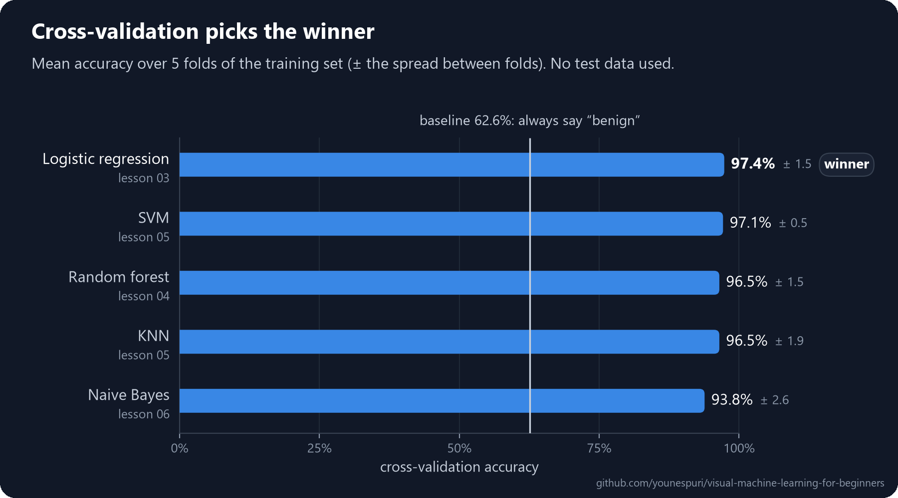
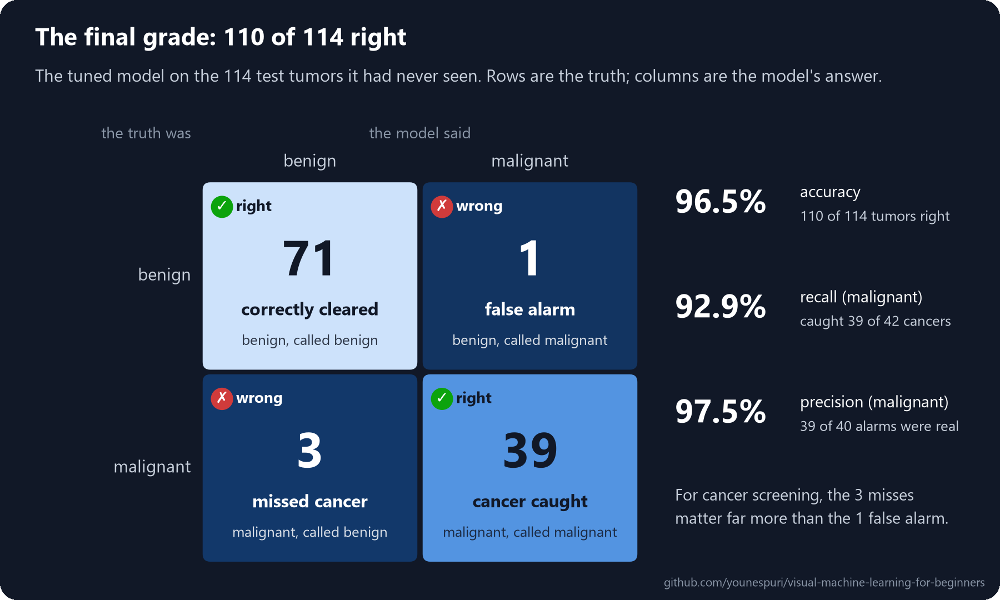

[Course home](../../README.md) · Lesson 09 of 09

# 09 · Final Project: An End-to-End Machine Learning Project in Python

**Put the whole course to work on one real dataset, from a raw table to a tested, explained model you can actually trust.**

`Beginner` · `~60 min` · [](https://colab.research.google.com/github/younespuri/visual-machine-learning-for-beginners/blob/main/lessons/09-final-project/notebook.ipynb)


### What you'll learn

- How every lesson of this course fits into one workflow you can reuse on almost any table of data.
- How to explore a dataset, then lock a test set away before you train anything.
- How a **Pipeline** chains scaling and a model so nothing leaks from data the model shouldn't see.
- How to compare five models fairly with cross-validation, then tune the winner.
- How to grade the final model once, read its mistakes, and explain the result in plain English.

**Before you start:** Lessons [01](../01-what-is-machine-learning/README.md) to [08](../08-overfitting-and-cross-validation/README.md). This project uses all of them, and every step links back to the lesson where you learned it.

---

## The idea in plain words

Over the last eight lessons you learned kitchen skills one at a time: how to prepare ingredients (scaling), a handful of recipes (the models), how to taste a dish (metrics), and how to taste several spoonfuls so one lucky bite can't fool you (cross-validation). You've never cooked a full meal with them. Today you will.

You'll decide what to cook (frame the problem), inspect the ingredients (explore), set a portion aside to taste at the very end (the test set), try several recipes (models), taste each one several times (cross-validation), fine-tune the winner (tuning), serve it once to real guests (the final test), and explain why it turned out the way it did (report).

**A machine learning project is exactly this:** the same few skills, in the right order, with strict rules about what you may taste and when.

## An everyday example

A loan officer deciding whether to approve a new applicant runs through the same steps by instinct. They know the question: *will this loan be repaid?* They look over the file and notice what's missing. They learn from past cases whose outcomes they already know, and a careful officer keeps a few of those cases aside to check their own judgment later. They weigh a few rules of thumb ("income only", "income plus job history"), test each one on many files rather than one, sharpen the best, and only then trust it with brand-new applicants.

A machine learning project does the same thing, with numbers, for thousands of applicants at once.

## How it really works

### The project: which tumors are malignant?

You'll use a real, classic medical dataset that ships with scikit-learn: the **Wisconsin breast cancer** dataset. Doctors took cell samples from 569 breast lumps with a thin needle and photographed them under a microscope. For every image, a computer measured the cell nuclei: 10 measurements such as radius, texture and smoothness, each recorded three ways (mean, error and worst). That's 30 numeric features per tumor, plus the answer: **malignant** (cancer) or **benign** (not cancer).

Framing it takes one sentence: *from 30 measurements, predict malignant or benign.* Every example comes with its answer and the answer is a category, so this is **supervised binary classification**, the kind of problem you met in [lesson 01](../01-what-is-machine-learning/README.md) and [lesson 03](../03-logistic-regression/README.md).

One more decision belongs here, before any code: **which mistake is worse?**

- A **false negative** calls a malignant tumor benign. A cancer goes untreated.
- A **false positive** calls a benign tumor malignant. The patient gets an extra test and a scare.

Both are bad, but the first is far worse. So besides accuracy, you'll watch **recall** for malignant tumors: the share of cancers the model actually catches.

### Nine steps, and where you learned each one

| # | Step | What you do | Key tool | Learned in |
| --- | --- | --- | --- | --- |
| 1 | **Frame** | Decide what to predict and which mistake is worse | features `X`, label `y` | [01](../01-what-is-machine-learning/README.md) |
| 2 | **Explore** | Check size, class balance, missing values and scales | pandas | [03](../03-logistic-regression/README.md), [05](../05-knn-and-svm/README.md) |
| 3 | **Split** | Lock 20% of the data away as the test set | `train_test_split(stratify=y)` | [08](../08-overfitting-and-cross-validation/README.md) |
| 4 | **Scale** | Put every feature on the same scale, learned from training data only | `StandardScaler` in a `Pipeline` | [05](../05-knn-and-svm/README.md) |
| 5 | **Compare** | Race five models with 5-fold cross-validation | `cross_val_score` | [03](../03-logistic-regression/README.md) to [06](../06-naive-bayes-and-unsupervised-learning/README.md), [08](../08-overfitting-and-cross-validation/README.md) |
| 6 | **Tune** | Fine-tune the winner's settings | `GridSearchCV` | [08](../08-overfitting-and-cross-validation/README.md) |
| 7 | **Test once** | Grade the final model on unseen data, one time | `predict`, `accuracy_score` | [08](../08-overfitting-and-cross-validation/README.md) |
| 8 | **Report** | Count each kind of mistake | `confusion_matrix`, `classification_report` | [03](../03-logistic-regression/README.md) |
| 9 | **Explain** | Say what the model learned, in plain words | `coef_` | [02](../02-linear-regression/README.md), [03](../03-logistic-regression/README.md) |

### The golden rule: touch the test set once

Everything that **learns** from data must learn from the training set only: the scaler's mean and standard deviation, the model's weights, your choice of model, your choice of settings. The test set is used exactly **once**, at the very end.

Why so strict? Every time the test set helps you make a decision, a little of it leaks into your model. The final score then measures how well you fit *that particular* test set, not how well you'll do on new patients. This is called **data leakage**, and its symptom is a model that looks great in your notebook and disappoints in the real world.

Looking is fine. Checking the size and class balance of the whole dataset in step 2 doesn't train anything. The moment something *fits* (a scaler, a model), it must see training data only.

### The one new tool: Pipeline

A `Pipeline` chains preprocessing and a model into one object, so you can't forget a step or fit it on the wrong data:

```text
                raw features --> StandardScaler --> model --> prediction
pipe.fit()      training data    learns mean, std   learns weights
pipe.predict()  new data         reuses them        reuses them
```

It matters most inside cross-validation. If you scaled `X_train` once and then cross-validated, every fold's validation part would already have shaped the mean and standard deviation: a small, sneaky leak. Hand `cross_val_score` a pipeline instead, and it refits the scaler inside every fold, on that fold's training part only.

---

## Code it

Open the [notebook in Colab](https://colab.research.google.com/github/younespuri/visual-machine-learning-for-beginners/blob/main/lessons/09-final-project/notebook.ipynb) to run everything below without installing anything. Each step builds on the one before, so run them in order.

### Step 1 · Frame the problem and load the data

```python
from sklearn.datasets import load_breast_cancer

data = load_breast_cancer(as_frame=True)
X = data.data                         # 30 measurements per tumor: the features
y = (data.target == 0).astype(int)    # 1 = malignant, 0 = benign: the label

print(data.target_names.tolist())
print(X.shape)
print(X.columns[:4].tolist())
# ['malignant', 'benign']
# (569, 30)
# ['mean radius', 'mean texture', 'mean perimeter', 'mean area']
```

- Every tumor has a known answer, and the answer is a category: supervised binary classification ([lesson 01](../01-what-is-machine-learning/README.md)).
- scikit-learn codes malignant as `0`, because it comes first in `target_names`. We flip it so `1` means malignant. The class you're hunting becomes the "positive" class, so recall now means "cancers caught" ([lesson 03](../03-logistic-regression/README.md)).
- `as_frame=True` gives you a pandas DataFrame with named columns instead of a bare array.

### Step 2 · Explore before you model

```python
print(y.value_counts())
print("share malignant:", round(y.mean(), 3))
print("missing values:", X.isna().sum().sum())
print(X[["mean area", "mean smoothness"]].describe().loc[["mean", "min", "max"]].round(3))
# target
# 0    357
# 1    212
# Name: count, dtype: int64
# share malignant: 0.373
# missing values: 0
#       mean area  mean smoothness
# mean    654.889            0.096
# min     143.500            0.053
# max    2501.000            0.163
```

- **Balance:** 37% malignant. A lazy model that always says "benign" is already 63% accurate: the accuracy trap from [lesson 03](../03-logistic-regression/README.md). Every real model has to beat that baseline.
- **Gaps:** no missing values. That's lucky; real data usually has some. You'd fill them with a `SimpleImputer` placed *inside* the pipeline, so it also learns from training data only.
- **Scales:** area runs into the thousands while smoothness stays below 1. KNN and SVM measure distances, so area would drown out everything else unless you scale ([lesson 05](../05-knn-and-svm/README.md)).

### Step 3 · Split once, and lock the test set away

```python
from sklearn.model_selection import train_test_split

X_train, X_test, y_train, y_test = train_test_split(
    X, y, test_size=0.2, stratify=y, random_state=42)

print("train:", X_train.shape, "  test:", X_test.shape)
print(f"share malignant   train: {y_train.mean():.3f}   test: {y_test.mean():.3f}")
# train: (455, 30)   test: (114, 30)
# share malignant   train: 0.374   test: 0.368
```

- 114 tumors go into the vault. `X_test` and `y_test` won't be touched again until step 7.
- `stratify=y` keeps the malignant share almost identical in both parts. Without it, a small test set can end up with too few cancers just by bad luck.
- `random_state=42` makes the split repeatable: the same 114 tumors every time you run it.

### Step 4 · Scale inside a pipeline, one per model

```python
from sklearn.pipeline import Pipeline
from sklearn.preprocessing import StandardScaler
from sklearn.linear_model import LogisticRegression
from sklearn.ensemble import RandomForestClassifier
from sklearn.neighbors import KNeighborsClassifier
from sklearn.svm import SVC
from sklearn.naive_bayes import GaussianNB

models = {
    "Logistic regression": LogisticRegression(max_iter=1000),   # lesson 03
    "Random forest": RandomForestClassifier(random_state=42),   # lesson 04
    "KNN": KNeighborsClassifier(),                              # lesson 05
    "SVM": SVC(),                                               # lesson 05
    "Naive Bayes": GaussianNB(),                                # lesson 06
}
pipelines = {name: Pipeline([("scale", StandardScaler()), ("model", model)])
             for name, model in models.items()}

print(pipelines["KNN"])
# Pipeline(steps=[('scale', StandardScaler()), ('model', KNeighborsClassifier())])
```

- Each pipeline is "scale, then model", glued into one object. `fit` learns the scaler's mean and standard deviation and then trains the model; `predict` reuses that same scaling, then predicts.
- Every model gets identical preprocessing, so the race is fair. Trees don't need scaling ([lesson 04](../04-decision-trees-and-random-forests/README.md)), but it doesn't hurt them either.
- Nothing has learned anything yet. These are five untrained recipes, waiting for data.

### Step 5 · Compare the models with cross-validation

```python
from sklearn.model_selection import StratifiedKFold, cross_val_score

cv = StratifiedKFold(n_splits=5, shuffle=True, random_state=42)

cv_scores = {}
for name, pipe in pipelines.items():
    scores = cross_val_score(pipe, X_train, y_train, cv=cv)   # accuracy on each of 5 folds
    cv_scores[name] = scores
    print(f"{name:<20} {scores.mean():.3f} ± {scores.std():.3f}")

best = max(cv_scores, key=lambda name: cv_scores[name].mean())
print("winner:", best)
# Logistic regression  0.974 ± 0.015
# Random forest        0.965 ± 0.015
# KNN                  0.965 ± 0.019
# SVM                  0.971 ± 0.005
# Naive Bayes          0.938 ± 0.026
# winner: Logistic regression
```

- `StratifiedKFold` is the classification version of the K-fold split from [lesson 08](../08-overfitting-and-cross-validation/README.md): every fold keeps the same malignant/benign mix. `shuffle=True` plus a `random_state` makes the folds random but repeatable.
- Cross-validation only ever sees `X_train`. Inside each fold, the pipeline refits its scaler on that fold's training part, so the validation part stays truly unseen.
- The top three are within one point of each other, closer than the ± spread between folds. Logistic regression edges it, and it's also the simplest model to explain.

### Step 6 · Tune the winner

```python
from sklearn.model_selection import GridSearchCV

grid = GridSearchCV(pipelines[best], {"model__C": [0.01, 0.1, 1, 10, 100]}, cv=cv)
grid.fit(X_train, y_train)

print("best C:", grid.best_params_["model__C"])
print("CV accuracy:", round(grid.best_score_, 3))
# best C: 1
# CV accuracy: 0.974
```

- `C` sets how hard logistic regression bends to fit the training data. A small `C` gives a simpler, more cautious model; a large `C` hugs the training set and risks overfitting ([lesson 08](../08-overfitting-and-cross-validation/README.md)).
- `model__C` means "the `C` of the step named `model`". Two underscores are how you reach inside a pipeline.
- The grid picked `C = 1`, which happens to be the default. That's a fine result: it's now a tested choice, not a guess. `GridSearchCV` then refits the winning pipeline on all 455 training tumors.

### Step 7 · Test once

```python
from sklearn.metrics import accuracy_score

final_model = grid.best_estimator_      # already refit on all 455 training tumors
y_pred = final_model.predict(X_test)    # the first and only look at the test set

print("test accuracy:", round(accuracy_score(y_test, y_pred), 3))
# test accuracy: 0.965
```

- Cross-validation promised about 0.974 and the test set delivered 0.965: 110 of 114 right. That closeness is what an honest workflow looks like.
- A much lower test score would be a warning sign: a leak somewhere, or a model tuned too tightly to the training data.
- From here on, the model is frozen. If you tweak it now and test again, the test set stops being a fair judge.

### Step 8 · Report the mistakes

```python
from sklearn.metrics import confusion_matrix, classification_report

print(confusion_matrix(y_test, y_pred))
print(classification_report(y_test, y_pred, target_names=["benign", "malignant"]))
# [[71  1]
#  [ 3 39]]
#               precision    recall  f1-score   support
#
#       benign       0.96      0.99      0.97        72
#    malignant       0.97      0.93      0.95        42
#
#     accuracy                           0.96       114
#    macro avg       0.97      0.96      0.96       114
# weighted avg       0.97      0.96      0.96       114
```

- Rows are the truth, columns the prediction ([lesson 03](../03-logistic-regression/README.md)): 71 benign tumors correctly cleared, 1 false alarm, 3 missed cancers, 39 cancers caught.
- Read the **malignant** row: recall 0.93 means the model caught 39 of the 42 cancers; precision 0.97 means 39 of its 40 "malignant" calls were right.
- The report rounds to two decimals, so accuracy shows 0.96 here and 0.965 in step 7. Same result.

### Step 9 · Explain what the model learned

```python
import pandas as pd

weights = pd.Series(final_model.named_steps["model"].coef_[0], index=X.columns)
print(weights.sort_values(key=abs, ascending=False).head(6).round(2))
# worst texture          1.43
# radius error           1.23
# worst symmetry         1.06
# mean concave points    0.95
# worst concavity        0.91
# area error             0.91
# dtype: float64
```

- Each coefficient is a weight, like w in [lesson 02](../02-linear-regression/README.md). The features were scaled, so the weights are comparable, and a positive weight pushes a tumor toward malignant.
- In these names, "mean" is the average over the cells in one image, "error" is how much a measurement varies between those cells, and "worst" is the average of the three largest values.
- All six push toward malignant: rough texture, cells of uneven size, lopsided shapes, dents in the outline. In plain words, **irregular cells look like cancer**, which is roughly what a pathologist looks for too.
- Read the exact order loosely: radius, perimeter and area measure almost the same thing, so the model can split the credit between them in odd ways. For a random forest you'd read `feature_importances_` instead ([lesson 04](../04-decision-trees-and-random-forests/README.md)).

### See it

```python
import matplotlib.pyplot as plt
from sklearn.metrics import ConfusionMatrixDisplay

ConfusionMatrixDisplay.from_predictions(
    y_test, y_pred, display_labels=["benign", "malignant"], cmap="Blues")
plt.title("The final model on 114 unseen tumors")
plt.show()
```

---

## What the results mean

### Cross-validation picked the winner



Every model beats the lazy baseline (always say "benign") by more than 30 points, so all five genuinely learned something. The top three sit within a point of each other, less than the ± spread between folds, so treat them as a near tie. Logistic regression edged it, and it's also the simplest and easiest to explain. That happens a lot on clean tabular data: try a simple model first, and make the fancy ones earn their place.

### The final grade, in plain words



On 114 tumors it had never seen, the model got 110 right: 96.5%, close to the 97.4% that cross-validation predicted. That's the payoff of the golden rule. Because nothing leaked, the estimate you made during development held up on fresh data.

Said out loud: *of 42 cancers, the model caught 39 and missed 3. Of 72 benign tumors, it cleared 71 and raised 1 false alarm. When it says "malignant", it's right 39 times out of 40.*

### Which mistakes matter more?

For cancer screening, the 3 misses matter far more than the 1 false alarm. A false alarm costs an extra test and a worried week; a miss can cost a life.

You can trade one kind of mistake for the other. Logistic regression gives every tumor a probability (the `predict_proba` from [lesson 03](../03-logistic-regression/README.md)) and calls it malignant above 50%. Lower that threshold to, say, 20%, and the model flags more tumors: it catches more cancers and raises more false alarms. Where to set it is a decision about costs, not code. Make it with cross-validation on the training set, *before* your one test run, never by trying thresholds on the test set. The Hard practice below walks you through it.

## Where you'll see it in the real world

These nine steps, or something very close, are what a junior data scientist does on almost every tabular problem: a startup predicting which users will cancel, a bank scoring loan applications, a shop forecasting which products will sell out. Real projects differ mostly in scale: more rows, messier data that takes longer to clean, eight or ten candidate models instead of five. The skeleton stays the same.

That's why this plain, disciplined workflow is worth more early in your career than knowing the newest algorithm. Most machine learning projects that fail don't fail because someone picked the wrong model. They fail because a step was skipped: the data was never really explored, or the test set leaked.

One honest caveat: this is a learning project on a small, classic dataset from the 1990s. A real diagnostic tool would need far more data, testing on patients from other hospitals, and regulatory approval before it came anywhere near a clinic.

## Common mistakes

- **Jumping straight to models.** Skipping exploration hides missing values, odd scales and class imbalance. Nothing crashes; the results are just quietly worse.
- **Fitting the scaler before the split.** Calling `StandardScaler().fit(X)` on all the data lets the test set shape your training. Split first, and keep preprocessing inside a `Pipeline`.
- **Choosing a model from a single train/test split.** One split can flatter one model by pure luck. Compare with cross-validation on the training set.
- **Peeking at the test set.** Checking the test score after every tweak, or picking a model or threshold by it, turns the test set into training data in disguise. Use it once, at the end.
- **Stopping at accuracy.** 96% sounds great, but only the confusion matrix tells you *which* mistakes hide in the other 4%. Decide which kind costs more for your problem.
- **Forgetting the baseline.** Here, always saying "benign" already scores 63%. Without a baseline, you can't tell whether a model learned anything at all.

## Remember

- A project is a workflow: **frame, explore, split, scale, compare, tune, test once, report, explain.**
- **Split early.** The test set stays locked away until the end and is used exactly once.
- Anything that **learns from data** learns from the training set only. A `Pipeline` makes that automatic, even inside cross-validation.
- **Compare models with cross-validation** as a mean ± spread, and always against a simple baseline.
- **Accuracy isn't the whole story.** Read the confusion matrix and decide which mistake costs more for your problem.
- **Explain the result in plain words:** what the model gets right, what it misses, and what drives its decisions.

## Practice

**Easy.** Change the split's `random_state` from `42` to `7` and rerun every step. Does the winner change? How far do the cross-validation and test scores move? What does that tell you about trusting any single number?

**Medium.** Add PCA from [lesson 07](../07-clustering-and-pca/README.md) between the scaler and the model: `Pipeline([("scale", StandardScaler()), ("pca", PCA(n_components=5)), ("model", LogisticRegression(max_iter=1000))])`, with `PCA` imported from `sklearn.decomposition`. Compare the cross-validation accuracy with 2, 5 and 10 components. How few can you keep before accuracy drops? And why must PCA sit *inside* the pipeline?

**Hard.** Catch more cancers without cheating. Get honest probabilities for the training tumors with `cross_val_predict(final_model, X_train, y_train, cv=cv, method="predict_proba")[:, 1]` (import it from `sklearn.model_selection`). For thresholds from 0.5 down to 0.1, count the cancers caught and the false alarms. Pick the highest threshold that catches at least 98% of the malignant training tumors, then apply it to the test set once: `final_model.predict_proba(X_test)[:, 1] >= threshold`. How many misses and false alarms do you get now? (In a real project, you'd settle the threshold before step 7.)

### Mini project

Run the same nine steps on a **regression** problem: scikit-learn's built-in diabetes dataset, `load_diabetes(as_frame=True)`. It predicts how much a patient's disease progresses in one year from 10 measurements such as age, BMI and blood pressure.

1. **Frame:** what is `y`, and why is this regression rather than classification?
2. **Explore:** size, missing values, and the range of `y`.
3. **Split** 80/20 with a fixed `random_state`. Skip `stratify`: it's for categories, not numbers.
4. **Scale and compare:** build pipelines for `LinearRegression` ([lesson 02](../02-linear-regression/README.md)) and the regression cousins of two models you know, `KNeighborsRegressor` and `RandomForestRegressor`. Compare them with `cross_val_score(..., scoring="r2")` and a `KFold` from [lesson 08](../08-overfitting-and-cross-validation/README.md).
5. **Tune** the winner with a small `GridSearchCV`, if it has a setting worth tuning.
6. **Test once:** report MSE and R² on the test set.
7. **Explain:** read `coef_` for the linear model, or `feature_importances_` for the forest. Which measurement matters most?

Don't expect a high score. Predicting how a disease progresses is hard, and an R² around 0.4 to 0.5 is a solid result on this dataset.

## Check yourself

<details>
<summary><b>1.</b> Name the nine steps of this project in order. Which of them may use the test set?</summary>

Frame, explore, split, scale, compare, tune, test once, report, explain. Only the final evaluation uses the test set: step 7 predicts on it once, and step 8 compares those same predictions with the true labels. Nothing before step 7 may see it.
</details>

<details>
<summary><b>2.</b> What is data leakage, and why does fitting a <code>StandardScaler</code> on the whole dataset before splitting cause it?</summary>

Leakage is when information from the data you evaluate on sneaks into training, so the final score looks better than the truth. A scaler fitted on all the data computes its mean and standard deviation partly from the test rows, so the test set has already shaped the model. Split first, and let a `Pipeline` fit the scaler on training data only.
</details>

<details>
<summary><b>3.</b> Why compare models with cross-validation instead of a single train/test split?</summary>

One split is one roll of the dice: some models get an easy test set and look better than they are. Cross-validation scores every model on five different validation folds and averages them, and the ± spread shows how much of any difference is just noise.
</details>

<details>
<summary><b>4.</b> On which data did <code>GridSearchCV</code> run, and why must the test set be used only once?</summary>

Only on the training set, with cross-validation inside it. Every decision made by looking at the test set (a model, a setting, a threshold) fits your work to that particular set, and its score stops being an honest estimate for new data. Used once, at the end, it stays a fair judge.
</details>

<details>
<summary><b>5.</b> The final model caught 39 of 42 cancers and raised 1 false alarm. Which number would you try to improve first, and how would you do it without cheating?</summary>

The 3 missed cancers, because a miss is far more costly than a false alarm. Lower the decision threshold so the model flags more tumors, and choose that threshold with cross-validated probabilities on the training set, not by trying values on the test set. Expect a few more false alarms in exchange.
</details>

<details>
<summary><b>6.</b> How do you see what a logistic regression learned? What would you look at for a random forest instead?</summary>

Read its coefficients, `coef_`. On scaled features they're comparable: the bigger the weight, the stronger its push, and the sign says which class it pushes toward. A random forest has no coefficients, so you read `feature_importances_`, which says how much each feature helped its trees split the data.
</details>

## What's next

You've finished the course. You can take a table of data, frame a problem, and build a model you can honestly trust. Some good directions from here:

- **More projects.** Pick a dataset you actually care about and run the nine steps. Write the results up in plain English in a README and put it on GitHub: nothing shows your skills better.
- **Kaggle.** Start with the Titanic competition, then the monthly Playground Series. Read the top public notebooks: you'll recognize this same workflow, plus plenty of new tricks.
- **Deep learning.** Neural networks train with the same loss and gradient descent ideas from [lesson 02](../02-linear-regression/README.md), and they're graded with the same train, validation and test discipline. PyTorch and Keras are the usual next step.
- **Deeper scikit-learn.** Try `ColumnTransformer` for tables that mix numbers and categories, and gradient boosting (`HistGradientBoostingClassifier`), often the strongest model on tabular data.

---

[← 08 · Overfitting and cross-validation](../08-overfitting-and-cross-validation/README.md) · [Course home](../../README.md)
